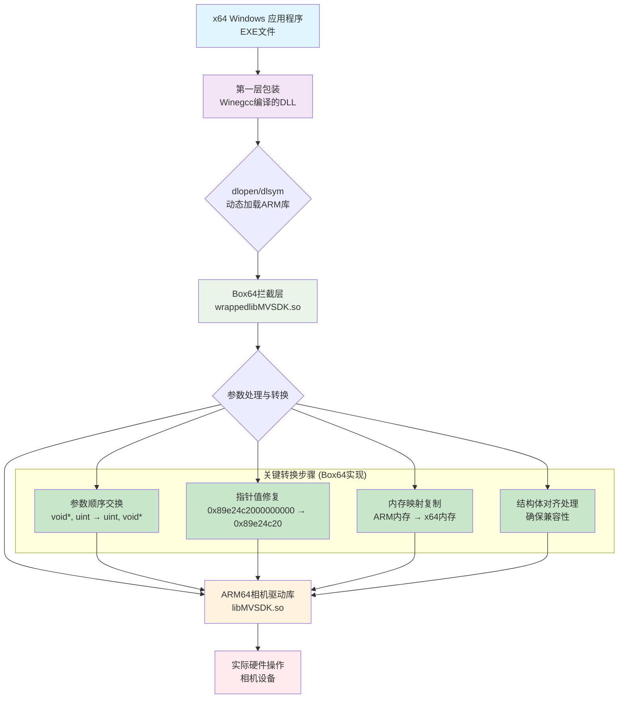
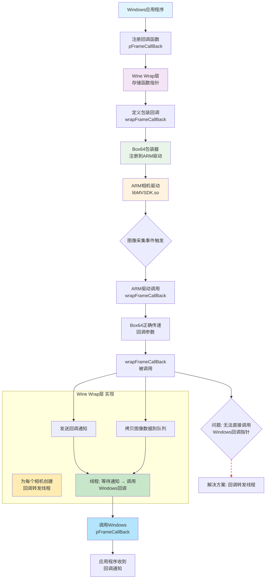
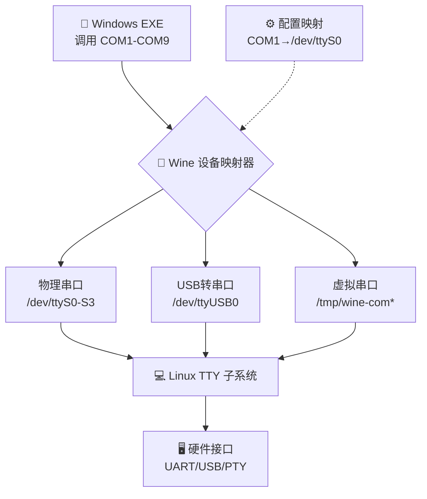
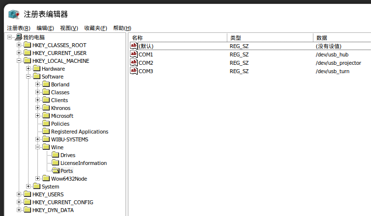

> 操作系统：银河麒麟桌面操作系统（国防版）V10
>
> 版本号：2207
>
> 内核：linux 5.4.18-87.76-yx02-generic
>
> CPU：Phytium，D2000/8 S8I
>
> 内存：32GB
>
> 桌面：UKUI
>
> 硬件架构：ARM64
>
> **注：Wine Arm版本没有意义，存在致命依赖问题：加密/授权库 - 官网不提供Windows Arm版本，因此，Wine Arm版本不需要考虑。**

# 1、Wine环境配置

> 尝试方法：
>
> 1. 编译Wine Arm64源码，编译成功但不能正常运行，原因：
>
>   - 麒麟系统可能有定制修改，导致兼容性问题；
>   - Wine对ARM的原生支持还很有限，很多Windows程序包含x86/x64原生代码，无法在ARM上直接运行，所以不采用该方案；
>
> 2. 使用编译好的Wine Arm64的deb文件安装失败，原因：
>
>   - 依赖链在ARM上不完整；
>   - ARM版本的Wine包很少且不完整；
>
> 3. 使用麒麟仓库的Wine安装包，不使用原因：
>
>   - 版本过低，稳定版仅支持到Wine5版本，开发版也支持到Wine8版本；
>   - Wine组件版本管理比较混乱，组件与主程序版本不一致，容易导致一些意料之外的问题；
>
> 4. Box64 + Wine10
>
>   - Windows程序 → x86 Wine → box64 → ARM CPU
>
>   - 规避架构问题：用box64处理x86指令，Wine处理Windows API
>
>   - 利用成熟生态：x86 Wine生态远比ARM Wine成熟
>
>   - 解决依赖地狱：预编译的x86 Wine包含所有依赖
>
>   - 跨发行版兼容：不依赖特定Linux发行版的包管理
>
>     ```
>     Windows程序 (x86/x64)
>         ↓
>     Wine (x86/x64)   ← 处理Windows API调用
>         ↓  
>      box64          ← 动态二进制翻译
>          ↓
>     ARM64指令        ← 原生执行
>     ```

## 1.1 手动编译Wine Arm版本【失败】

### 1.1.1 克隆并切换到 stable 分支

- 第一步：安装 Git

  ```linux
  # 更新软件源并安装 git
  sudo apt update
  sudo apt install git -y
  
  # 验证安装
  git --version
  ```

- 第二步：使用 Git 克隆稳定版

  ```linux
  # 克隆 Wine 仓库
  cd ~
  git clone https://github.com/wine-mirror/wine.git
  
  # 进入目录
  cd wine
  
  # 切换到稳定分支
  git checkout stable
  
  # 验证当前分支
  git branch
  ```

- 第三步：Git 基本操作说明

  - 查看所有可用分支

  ```linux
  git branch -a
  ```

  - 查看当前状态

  ```linux
  git status
  ```

  - 查看提交历史

  ```linux
  git log --oneline -10
  ```

  - 如果需要更新代码

  ```linux
  git pull origin stable
  ```

  - 如果 GitHub 访问慢，用 Gitee 镜像

  ```linux
  # 删除之前的克隆（如果有）
  cd ~
  rm -rf wine
  
  # 使用 Gitee 镜像（国内速度更快）
  git clone https://gitee.com/mirrors/wine.git
  cd wine
  git checkout stable
  ```

  - 完整的 Git 使用流程

  ```linux
  # 1. 安装 Git
  sudo apt install git -y
  
  # 2. 克隆仓库
  git clone https://gitee.com/mirrors/wine.git
  
  # 3. 切换分支
  cd wine
  git checkout stable
  
  # 4. 验证
  git branch
  ```

  > Git 常用命令速查
  > git clone [url] 克隆远程仓库
  > git checkout [分支名] 切换分支
  > git branch	查看分支
  > git status	查看状态
  > git pull	更新代码

### 1.1.2 安装编译依赖

  - 安装交叉编译依赖

    ```linux
    # 安装基础编译工具
    sudo apt update
    sudo apt install build-essential -y
    
    # 安装必需依赖
    sudo apt install libx11-dev libfreetype6-dev libglu1-mesa-dev libgnutls28-dev -y
    
    # 安装工具
    sudo apt install flex bison autoconf -y
    
    # 可选但推荐的依赖
    sudo apt install libldap2-dev libsdl2-dev libvulkan-dev libpcap-dev libcups2-dev -y
    ```

### 1.1.3 配置编译选项

  ```linux
  # 基础配置（ARM64 会自动检测）
  ./configure --enable-win64 --prefix=/usr/local/wine-stable

  # 或者更详细的配置
  ./configure \
      --enable-win64 \
      --with-mingw \
      --with-vulkan \
      --prefix=/usr/local/wine-stable \
      --libdir=/usr/local/wine-stable/lib
  ```

  - 在ARM64上编译Wine需要交叉编译工具，导致配置失败，未能生成Makefile文件，因此在这里安装完整的交叉编译工具链

    > ARM64 Linux 系统
    >      ↓
    > 编译 ARM64 版本的 Wine
    >      ↓
    > 但 Wine 需要生成 Windows PE 格式的可执行文件
    >      ↓  
    > PE 格式是 x86/x64 架构的，需要交叉编译工具

    ```linux
    # 1. 查看最新版本
    curl -s https://api.github.com/repos/mstorsjo/llvm-mingw/releases/latest | grep browser_download_url
    
    # 【2-下载方法1】 下载通用 ARM64 版本（推荐）
    curl -L -o llvm-mingw.zip https://github.com/mstorsjo/llvm-mingw/releases/download/20251104/llvm-mingw-20251104-ucrt-aarch64.zip
    
    # 【2-下载方法2】 下载方法1连接github失败，手动下载后拷贝到此电脑
    文件版本： llvm-mingw-20251104-ucrt-ubuntu-22.04-aarch64.tar.xz
    
    # 【2-下载方法2】 进入下载目录
    cd ~/下载
    
    # 3. 解压到系统目录
    sudo tar -xf llvm-mingw-20251104-ucrt-ubuntu-22.04-aarch64.tar.xz -C /opt/
    
    # 4. 检查解压后的目录名
    ls -la /opt/ | grep llvm-mingw
    
    # 5. 如果目录名不是 llvm-mingw，创建符号链接
    sudo ln -sf /opt/llvm-mingw-20251104-ucrt-ubuntu-22.04-aarch64 /opt/llvm-mingw
    
    # 6. 配置环境变量：添加到 PATH
    echo 'export PATH="/opt/llvm-mingw/bin:$PATH"' >> ~/.bashrc
    source ~/.bashrc
    
    # 6. 配置环境变量：验证环境变量
    echo $PATH | grep llvm-mingw
    
    # 7. 验证安装
    which aarch64-w64-mingw32-clang
    aarch64-w64-mingw32-clang --version
    ```

    - 编译时遇到新问题，llvm-mingw因为版本兼容性问题无法在麒麟系统运行

    > 🏗️ GLIBC 是什么？
    > GLIBC（GNU C Library） 是 Linux 系统的核心基础库，相当于 Linux 的"心脏"。
    >
    > ```
    > 系统的"基础骨架"
    > 
    > 应用程序 (App1, App2, App3...)
    >     ↓
    > 各种编程语言库 (Python, Java, C++...)
    >     ↓  
    > GLIBC ← 系统的核心基础库
    >     ↓
    > Linux 内核 (Kernel)
    > ```

    ```linux
    # 查询系统的GLIBC版本（2.31）
    ldd --version
    # ldd (Ubuntu GLIBC 2.31-0kylin9.1k20.5) 2.31
    
    # 下载的llvm-mingw需要的最低GLIBC版本（3.4）
    strings /usr/lib/aarch64-linux-gnu/libstdc++.so.6 | grep GLIBCXX
    GLIBCXX_3.4
    GLIBCXX_3.4.1
    GLIBCXX_3.4.2
    GLIBCXX_3.4.3
    GLIBCXX_3.4.4
    GLIBCXX_3.4.5
    GLIBCXX_3.4.6
    GLIBCXX_3.4.7
    GLIBCXX_3.4.8
    GLIBCXX_3.4.9
    GLIBCXX_3.4.10
    GLIBCXX_3.4.11
    GLIBCXX_3.4.12
    GLIBCXX_3.4.13
    GLIBCXX_3.4.14
    GLIBCXX_3.4.15
    GLIBCXX_3.4.16
    GLIBCXX_3.4.17
    GLIBCXX_3.4.18
    GLIBCXX_3.4.19
    GLIBCXX_3.4.20
    GLIBCXX_3.4.21
    GLIBCXX_3.4.22
    GLIBCXX_3.4.23
    GLIBCXX_3.4.24
    GLIBCXX_3.4.25
    GLIBCXX_3.4.26
    GLIBCXX_3.4.27
    GLIBCXX_3.4.28
    GLIBCXX_DEBUG_MESSAGE_LENGTH
    
    # 这里重新选择llvm-mingw-20220906-ucrt-ubuntu-18.04-aarch64.tar.xz版本
    # https://github.com/mstorsjo/llvm-mingw/releases/download/20220906/llvm-mingw-20220906-ucrt-ubuntu-18.04-aarch64.tar.xz
    # 清理上一个版本的安装残余文件不作说明
    
    # 解压
    tar -xf llvm-mingw-20220906-ucrt-ubuntu-18.04-aarch64.tar.xz
    
    # 安装
    sudo mv llvm-mingw-20220906-ucrt-ubuntu-18.04-aarch64 /opt/llvm-mingw
    
    # 配置环境
    echo 'export PATH="/opt/llvm-mingw/bin:$PATH"' >> ~/.bashrc
    source ~/.bashrc
    ```

    ### 1.1.4 开始编译

    - 执行编译指令

      > 预计编译时间：
      > 首次编译：30分钟到2小时（取决于电脑性能）
      > 后续编译：会快很多 

        ```linux
        # 开始编译 Wine
        make -j$(nproc)
      
        # 或者如果你想知道编译进度
        make -j$(nproc) 2>&1 | tee build.log
        ```

    - 如果编译中断：

      ```linux
      # 继续编译（不会从头开始）
      make -j$(nproc)
      
      # 或者清理后重新编译
      make distclean
      ./configure --enable-win64 --prefix=/usr/local/wine-stable
      make -j$(nproc)
      ```

    - 如果编译遇到问题

      ```linux
      # 内存不足：减少并行编译数
      make -j2
      
      # 依赖缺失：根据错误信息安装对应开发包
      sudo apt install libxxxx-dev
      ```

    - 如果版本不能正常运行，可以编译更早版本的wine

      ```linux
      # 查看可用的 9.x 版本
      git tag | grep "wine-9" | sort -V
      
      # 切换到最新的 9.x 版本（比如 9.0）
      git checkout wine-9.0
      
      # 清理环境
      make distclean 2>/dev/null || make clean
      
      # 配置
      ./configure --enable-win64 --prefix=/usr/local/wine-9.0
      
      # 4. 开始编译（单线程）
      make -j1
      ```

    - 编译成功，但是运行失败，尝试方法二。

## 1.2 Box64+Wine 

  ### 1.2.1 手动编译安装Box64

  - 克隆Box64源码

    ```linux
    # 安装必须的依赖
    sudo apt install git cmake build-essential
    
    git clone https://github.com/ptitSeb/box64
    # github连接失败可以使用内网镜像
    git clone https://gitcode.com/gh_mirrors/bo/box64
    cd box64
    ```

  - 创建构建目录并编译

    ```linux
    mkdir build
    cd build
    
    # 配置编译选项
    cmake .. \
    -DARM_DYNAREC=ON \
    -DCMAKE_BUILD_TYPE=RelWithDebInfo \
    -DDOWNLOAD_LIBS=ON \
    -DDOWNLOAD_X64LIBS=ON \
    -DDOWNLOAD_WRAPPEDLIBS=ON  # 下载完整的库
    
    # 开始编译（根据CPU核心数调整-j参数）
    make -j4
    ```

  - 安装Box64

    ```linux
    sudo make install
    ```

  - 配置系统

    ```linux
    # 重新加载系统库
    sudo ldconfig
    
    # 设置box64为默认的x86_64解释器
    sudo systemctl daemon-reload

    #创建符号链接
    sudo ln -sf /home/user/box64/build/box64 /usr/local/bin/box64
    ```

  - 检查Box64安装

    ```linux
    box64 --version
    ```

  ### 1.2.2 x86_64 Wine包下载

  - 下载合适的Wine包

    > 官方构建版本 (Official Builds)
    >
    >   - 由Wine开发者或社区维护者预先编译好
    >   - 针对x86_64架构编译 

    注意：如果遇到`Error loading needed lib libgcc_s.so.1`问题，需要检查 box64 的库包装情况。
    ```linux
    find ~/box64 -name "*libgcc*" -type f 2>/dev/null
    ```
    如果可以检查到`libgcc_s.so.1`文件，说明 box64 自带了 x86_64 的库，但 Wine 没有找到它们，需要告诉 box64 使用这些库。
    ```linux
    # 创建 box64 配置文件目录
    mkdir -p ~/.config/box64

    # 创建配置文件
    cat > ~/.config/box64/box64.conf << 'EOF'
    # Box64 配置文件
    BOX64_LD_LIBRARY_PATH=/home/user/box64/x64lib:/home/user/box64/x86lib:/usr/lib/x86_64-linux-gnu:/lib/x86_64-linux-gnu
    BOX64_PATH=/usr/bin:/bin:/usr/local/bin
    BOX64_DYNAREC=1
    BOX64_LOG=0
    # 可选：禁用某些模块以提升兼容性
    BOX64_NOPULSE=1
    BOX64_NOGTK=1
    EOF

    # 添加到 bashrc，让环境变量生效
    echo 'export BOX64_LD_LIBRARY_PATH="/home/user/box64/x64lib:/home/user/box64/x86lib:/usr/lib/x86_64-linux-gnu:/lib/x86_64-linux-gnu"' >> ~/.bashrc
    source ~/.bashrc
    ```
    ```linux
    cd ~
    # 下载专为box64优化的Wine构建
    wget https://github.com/Kron4ek/Wine-Builds/releases/download/10.0/wine-10.0-amd64.tar.xz
    tar -xf wine-10.0-amd64.tar.xz
    
    # 启动wineboot
    cd wine-10.0-amd64/bin
    # 测试wine安装版本
    box64 ./wine64 --version
    
    # 以下是windows环境的完整初始化流程
    # 1. 设置Wine架构（64位）
    export WINEARCH=win64
    
    # 2. 设置Wine前缀（可选，不设置就使用默认的 ~/.wine）
    # 可以使用不同WINEPREFIX创建独立环境（多个windows环境）
    export WINEPREFIX=~/.wine10
    
    # 3. 初始化Wine环境（只需要执行一次）
    box64 ./wine64 wineboot -i
    
    # 4. 运行winecfg进行配置（可选）
    box64 ./wine64 winecfg
    ```

  - wine-mono组件安装

    > `box64 ./wine64 wineboot`指令会提示wine-mono 组件，选择安装即可
    >
    > - wine-mono 是 .NET Framework 的开源实现
    > - 很多Windows程序需要.NET环境才能运行
    > - 包括：C#程序、ASP.NET应用、Unity游戏等
    >   如果安装失败，可以自行手动安装
    >
    > ```
    > # 手动下载wine-mono
    > cd ~/wine-10.0-amd64
    > wget https://dl.winehq.org/wine/wine-mono/8.1.0/wine-mono-8.1.0-x86.msi
    > # 使用Wine安装
    > wine10 msiexec /i wine-mono-8.1.0-x86.msi
    > ```linux
    > ```

  - 创建wine10脚本

    >`cat > ~/wine10 << 'EOF'` 
    >`cat`: 连接文件并打印到标准输出;
    >`\> ~/wine10`: 将输出重定向（创建）到当前用户主目录下的 wine10 文件;
    >`<< 'EOF'`: 一种称为 "Here Document" 的语法。它告诉 `cat` 从接下来的行中读取内容，直到遇到单独一行的 `EOF` 为止。单引号的 'EOF' 表示禁止变量替换，确保 `$PATH` 和 `$@` 等内容原样写入文件，而不是在执行此命令时就被展开;
    >`#!/bin/bash`: `Shebang`。指定这个脚本要用哪个解释器来执行，这里指定使用 /bin/bash.
    >
    >___
    >
    >`export WINEARCH=win64`
    >`export`: 设置环境变量，并使其对后续启动的任何子进程都可见;
    >`WINEARCH=win64`: 告诉 Wine 我们要模拟一个 64位 的 Windows 环境，这是至关重要的，因为它决定了 Wine 如何设置其内部结构.
    >
    >___
    >
    >`export WINEPREFIX=~/.wine10`
    >`WINEPREFIX`: 这是 Wine 中一个极其重要的概念;
    >`~/.wine10`: `~`代表当前用户的主目录。所以这行指令的意思是：将 Wine 的配置、安装的 Windows 程序以及虚拟的 C: 盘（drive_c）都存放在 `~/.wine10` 这个目录下.
    >为什么要这么做？ 默认的 Wine 前缀是 ~/.wine。通过创建一个新的前缀（.
    >wine10），你可以：
    >①隔离环境：避免与你系统上可能存在的其他 Wine 版本（如通过包管理器安装的）发生冲突。
    >②方便管理：如果这个基于 Box64 的 Wine 环境出了问题，直接删除整个 ~/.wine10 文件夹即可，不会影响其他 Wine 配置.
    >
    >___
    >
    >`export PATH=~/wine-x64/wine-10.0-amd64/bin:$PATH`
    >`PATH`: 系统用来查找可执行文件的环境变量;
    >`~/wine-x64/wine-10.0-amd64/bin:$PATH`: 之前下载并解压的、专为 x86_64 架构编译的 Wine 程序所在目录;
    >`:$PATH`: 将原有的 PATH 变量内容附加在新路径之后;
    >作用：这样设置后，当你在脚本中执行 wine64 时，系统会首先在 ~/wine-10.0-amd64/bin 目录下寻找，确保我们使用的是这个特定的 Wine 版本，而不是系统自带的（如果有的话）.
    >
    >___
    >
    >`box64 wine64 "$@"`
    >`box64`: 这是核心！它作为一个“翻译层”，拦截 wine64 这个 x86_64 程序对系统的调用，并将其转换为 ARM64 指令.
    >`wine64`: 这是我们要运行的 x86_64 版本的 Wine 程序.
    >`"$@"`: 这是一个 Bash 特殊变量，它代表了传递给脚本的所有命令行参数.
    >例如，当你执行 `~/wine10 notepad` 时，`$@` 就等同于 `notepad`.
    >当你执行 `~/wine10 winecfg` 时，`$@` 就等同于 `winecfg`.
    >整行作用：用 box64 来运行 wine64 程序，并将用户传给 wine10 脚本的任何参数原封不动地传给 wine64.
    >`EOF`: 标志着 "Here Document" 的结束，`cat` 命令在这里停止读取，并完成文件的创建.

    ```linux
    # 创建wine运行脚本
    cat > ~/wine-run << 'EOF'
    #!/bin/bash
    # 只运行 Windows 程序，不涉及组件安装
    export WINEARCH=win64
    export WINEPREFIX=~/.wine10
    box64 ~/wine-x64/wine-10.0-amd64/bin/wine64 "$@"
    EOF
    chmod +x ~/wine-run
    
    # 验证文件
    ls -la ~/wine-run
    cat ~/wine-run
    ```

  - 测试基本功能

    ```linux
    ~/wine-run --version
    # 测试Wine配置界面
    ~/wine-run winecfg
    
    # 测试运行Windows记事本
    ~/wine-run notepad
    
    # 测试命令行
    ~/wine-run cmd
    ```

### 1.2.3 完善Wine组件

  - 安装wintricks

    > winetricks 是专门为 Wine 环境下载和安装 Windows 组件的工具，但是Winetricks不一定能够正确识别Box64 + Wine的特殊环境，直接使用可能会出现问题，因此可以不用安装，直接下载所需的文件，自行使用Wine安装。

# 2、软件移植

## 2.1 动态链接库跨平台实现

### 2.1.1 技术路线选择

| 方案             | 核心原理                         | 优点                     | 缺点                    | 适用场景                         |
| :--------------- | -------------------------------- | ------------------------ | ----------------------- | -------------------------------- |
| 1.DLL包装器 ✅    | 拦截Win API调用，转至Linux原生库 | 性能好，控制精细         | 开发复杂，需深入理解API | 性能要求高的专用硬件             |
| 2.本地服务桥接   | Windows软件与Linux服务进程通信   | 架构清晰，易于调试       | 需要进程间通信          | 复杂设备，已有Linux驱动          |
| 3.设备直通虚拟机 | 虚拟机直接控制物理硬件           | 近乎原生性能，兼容性完美 | 资源开销大              | 对性能和稳定性要求极高的工业环境 |
| 4.协议重实现 ❌   | 在Wine内重新实现设备协议         | 无需外部依赖，部署简单   | 逆向工程难度大          | 协议已知的简单设备               |
| 5.混合容器化     | 容器内同时运行Win和Linux组件     | 资源隔离，部署灵活       | 配置复杂                | 云环境或现代部署需求             |

【方案1】DLL包装器的工作原理

```
Windows软件 → 调用原厂DLL函数 → DLL包装器 → 转换为Linux系统调用 → 实际硬件
     ↑              ↑              ↑
   (x86_64)      (空壳DLL)     (架构转换层)
```

【方案2】本地服务桥接的工作原理

```
Windows软件 → Wine环境 → 进程间通信 → Linux本地服务 → 硬件驱动
    ↑            ↑          ↑            ↑           ↑
 (调用DLL) (轻量代理DLL) (socket/管道) (原生C/C++)(直接控制)
```

【方案3】设备直通虚拟机的工作原理

```
物理硬件 → Linux KVM → Windows虚拟机 → 扫描软件
   ↑           ↑            ↑              ↑
(USB设备)   (VFIO直通)   (原生驱动)    (直接调用)
```

【方案4】协议重实现的工作原理

```C++
// 基于逆向分析重新实现串口协议
// serial_reimpl.c - 在Wine内重新实现协议

#include <windows.h>
#include <stdio.h>
#include <unistd.h>
#include <fcntl.h>
#include <termios.h>

// 重新实现厂商专有协议
typedef struct {
    int linux_fd;
    DWORD windows_handle;
    BOOL is_connected;
} SERIAL_DEVICE;

HRESULT WINAPI VendorSerialInit(DWORD baudrate, LPVOID* handle) {
    SERIAL_DEVICE* dev = malloc(sizeof(SERIAL_DEVICE));
    
    // 打开Linux串口设备
    dev->linux_fd = open("/dev/ttyUSB0", O_RDWR | O_NOCTTY);
    if (dev->linux_fd < 0) {
        free(dev);
        return E_FAIL;
    }
    
    // 配置串口参数
    struct termios options;
    tcgetattr(dev->linux_fd, &options);
    cfsetispeed(&options, B9600);  // 根据baudrate转换
    cfsetospeed(&options, B9600);
    options.c_cflag |= (CLOCAL | CREAD);
    options.c_cflag &= ~PARENB;
    options.c_cflag &= ~CSTOPB;
    options.c_cflag &= ~CSIZE;
    options.c_cflag |= CS8;
    tcsetattr(dev->linux_fd, TCSANOW, &options);
    
    dev->is_connected = TRUE;
    *handle = dev;
    return S_OK;
}

// 重新实现专有数据包格式
HRESULT WINAPI VendorSendCommand(LPVOID handle, BYTE command, BYTE* data, DWORD data_len) {
    SERIAL_DEVICE* dev = (SERIAL_DEVICE*)handle;
    
    // 构建厂商专有协议帧
    BYTE packet[256];
    int packet_len = 0;
    
    // 帧头
    packet[packet_len++] = 0xAA;
    packet[packet_len++] = 0x55;
    
    // 命令字节
    packet[packet_len++] = command;
    
    // 数据长度
    packet[packet_len++] = data_len;
    
    // 数据内容
    memcpy(packet + packet_len, data, data_len);
    packet_len += data_len;
    
    // 校验和
    BYTE checksum = 0;
    for (int i = 0; i < packet_len; i++) {
        checksum ^= packet[i];
    }
    packet[packet_len++] = checksum;
    
    // 发送数据
    write(dev->linux_fd, packet, packet_len);
    return S_OK;
}
```

【方案5】Docker部署架构

```linux
# Dockerfile - 混合Windows/Linux环境
FROM ubuntu:20.04 AS base

# 安装Wine和Box64
RUN dpkg --add-architecture i386 && \
    apt-get update && \
    apt-get install -y wine wine32 winetricks

# 安装硬件访问工具
RUN apt-get install -y usbutils v4l-utils

# 复制Windows软件
COPY windows_app/ /app/windows/
COPY linux_drivers/ /app/linux/

# 设置启动脚本
COPY entrypoint.sh /app/
RUN chmod +x /app/entrypoint.sh

ENTRYPOINT ["/app/entrypoint.sh"]
```

### 2.1.2 动态链接库分类处理

| DLL类型      | 处理方案  | 理由                           | 实施难度 |
| ------------ | --------- | ------------------------------ | -------- |
| 图形界面类   | 直接使用  | Wine对Qt、MFC等有较好支持      | ⭐        |
| 基础运行时库 | 直接使用  | Wine内置或可通过winetricks安装 | ⭐        |
| 纯计算函数   | 直接使用  | 架构转换开销可接受             | ⭐⭐       |
| 硬件交互类   | DLL包装器 | 需要直接访问Linux驱动          | ⭐⭐⭐⭐     |

- 可以直接使用的库

  ```
  # Qt库
  Qt5Core.dll
  Qt5Gui.dll  
  Qt5Widgets.dll
  
  # VC++ 运行时库
  msvcp100.dll
  msvcr100.dll
  vcruntime140.dll
  
  # 系统API库
  kernel32.dll  # Wine有良好实现
  user32.dll
  gdi32.dll
  advapi32.dll
  # 数学计算、数据处理等
  calculation_engine.dll
  math_library.dll
  data_processing.dll
  ```

  这些库不涉及硬件特性和系统调用，Box64的指令转换足够高效，因此无需处理。

- 需要DLL包装器的DLL

  ```
  # 串口通信
  serial_communication.dll
  com_port_manager.dll
  
  # USB/HID设备
  hid_access.dll
  usb_controller.dll
  
  # 相机控制
  camera_sdk.dll
  frame_grabber.dll
  
  # 专用硬件
  scanner_controller.dll
  motion_control.dll
  ```

  包装示例

  ```C++
  // serial_wrapper.c
  #include <windows.h>
  #include <unistd.h>
  #include <fcntl.h>
  #include <termios.h>
  
  // 替换原厂串口DLL的函数
  BOOL WINAPI SerialOpenWrapper(LPCSTR portName, DWORD baudRate) {
      // 映射COM端口到Linux设备
      const char* linux_device = map_com_to_linux(portName);
      int fd = open(linux_device, O_RDWR | O_NOCTTY);
      
      // 配置串口参数
      struct termios options;
      tcgetattr(fd, &options);
      cfsetispeed(&options, convert_baudrate(baudRate));
      // ... 更多配置
      
      return (fd != -1);
  }
  ```

- 需要特殊处理的DLL
  显卡计算类

  ```
  # CUDA计算
  cudart64.dll
  nppial.dll
  nvgraph.dll
  
  # OpenCL计算
  opencl.dll
  
  # 专用GPU计算
  gpu_acceleration.dll
  cuda_plugin.dll
  ```

  处理方案选择

  ```mermaid
  graph TD
    A[GPU计算DLL] --> B{功能类型}
    B --> C[通用计算]
    B --> D[图形渲染]
    B --> E[AI推理]
    
    C --> F[转换到OpenCL]
    D --> G[使用Vulkan/OpenGL]
    E --> H[寻找ARM替代]
    
    F --> I[创建包装器]
    G --> J[使用WineD3D]
    H --> K[TensorFlow Lite等]
  ```

## 2.2 初步运行测试

- 将XTOM的release文件夹拷贝到麒麟系统，使用`~/wine-run XTOM.exe`指令运行，首先遇到以下问题：

  ```linux
  004c:err:dnsapi:DllMain No libresolv support, expect problems
  0024:err:module:import_dll Library mfc100.dll (which is needed by L"C:\\Program Files\\Release\\EasyPODx64.dll") not found
  0024:err:module:import_dll Library EasyPODx64.dll (which is needed by L"C:\\Program Files\\Release\\XTOM.exe") not found
  0024:err:module:import_dll Library MVSDKmd.dll (which is needed by L"C:\\Program Files\\Release\\CAMCTRL_64.dll") not found
  0024:err:module:import_dll Library GxIAPI.dll (which is needed by L"C:\\Program Files\\Release\\CAMCTRL_64.dll") not found
  0024:err:module:import_dll Library DxImageProc.dll (which is needed by L"C:\\Program Files\\Release\\CAMCTRL_64.dll") not found
  0024:err:module:import_dll Library CAMCTRL_64.dll (which is needed by L"C:\\Program Files\\Release\\XTOM.exe") not found
  0024:err:module:import_dll Library WIBUCM64.dll (which is needed by L"C:\\Program Files\\Release\\XTOM.exe") not found
  0024:err:module:loader_init Importing dlls for L"C:\\Program Files\\Release\\XTOM.exe" failed, status c0000135
  ```

- 分析问题
  以第一句报错为例：`0024:err:module:import_dll Library mfc100.dll (which is needed by L"C:\\Program Files\\Release\\EasyPODx64.dll") not found`，意味着 EasyPODx64.dll 需要 mfc100.dll 动态链接库的支持，下载安装VC++2010即可

  ```
  wget https://download.microsoft.com/download/1/6/5/165255E7-1014-4D0A-B094-B6A430A6BFFC/vcredist_x64.exe
  ~/wine-run vcredist_x64.exe
  ```

  除此之外，其余问题皆是由于`CAMCTRL_64.dll`未找到所需相机的动态链接库导致的，在这里尝试了

  1. 使用DLL重定向

    ```linux
  # 完全禁用这些DLL的加载
  export WINEDLLOVERRIDES="MVSDKmd=b,GxIAPI=b,DxImageProc=b,CAMCTRL_64=b,WIBUCM64=b"
  box64 wine "C:\\Program Files\\Release\\XTOM.exe"
    ```

  2. 创建最小化DLL占位文件

    ```
  # 快速创建所有缺失DLL的空文件
  cd ~/.wine/drive_c/windows/system32/
  for dll in MVSDKmd.dll GxIAPI.dll DxImageProc.dll CAMCTRL_64.dll; do
      touch "$dll"
  done
    ```

  重新尝试运行，依旧提示依赖库未找到的错误。

- 备份当前windows环境
  上一步说明这里想要绕过dll依赖只运行UI环境难度较大，因此尝试在windows环境安装相关的相机驱动，但是为了确保后续使用dll包装方法时windows环境是纯净的，因此需要备份当前的windows环境，用作后续的dll包装处理。

  > 当在Wine中安装了Windows驱动后，DLL加载的优先级会是：
  >
  > ```text
  > Wine内置DLL → Wine的system32目录 → Windows驱动DLL → 包装DLL
  > ```
  >

  完整备份当前windows环境方法

  ```linux
  # 1. 首先确认当前环境
  #!/bin/bash
  
  # 1. 设置变量
  export WINEARCH=win64
  export OLD_WINEPREFIX="/home/user/.wine10-17"
  export NEW_WINEPREFIX="/home/user/.wine-xtom"
  export WINE_BIN_DIR="/home/user/wine-x64/wine-10.17-amd64/bin"
  
  echo "=== Wine环境迁移 ==="
  echo "源: $OLD_WINEPREFIX"
  echo "目标: $NEW_WINEPREFIX"
  
  # 2. 检查源环境是否存在
  if [ ! -d "$OLD_WINEPREFIX" ]; then
      echo "❌ 源Wine环境不存在: $OLD_WINEPREFIX"
      exit 1
  fi
  
  # 3. 检查目标是否已存在
  if [ -d "$NEW_WINEPREFIX" ]; then
      read -p "⚠️ 目标环境已存在，是否覆盖？(y/n): " confirm
      if [ "$confirm" != "y" ]; then
          echo "操作取消"
          exit 0
      fi
      echo "移除现有环境..."
      rm -rf "$NEW_WINEPREFIX"
  fi
  
  # 4. 停止所有Wine进程（包括旧的）
  echo "停止Wine进程..."
  cd "$WINE_BIN_DIR"
  box64 ./wineserver -k 2>/dev/null || true
  sleep 3  # 等待进程完全退出
  
  # 5. 使用rsync进行更可靠的拷贝（保留权限）
  echo "拷贝Wine环境..."
  rsync -av --progress "$OLD_WINEPREFIX/" "$NEW_WINEPREFIX/"
  
  # 6. 修复可能的权限问题
  echo "修复权限..."
  find "$NEW_WINEPREFIX" -type f -name "*.exe" -exec chmod +x {} \; 2>/dev/null || true
  find "$NEW_WINEPREFIX" -type f -name "*.dll" -exec chmod +x {} \; 2>/dev/null || true
  
  # 7. 更新注册表中的路径（如果需要）
  # 某些程序可能硬编码了路径，需要更新
  echo "更新环境配置..."
  cat > "$NEW_WINEPREFIX/update_registry.reg" << 'EOF'
  REGEDIT4
  
  [HKEY_CURRENT_USER\Environment]
  "WINEPREFIX"="%USERPROFILE%\\.wine-xtom"
  EOF
  
  box64 ./wine regedit "$NEW_WINEPREFIX/update_registry.reg" 2>/dev/null || true
  
  # 8. 验证新环境
  echo "验证新环境..."
  export WINEPREFIX="$NEW_WINEPREFIX"
  
  # 运行wineboot初始化
  box64 ./wine wineboot -u 2>&1 | tail -5
  box64 ./wine64 winecfg &
  echo "新环境已就绪: $WINEPREFIX"
  ```

  拷贝完新环境后，拷贝此前新建的`wine-run`shell脚本并修改windows环境路径，使用该脚本运行测试windows环境。

- 在拷贝的测试windows环境安装相机驱动

  ```linux
  cd /home/user/下载
  ~/wine-test ./MVviewer_2_3.exe
  ~/wine-test ./Galaxy_Windows_CN_32bits-64bits_2.5.2509.9041.exe
  ```

- 在Wine搭建的windows环境下安装相机驱动完毕，继续运行，弹窗提示`This application failed to start because it could not find or load the Qt platform plugin “windows“`。

  > 具体来说，这个错误可能由以下几个原因引起：
  >
  > 1. 环境配置不正确：
  >    Qt应用程序依赖于一系列的环境变量来找到其所需的资源，包括平台插件。如果QT_QPA_PLATFORM_PLUGIN_PATH环境变量没有正确设置，或者指向的路径不包含qwindows.dll（Windows平台插件），那么应用程序将无法加载它。
  > 2. 文件缺失或损坏：
  >    qwindows.dll文件可能因安装不完整、文件损坏或误删除而缺失。这通常发生在Qt安装过程中，或者当应用程序被部署到目标机器时，如果某些必要的文件没有被包括在内。
  > 3. 路径问题：
  >    如果Qt应用程序被部署到了一个不包含必要插件的目录结构中，或者如果插件被移动到了不同的位置而没有更新相应的环境变量或配置文件，那么应用程序将无法找到它们。
  > 4. 权限问题：
  >    在某些情况下，应用程序可能没有足够的权限来访问其所需的文件或目录。这可能是由于操作系统的安全策略、文件系统的权限设置或运行应用程序的用户帐户的权限级别。
  > 5. Qt版本不兼容：
  >    如果应用程序是使用一个版本的Qt开发的，但是尝试在一个不兼容的Qt版本上运行，那么可能会出现各种问题，包括无法加载平台插件。
  > 6. 依赖库问题：
  >    Qt应用程序可能依赖于其他库或组件，这些库或组件如果缺失、损坏或版本不兼容，也可能导致无法加载平台插件。

  解决方法：
  在Windows环境下，使用windeployqt工具，重新生成Qt依赖，然后把相关QT依赖文件拷贝到程序路径下，即可正常运行软件。

  ```plaintext
  ├── XTOM.exe
  ├── Qt5Core.dll
  ├── Qt5Gui.dll
  ├── Qt5Widgets.dll
  └── platforms/
      └── qwindows.dll
  ```

- 打开工程时，软件闪退，在闪退的代码附近打印日志，定位闪退代码

  ```C++
  // Index = 1时，切换到OpenGL窗口
  QStackedWidget::setCurrentIndex(1);
  ```

  保存wine在命令窗口的输出

  ```linux
  ~/wine-test XTOM.exe 2>&1 | tee full_output.log
  ```

  检索wine输出的错误信息，发现程序在尝试使用OpenGL渲染时失败了，可能原因：

  - OpenGL版本不兼容
  - 图形驱动不支持某些特性
  - 在虚拟化环境中运行
  - ARM64与x86_64图形库的兼容性问题

  ```linux
  platform 1
  0128:fixme:msg:ChangeWindowMessageFilterEx 00000000000100BC c08c 1 0000000000000000
  Using native(wrapped) libGL.so.1
  Using native(wrapped) libvulkan.so.1
  X Error of failed request:  GLXBadFBConfig
  Major opcode of failed request:  152 (GLX)
  Minor opcode of failed request:  0 ()
  Serial number of failed request:  8055
  Current serial number in output stream:  8055
  ```

  直接使用OpenGL库编写测试程序，测试box64 + wine环境下是否能够正常使用显卡渲染OpenGL

  ```C++
  #include <windows.h>
  #include <GL/gl.h>
  #include <math.h>
  
  // 全局变量
  HDC hDC;
  HGLRC hRC;
  HWND hWnd;
  int window_width = 800;
  int window_height = 600;
  float rotation_angle = 0.0f;
  
  // 函数声明
  void DrawColorCube(void);
  void DrawWireCube(void);
  void DrawPyramid(void);
  void DrawScene(void);
  
  // 简单的透视投影实现
  void SimplePerspective(double fovy, double aspect, double zNear, double zFar) {
      double f = 1.0 / tan(fovy * 3.14159265358979323846 / 360.0);
      glLoadIdentity();
      glMultMatrixd((double[]){
          f/aspect, 0, 0, 0,
          0, f, 0, 0,
          0, 0, (zFar+zNear)/(zNear-zFar), -1,
          0, 0, (2*zFar*zNear)/(zNear-zFar), 0
      });
  }
  
  // 简单的视图矩阵实现
  void SimpleLookAt(double eyex, double eyey, double eyez,
                    double centerx, double centery, double centerz,
                    double upx, double upy, double upz) {
      double forward[3], side[3], up[3];
      
      forward[0] = centerx - eyex;
      forward[1] = centery - eyey;
      forward[2] = centerz - eyez;
      
      double len = sqrt(forward[0]*forward[0] + forward[1]*forward[1] + forward[2]*forward[2]);
      forward[0] /= len; forward[1] /= len; forward[2] /= len;
      
      up[0] = upx; up[1] = upy; up[2] = upz;
      
      side[0] = forward[1] * up[2] - forward[2] * up[1];
      side[1] = forward[2] * up[0] - forward[0] * up[2];
      side[2] = forward[0] * up[1] - forward[1] * up[0];
      
      len = sqrt(side[0]*side[0] + side[1]*side[1] + side[2]*side[2]);
      side[0] /= len; side[1] /= len; side[2] /= len;
      
      up[0] = side[1] * forward[2] - side[2] * forward[1];
      up[1] = side[2] * forward[0] - side[0] * forward[2];
      up[2] = side[0] * forward[1] - side[1] * forward[0];
      
      double m[16] = {
          side[0], up[0], -forward[0], 0,
          side[1], up[1], -forward[1], 0,
          side[2], up[2], -forward[2], 0,
          0, 0, 0, 1
      };
      
      glMultMatrixd(m);
      glTranslated(-eyex, -eyey, -eyez);
  }
  
  // OpenGL初始化
  BOOL InitOpenGL(HWND hWnd) {
      PIXELFORMATDESCRIPTOR pfd;
      int pixelformat;
      
      hDC = GetDC(hWnd);
      
      ZeroMemory(&pfd, sizeof(pfd));
      pfd.nSize = sizeof(pfd);
      pfd.nVersion = 1;
      pfd.dwFlags = PFD_DRAW_TO_WINDOW | PFD_SUPPORT_OPENGL | PFD_DOUBLEBUFFER;
      pfd.iPixelType = PFD_TYPE_RGBA;
      pfd.cColorBits = 32;
      pfd.cDepthBits = 24;
      pfd.iLayerType = PFD_MAIN_PLANE;
      
      pixelformat = ChoosePixelFormat(hDC, &pfd);
      if (pixelformat == 0) return FALSE;
      if (SetPixelFormat(hDC, pixelformat, &pfd) == FALSE) return FALSE;
      Sleep(1000);
      hRC = wglCreateContext(hDC);
      if (hRC == NULL) return FALSE;
      if (wglMakeCurrent(hDC, hRC) == FALSE) return FALSE;
      
      // 设置视口和投影
      glViewport(0, 0, window_width, window_height);
      glMatrixMode(GL_PROJECTION);
      glLoadIdentity();
      SimplePerspective(45.0, (double)window_width / (double)window_height, 0.1, 100.0);
      glMatrixMode(GL_MODELVIEW);
      
      glEnable(GL_DEPTH_TEST);
      glClearColor(0.1f, 0.1f, 0.2f, 1.0f);
      
      return TRUE;
  }
  
  // 绘制彩色立方体
  void DrawColorCube(void) {
      glBegin(GL_QUADS);
      
      // 前面 - 红色
      glColor3f(1.0f, 0.0f, 0.0f);
      glVertex3f(-1.0f, -1.0f, 1.0f);
      glVertex3f(1.0f, -1.0f, 1.0f);
      glVertex3f(1.0f, 1.0f, 1.0f);
      glVertex3f(-1.0f, 1.0f, 1.0f);
      
      // 后面 - 绿色
      glColor3f(0.0f, 1.0f, 0.0f);
      glVertex3f(-1.0f, -1.0f, -1.0f);
      glVertex3f(-1.0f, 1.0f, -1.0f);
      glVertex3f(1.0f, 1.0f, -1.0f);
      glVertex3f(1.0f, -1.0f, -1.0f);
      
      // 上面 - 蓝色
      glColor3f(0.0f, 0.0f, 1.0f);
      glVertex3f(-1.0f, 1.0f, -1.0f);
      glVertex3f(-1.0f, 1.0f, 1.0f);
      glVertex3f(1.0f, 1.0f, 1.0f);
      glVertex3f(1.0f, 1.0f, -1.0f);
      
      // 下面 - 黄色
      glColor3f(1.0f, 1.0f, 0.0f);
      glVertex3f(-1.0f, -1.0f, -1.0f);
      glVertex3f(1.0f, -1.0f, -1.0f);
      glVertex3f(1.0f, -1.0f, 1.0f);
      glVertex3f(-1.0f, -1.0f, 1.0f);
      
      // 右面 - 品红色
      glColor3f(1.0f, 0.0f, 1.0f);
      glVertex3f(1.0f, -1.0f, -1.0f);
      glVertex3f(1.0f, 1.0f, -1.0f);
      glVertex3f(1.0f, 1.0f, 1.0f);
      glVertex3f(1.0f, -1.0f, 1.0f);
      
      // 左面 - 青色
      glColor3f(0.0f, 1.0f, 1.0f);
      glVertex3f(-1.0f, -1.0f, -1.0f);
      glVertex3f(-1.0f, -1.0f, 1.0f);
      glVertex3f(-1.0f, 1.0f, 1.0f);
      glVertex3f(-1.0f, 1.0f, -1.0f);
      
      glEnd();
  }
  
  // 绘制线框立方体
  void DrawWireCube(void) {
      glBegin(GL_LINES);
      glColor3f(1.0f, 1.0f, 1.0f);
      
      // 前面
      glVertex3f(-1.0f, -1.0f, 1.0f); glVertex3f(1.0f, -1.0f, 1.0f);
      glVertex3f(1.0f, -1.0f, 1.0f); glVertex3f(1.0f, 1.0f, 1.0f);
      glVertex3f(1.0f, 1.0f, 1.0f); glVertex3f(-1.0f, 1.0f, 1.0f);
      glVertex3f(-1.0f, 1.0f, 1.0f); glVertex3f(-1.0f, -1.0f, 1.0f);
      
      // 后面
      glVertex3f(-1.0f, -1.0f, -1.0f); glVertex3f(1.0f, -1.0f, -1.0f);
      glVertex3f(1.0f, -1.0f, -1.0f); glVertex3f(1.0f, 1.0f, -1.0f);
      glVertex3f(1.0f, 1.0f, -1.0f); glVertex3f(-1.0f, 1.0f, -1.0f);
      glVertex3f(-1.0f, 1.0f, -1.0f); glVertex3f(-1.0f, -1.0f, -1.0f);
      
      // 连接线
      glVertex3f(-1.0f, -1.0f, 1.0f); glVertex3f(-1.0f, -1.0f, -1.0f);
      glVertex3f(1.0f, -1.0f, 1.0f); glVertex3f(1.0f, -1.0f, -1.0f);
      glVertex3f(1.0f, 1.0f, 1.0f); glVertex3f(1.0f, 1.0f, -1.0f);
      glVertex3f(-1.0f, 1.0f, 1.0f); glVertex3f(-1.0f, 1.0f, -1.0f);
      
      glEnd();
  }
  
  // 绘制场景
  void DrawScene(void) {
      glClear(GL_COLOR_BUFFER_BIT | GL_DEPTH_BUFFER_BIT);
      glLoadIdentity();
      
      // 设置相机
      SimpleLookAt(5.0, 4.0, 5.0, 0.0, 0.0, 0.0, 0.0, 1.0, 0.0);
      
      // 绘制旋转的彩色立方体
      glPushMatrix();
      glRotatef(rotation_angle, 1.0f, 1.0f, 0.5f);
      DrawColorCube();
      glPopMatrix();
      
      // 绘制线框立方体
      glPushMatrix();
      glTranslatef(2.5f, 0.0f, 0.0f);
      glRotatef(rotation_angle * 1.5f, 0.0f, 1.0f, 1.0f);
      DrawWireCube();
      glPopMatrix();
      
      SwapBuffers(hDC);
  }
  
  // 窗口过程函数
  LRESULT CALLBACK WndProc(HWND hWnd, UINT message, WPARAM wParam, LPARAM lParam) {
      switch (message) {
          case WM_CREATE:
              if (!InitOpenGL(hWnd)) {
                  PostQuitMessage(0);
              }
              break;
              
          case WM_SIZE:
              window_width = LOWORD(lParam);
              window_height = HIWORD(lParam);
              if (hDC && hRC) {
                  glViewport(0, 0, window_width, window_height);
                  glMatrixMode(GL_PROJECTION);
                  glLoadIdentity();
                  SimplePerspective(45.0, (double)window_width / (double)window_height, 0.1, 100.0);
                  glMatrixMode(GL_MODELVIEW);
              }
              break;
              
          case WM_PAINT: {
              PAINTSTRUCT ps;
              BeginPaint(hWnd, &ps);
              DrawScene();
              EndPaint(hWnd, &ps);
              break;
          }
              
          case WM_KEYDOWN:
              if (wParam == VK_ESCAPE) {
                  PostQuitMessage(0);
              }
              break;
              
          case WM_DESTROY:
              if (hRC) {
                  wglMakeCurrent(NULL, NULL);
                  wglDeleteContext(hRC);
              }
              if (hDC) {
                  ReleaseDC(hWnd, hDC);
              }
              PostQuitMessage(0);
              break;
              
          default:
              return DefWindowProc(hWnd, message, wParam, lParam);
      }
      return 0;
  }
  
  // 定时器回调
  VOID CALLBACK TimerProc(HWND hWnd, UINT message, UINT_PTR idTimer, DWORD dwTime) {
      rotation_angle += 1.0f;
      if (rotation_angle > 360.0f) rotation_angle -= 360.0f;
      InvalidateRect(hWnd, NULL, FALSE);
  }
  
  int WINAPI WinMain(HINSTANCE hInstance, HINSTANCE hPrevInstance, LPSTR lpCmdLine, int nCmdShow) {
      WNDCLASS wc = {0};
      MSG msg;
      
      wc.style = CS_HREDRAW | CS_VREDRAW | CS_OWNDC;
      wc.lpfnWndProc = WndProc;
      wc.hInstance = hInstance;
      wc.hCursor = LoadCursor(NULL, IDC_ARROW);
      wc.lpszClassName = "OpenGLTest";
      
      if (!RegisterClass(&wc)) return 0;
      
      hWnd = CreateWindow("OpenGLTest", "OpenGL Graphics Test", 
                        WS_OVERLAPPEDWINDOW, 100, 100, window_width, window_height, 
                        NULL, NULL, hInstance, NULL);
      
      if (!hWnd) return 0;
      
      ShowWindow(hWnd, nCmdShow);
      UpdateWindow(hWnd);
      
      SetTimer(hWnd, 1, 16, TimerProc);
      
      while (GetMessage(&msg, NULL, 0, 0)) {
          TranslateMessage(&msg);
          DispatchMessage(&msg);
      }
      
      KillTimer(hWnd, 1);
      return msg.wParam;
  }
  ```

  编译为可执行程序

  ```linux
  # 编译
  x86_64-w64-mingw32-gcc -o opengl_test.exe opengl_test.c -lopengl32 -lgdi32 -mwindows
  # 运行
  ~/wine-test opengl_test.exe 
  ```

  上述测试样例可以在wine环境正常显示，说明在box64 + wine环境下OpenGL组件是完善的，对比Qt和原生OpenGL库分别实现的程序运行结果

  ```linux
  # OpenGL原生库测试程序运行打印
  Using emulated /home/user/wine-x64/wine-10.0-amd64/lib/wine/x86_64-unix/opengl32.so
  Using emulated /home/user/wine-x64/wine-10.0-amd64/lib/wine/x86_64-unix/winex11.so
  Using native(wrapped) libXext.so.6
  Using native(wrapped) libX11.so.6
  Using native(wrapped) libxcb.so.1
  Using native(wrapped) libXau.so.6
  Using native(wrapped) libXdmcp.so.6
  Using native(wrapped) libXinerama.so.1
  Using native(wrapped) libXxf86vm.so.1
  Using native(wrapped) libXrender.so.1
  Using native(wrapped) libXrandr.so.2
  Using native(wrapped) libXcomposite.so.1
  Using native(wrapped) libXi.so.6
  Using native(wrapped) libXcursor.so.1
  Using native(wrapped) libXfixes.so.3
  
  # Qt程序运行打印
  Using native(wrapped) libXext.so.6
  Using native(wrapped) libX11.so.6
  Using native(wrapped) libxcb.so.1
  Using native(wrapped) libXau.so.6
  Using native(wrapped) libXau.so.6
  Using native(wrapped) libXdmcp.so.6
  Using native(wrapped) libXinerama.so.1
  Using native(wrapped) libXxf86vm.so.1
  Using native(wrapped) libXrender.so.1
  Using native(wrapped) libXrandr.so.2
  Using native(wrapped) libXcomposite.so.1
  Using native(wrapped) libXi.so.6
  Using native(wrapped) libXcursor.so.1
  Using native(wrapped) libXfixes.so.3
  Using emulated /home/user/wine-x64/wine-10.0-amd64/lib/wine/x86_64-unix/opengl32.so
  Using native(wrapped) libvulkan.so.1
  Using native(wrapped) libGL.so.1
  error: invalid value for MESA_GL_VERSION_OVERRIDE: 
  X Error of failed request:  GLXBadFBConfig
    Major opcode of failed request:  152 (GLX)
    Minor opcode of failed request:  0 ()
    Serial number of failed request:  379
    Current serial number in output stream:  379
  ```

  分析原因：
  ARM硬件OpenGL驱动与wine的GLX请求不兼容，导致硬件加速路径失败。
  ```mermaid
  graph TD
    A[应用程序] --> B[wine + wined3d];
    B --> C[请求硬件OpenGL上下文];
    C --> D[包含高级特性: core profile, 版本3.0+];
    D --> E[ARM硬件驱动];
    E --> F{驱动检查};
    F -->|不支持这些特性| G[GLXBadFBConfig];
    F -->|驱动bug或不完整| G;
    
    style G fill:#ff6666
  ```

  解决方案：
  初次没有分析到问题所在，选择禁用wine自带的wined3d：`export WINEDLLOVERRIDES="opengl32=n,b;wined3d=n"`，实际上并没有解决问题，系统回退到CPU软件渲染（llvmpip），而且性能极低。
  ```mermaid
  graph TD
    A[应用程序] --> B[wine + wined3d=n];
    B --> C[跳过wined3d硬件加速];
    C --> D[回退到软件渲染路径];
    D --> E[Mesa软件渲染器 llvmpipe];
    E --> F[创建简单的OpenGL 2.0上下文];
    F --> G[软件渲染器完全支持];
    G --> H[成功运行<br/>但性能很低];
    
    style H fill:#90ee90
  ```

  这时注意到Wine在10.17版本更新了一个主要功能：
  ```text
  EGL renderer used by default for OpenGL.
  ```
  升级Wine版本后，问题解决，但是还存在渲染颜色失败问题，需要后续进一步解决。

  **wine 10.17的EGL后端通过使用更现代、更标准的API，以及为ARM平台特别优化的代码路径，成功实现了硬件加速，这才是真正的解决方案。**
  ```text
  EGL vs GLX 在ARM上的区别：

  GLX问题：
  1. 绑定X11，历史包袱重
  2. 扩展检测复杂
  3. ARM驱动实现不完整
  4. wine的GLX代码老旧

  EGL优势：
  1. 专为嵌入式/移动设计（ARM原生）
  2. API更简单、更标准化
  3. 更好的错误处理
  4. wine的EGL后端是新编写的
  ```

- 最后，补充一下OpenGL的完整渲染流程以更好地理解上述问题

    - 应用程序：调用 glClear(), glDrawElements() 等标准OpenGL函数
    - OpenGL 客户端库 (如 libGL.so)：提供函数接口 │ 参数验证和记录
    - 窗口系统绑定层：GLX (Linux/X11) 或 WGL (Windows) 或 EGL (移动/嵌入式)
        
        主要职责：
        1. 管理OpenGL上下文 (状态容器)
        2. 连接OpenGL与操作系统窗口
        3. 处理缓冲区交换 (双缓冲)
        4. 扩展功能查询 
    - 用户态显卡驱动：NVIDIA驱动 / AMD驱动 / Intel驱动 / Mesa (开源)
        
        核心工作：
        1. 将OpenGL命令翻译为GPU专用指令
        2. 编译和优化着色器程序 
        3. 管理纹理、缓冲区等资源
        4. 错误检查和性能优化 
    - 系统调用接口：ioctl() (Linux) 或 DXGK调用 (Windows)，从用户空间切换到内核空间
    - 内核态显卡驱动
        关键职责：
        1. 直接与GPU硬件通信
        2. 内存管理 (显存/系统内存)
        3. 命令队列调度
        4. 中断处理
        5. 多进程GPU访问安全
    - GPU硬件：并行执行：顶点处理 → 光栅化 → 片段处理 → 输出合并，结果写入帧缓冲区
    - 显示/合成系统

        Linux: X Server 或 Wayland合成器

        Windows: DWM桌面窗口管理器

        职责：获取各个窗口的帧缓冲区，合成最终屏幕图像
    - 屏幕显示，像素点亮！
    ```mermaid
    graph TD
    subgraph "应用程序层"
        A[调用glDrawElements等]
    end
    
    subgraph "OpenGL运行时"
        B[OpenGL库]
        C{窗口系统绑定}
        C -->|Linux/X11| D[GLX]
        C -->|Windows| E[WGL]
    end
    
    subgraph "显卡驱动层"
        F[用户态驱动<br>翻译OpenGL命令]
        G[内核态驱动<br>调度GPU]
    end
    
    subgraph "硬件层"
        H[GPU执行]
        I[帧缓冲区]
    end
    
    subgraph "显示层"
        J[显示服务器合成]
        K[屏幕显示]
    end
    
    A --> B --> C
    D --> F
    E --> F
    F --> G --> H --> I --> J --> K
    ```

## 2.3 Arm64硬件驱动安装

### 2.3.1 CodeMeter安装

- 官网下载Arm64架构支持的软件

  > 官网：www.wibu.com.cn
  > 安装包：codemeter-lite_8.40.7120.501_arm64.deb

- 安装CodeMeter

  ``` linux
  # 基本安装
  sudo dpkg -i codemeter-lite_8.40.7120.501_arm64.deb
  
  # 如果依赖有问题，修复依赖
  sudo apt install -f
  ```

- 创建快捷方式

  ```
  sudo tee /usr/share/applications/codemeter-web.desktop << 'EOF'
  [Desktop Entry]
  Version=1.0
  Type=Application
  Name=CodeMeter Web管理
  Comment=CodeMeter Web管理界面
  Exec=xdg-open http://localhost:22350
  Icon=web-browser
  Terminal=false
  StartupNotify=true
  Categories=System;
  EOF
  ```

- 使用CodeMeter
  CodeMter无需进行库的包装即可正常使用，运行原理：

  - CodeMeter服务以 root权限 运行
  - 服务可以访问所有USB设备
  - Wine应用程序通过 本地网络通信 (localhost:22350) 与CodeMeter服务交互

  Wine应用程序的连接： 

  ```text
  Wine中的WIBUCM64.dll → 网络请求 → localhost:22350 → CodeMeter服务 → 物理加密狗
      ↑                      ↑              ↑                ↑
  (x86_64, 需Box64转换)   (本地网络)    (ARM64原生服务)   (直接硬件访问)
  ```

  实际数据流

  ```text
  Wine应用程序 (x86_64)
          ↓ 网络请求 (localhost:22350)
  CodeMeter服务 (ARM64) 
          ↓ 系统调用 (ioctl, usb_control_msg)
  Linux内核 → USB子系统 → 物理加密狗
  ```

### 2.3.2 大恒相机驱动安装

- Linux ARM64版本驱动下载

  > 下载地址：https://www.daheng-imaging.com/index.php?m=content&c=index&a=lists&catid=59&czxt=30&sylx=&syxj=44#mmd

- 解压安装

  ```linux
  chmod +x Galaxy_camera.run
  sudo ./Galaxy_camera.run
  ```

- 新增快捷方式

  ```linux
  # IP配置工具快捷方式
  sudo tee /usr/share/applications/galaxy-ipconfig.desktop << 'EOF'
  > [Desktop Entry]
  > Version=1.0
  > Type=Application
  > Name=Galaxy IP Config
  > Name[zh_CN]=大恒IP配置工具
  > Comment=Galaxy Camera IP Configuration Tool
  > Comment[zh_CN]=大恒相机IP配置工具
  > Exec=/home/user/Galaxy_Camera/Galaxy_camera/bin/GxGigeIPConfig
  > Icon=network-wired
  > Categories=Graphics;Network;
  > Terminal=false
  > StartupNotify=true
  > EOF
  
  # 大恒相机快捷方式
  sudo tee /usr/share/applications/galaxyview.desktop << 'EOF'
  > [Desktop Entry]
  > Version=1.0
  > Type=Application
  > Name=Galaxy Camera Viewer
  > Name[zh_CN]=大恒相机查看器
  > Comment=Galaxy Camera Viewing Application (Qt5 Version)
  > Comment[zh_CN]=大恒相机查看应用程序 (Qt5版本)
  > Exec=/home/user/Galaxy_Camera/Galaxy_camera/bin/GxViewer_qt5
  > Icon=camera-web
  > Categories=Graphics;Viewer;
  > Terminal=false
  > StartupNotify=true
  > EOF
  ```

### 2.3.3 大华相机驱动安装

- Linux ARM64版本驱动下载

  > 下载地址：https://www.irayple.com/cn/serviceSupport/downloadCenter/18?p=17

- 解压安装

  ```linux
  chmod +x Galaxy_camera.run
  sudo ./Galaxy_camera.run
  ```

- 创建快捷方式

  ```
  sudo tee /usr/share/applications/mvviewer.desktop << 'EOF'
  [Desktop Entry]
  Version=1.0
  Type=Application
  Name=MVviewer
  Comment=MindVision相机查看器
  Exec=/bin/bash -c "cd /opt/HuarayTech/MVviewer/bin && ./run.sh"
  Icon=camera-web
  Terminal=false
  StartupNotify=true
  Categories=Graphics;
  EOF
  sudo chmod 644 /usr/share/applications/mvviewer.desktop
  ```

## 2.4 DLL包装器实现
### 2.4.1 DLL包装器实现【底层调用Linux x64 相机驱动库】(失败)

1. **技术路线**

    *文件结构：*
    ```text
    项目目录/
    ├── sdk/
    │   └── x64/                    # x64版华睿SDK（用于Box64翻译）
    │       ├── libMVSDK_x64.so     # x64 Linux库
    │       ├── IMVApi.h
    │       └── IMVDefines.h
    ├── src/
    │   ├── UnixMV_x64.h           # x64版Unix接口（重新编译为x64库）
    │   ├── UnixMV_x64.cpp         # 调用x64 SDK（通过Box64运行）
    │   ├── WrapMV.h               # Windows接口
    │   └── WrapMV.c               # Windows DLL（静态链接UnixMV_x64库）
    ├── build/
    │   ├── libUnixMV_x64.so       # x64 Linux库（通过linux gcc x64编译）
    │   └── WrapMV.dll             # x64 Windows DLL（通过winegcc编译）
    └── 编译脚本/
    ```
    *数据流图*
    ```text
      [Windows App]          [Wine x64]          [Box64]          [Linux x64]         [ARM64 CPU]
        │                      │                   │                  │                   │
        │ 调用WRAP_IMV_GetFrame│                   │                  │                   │
        ├─────────────────────>│                   │                  │                   │
        │                      │ PE到ELF转换       │                  │                   │
        │                      ├──────────────────>│                  │                   │
        │                      │                   │ ABI翻译          │                   │
        │                      │                   ├─────────────────>│                  │
        │                      │                   │                  │ 调用UNIX_IMV_GetFrame│
        │                      │                   │                  ├──────────────────>│
        │                      │                   │                  │                  │ ARM64执行
        │                      │                   │                  │<──────────────────│
        │                      │                   │<─────────────────│                  │
        │                      │<──────────────────│                  │                   │
        │<─────────────────────│                   │                  │                   │
        │  返回结果             │                   │                  │                   │
    ```
    *完整执行链*
    ```
    ARM64 CPU
        ↓
    box64 (指令翻译)
        ↓
    x86_64-linux-gnu-g++ (编译 UnixMV.so)
        ↓
    box64 (指令翻译)
        ↓
    winegcc (编译 WrapMV.dll)
        ↓
    最终：libUnixMV.so (x64 Linux ELF) + WrapMV.dll (x64 Windows PE)
    ```

2. **安装linux x64 gcc编译器**
    
    由于本次使用的麒麟系统是ARM架构，因此x64 gcc编译器需要自行下载，最方便的是使用预构建的完整工具链
    ```
    # 回到主目录
    cd ~

    # 下载完整的 x86_64 交叉编译器（专门为 ARM 主机构建）
    wget https://toolchains.bootlin.com/downloads/releases/toolchains/x86-64/tarballs/x86-64--glibc--stable-2022.08-1.tar.bz2

    # 解压
    tar xf x86-64--glibc--stable-2022.08-1.tar.bz2

    # 进入目录并测试
    cd x86-64--glibc--stable-2022.08-1
    ./bin/x86_64-linux-gcc --version
    ```
    
3. **winegcc问题处理**

    直接使用`~/wine-x64/wine-10.17-amd64/bin/winegcc --version`会发现错误`winegcc: Could not find gcc`，这意味着winegcc没有找到 x86_64 版本的 gcc，虽然我们已经设置了交叉编译器，但 winegcc 可能没有正确找到它。
    设置正确的环境变量重新尝试，依旧报错，尝试跟踪指令输出
    ```linux
    ~/wine-x64/wine-10.17-amd64/bin$ strace -f -e execve,execveat box64 ./winegcc --version 2>&1 | grep -E 'exec.*gcc|"gcc"|gcc-11'
    ```
    错误信息提示
    ```linux
    newfstatat(AT_FDCWD, "/usr/bin/gcc-11", ...) = -1 ENOENT (没有那个文件或目录)
    ```
    这意味着winegcc 在查找 gcc-11(硬编码，设置环境变量无效)，所以我们需要创建 /usr/bin/gcc-11 g++-11 包装器
    ```linux
    sudo ln -sf /home/user/x86-64--glibc--stable-2022.08-1/bin/x86_64-linux-gcc-11.3.0.br_real /usr/bin/gcc-11
    sudo ln -sf /home/user/x86-64--glibc--stable-2022.08-1/bin/x86_64-linux-g++.br_real /usr/bin/g++-11

    # 测试
    cd ~/wine-x64/wine-10.17-amd64/bin
    box64 ./winegcc --version
    ```
    **这里考虑，为什么Wine 为什么需要外部编译器？**

    原因：
    - Wine 不是编译器 - Wine 是一个兼容层/转换层，不是编译器
    - winegcc/wineg++ 是包装器 - 它们只是 GNU GCC 的包装器
    - 作用：
      - 设置正确的 Wine 特定标志
      - 链接 Wine 的库（如 libwine）
      - 处理 Windows 特定的调用约定
      - 但实际的编译工作还是交给 GCC

    winegcc 的工作流程
    ```text
    winegcc → 调用系统 GCC → 编译代码 → 链接 Wine 库 → 生成 Windows PE 文件
        ↑
      (包装器)
    ```
    对于本次问题，情况特殊在于：

    **主机:** ARM64（飞腾处理器）

    **目标:** x86_64 Windows

    **工具链:** x86_64 GCC（通过 Box64 运行）

    这就是为什么我们需要：

    x86_64 的 GCC（用于编译 x86_64 代码）

    Box64（在 ARM 上运行 x86_64 的 GCC）

    包装器脚本（让 winegcc 能找到正确的编译器）

    **解决完winegcc问题后，在编译WrapMV.dll过程中，遇到新的问题**
    ```text
    /usr/bin/ld: 无法辨认的仿真模式: elf_x86_64
    支持的仿真： aarch64linux aarch64elf aarch64elf32 aarch64elf32b aarch64elfb armelf armelfb aarch64linuxb aarch64linux32 aarch64linux32b armelfb_linux_eabi armelf_linux_eabi
    winebuild: /usr/bin/ld failed with status 1
    winegcc: /home/user/wine-x64/wine-10.17-amd64/bin/winebuild failed
    ```
    这里分析winegcc的工作原理
    ```text
    winegcc
    ├── 调用 gcc (x86_64 版本) 编译 C 代码为 .o 文件
    ├── 调用 winebuild 处理 Windows 特定的部分
    └── 调用 ld (x86_64 版本) 链接成 .dll
    ```
    这是链接器架构不匹配的问题，winegcc 在链接阶段调用了系统默认的 ld（ARM64 版本），而不是 x86_64 版本的 ld，解决方法：创建系统级包装器（覆盖系统 ld），但是要注意对原文件的备份。
    
    分析原ld文件，发现只是ARM64编译器ld文件的快捷方式。
    ```linux
    readlink /usr/bin/ld
    # 执行结果： /usr/bin/aarch64-linux-gnu-ld.bfd
    ```

    **`替换符号链接后一定要记得恢复，否则会导致ARM系统的编译器连接错误！！！`**
    ```linux
    # 直接替换符号链接
    sudo ln -sf "/home/user/x86-64--glibc--stable-2022.08-1/bin/x86_64-buildroot-linux-gnu-ld" /usr/bin/ld

    # 恢复原状，原本的ld文件就是链接的aarch64-linux-gnu-ld.bfd文件
    sudo ln -sf /usr/bin/aarch64-linux-gnu-ld.bfd /usr/bin/ld
    ```
    **至此，winegcc和linux x64 gcc编译器的问题全部解决，接下来可以对包装类进行编译。**
4. **编译包装类**

    使用以下脚本，编译代码生成库文件:
    libUnixMV.so  (Linux x86-64 共享库)
    WrapMV.dll.so
    WrapMV.dll    (Windows x86-64 DLL)
    ```linux
    #!/bin/bash
    set -e  # 出错时退出

    # ========== 配置区域 ==========
    PROJECT_DIR=$(pwd)
    BUILD_DIR="$PROJECT_DIR/build"
    SRC_DIR="$PROJECT_DIR/src"
    SDK_DIR="$PROJECT_DIR/sdk/x64"

    # 工具路径
    BOXPATH="box64"  # box64已在PATH中
    WINEGCC="/home/user/wine/wine-10.17-amd64/bin/winegcc"

    # x86_64 工具链
    X64_BASE="/home/user/x86-64--glibc--stable-2022.08-1/bin"
    X64_GCC="$X64_BASE/x86_64-linux-gcc"
    X64_GXX="$X64_BASE/x86_64-linux-g++"
    # ==============================

    # 设置正确的链接器
    echo "=== 1. 替换系统 ld ==="
    echo "当前系统 ld: $(ls -l /usr/bin/ld 2>/dev/null || echo '不存在')"

    sudo ln -sf "/home/user/x86-64--glibc--stable-2022.08-1/bin/x86_64-buildroot-linux-gnu-ld" /usr/bin/ld

    echo "=========================================="
    echo "    WrapMV 跨平台编译脚本 (ARM64 → x86-64)"
    echo "=========================================="

    echo "=== 2. 清理构建目录 ==="
    rm -rf "$BUILD_DIR"
    mkdir -p "$BUILD_DIR"

    echo "=== 3. 编译 UnixMV.so (x86-64 Linux 共享库) ==="
    echo "使用: $X64_GXX"

    UNIX_LOG="$BUILD_DIR/unixmv_compile.log"
    $BOXPATH $X64_GXX -shared -fPIC -std=c++11 -m64 \
        -o "$BUILD_DIR/libUnixMV.so" \
        "$SRC_DIR/UnixMV.cpp" \
        -I"$SRC_DIR" \
        -I"$SDK_DIR" \
        -L"$SDK_DIR" -lMVSDK \
      -L/home/user/x86-64--glibc--stable-2022.08-1/lib -lgmp \
        -Wl,-rpath,/home/user/x86-64--glibc--stable-2022.08-1/lib \
        -ldl -lpthread\
      2>&1 | tee "$UNIX_LOG"

    echo "   -> 验证: $(file "$BUILD_DIR/libUnixMV.so" | cut -d: -f2-)"
    echo "   -> 大小: $(ls -lh "$BUILD_DIR/libUnixMV.so" | awk '{print $5}')"

    echo "=== 4. 编译 WrapMV.dll (x86-64 Windows DLL) ==="
    echo "使用: winegcc (通过 box64)"

    WRAP_LOG="$BUILD_DIR/wrapmv_compile.log"
    $BOXPATH $WINEGCC -shared -m64 \
        -o "$BUILD_DIR/WrapMV.dll.so" \
        "$SRC_DIR/WrapMV.c" \
        "$SRC_DIR/WrapMV.def" \
        -I"$SRC_DIR" \
        -L"$BUILD_DIR" -lUnixMV \
        -L"$SDK_DIR" -lMVSDK\
      -ldl -lpthread
      2>&1 | tee "$WRAP_LOG"

    # 重命名为 .dll
    if [ -f "$BUILD_DIR/WrapMV.dll.so" ]; then
        echo "✅ 生成 DLL 成功"

        # 创建符号链接
        cd "$BUILD_DIR"
        ln -sf WrapMV.dll.so WrapMV.dll
    else
        echo "❌ 生成 DLL 失败"
        exit 1
    fi

    echo "=== 5. 验证生成文件 ==="
    echo "生成的文件:"
    ls -lh "$BUILD_DIR/" | grep -E "\.(so|dll)$"

    echo ""
    echo "文件类型检查:"
    echo "1. libUnixMV.so: $(file "$BUILD_DIR/libUnixMV.so" | cut -d: -f2-)"
    echo "2. WrapMV.dll:   $(file "$BUILD_DIR/WrapMV.dll" | cut -d: -f2-)"

    echo ""
    echo "=== 6. 恢复系统链接器 ==="
    sudo ln -sf /usr/bin/aarch64-linux-gnu-ld.bfd /usr/bin/ld

    echo ""
    echo "=========================================="
    echo "✅ 构建完成！"
    echo "=========================================="
    echo "生成的库文件:"
    echo "  - $BUILD_DIR/libUnixMV.so  (Linux x86-64 共享库)"
    echo "  - $BUILD_DIR/WrapMV.dll    (Windows x86-64 DLL)"
    echo ""
    echo "使用说明:"
    echo "1. 在 x86-64 Linux 上: 使用 libUnixMV.so"
    echo "2. 在 Windows 或 Wine 上: 使用 WrapMV.dll"
    echo "3. 在 ARM64 Linux + Wine + Box64 上:"
    echo "   可以通过 Wine 加载 WrapMV.dll"
    echo "   WrapMV.dll 会动态加载 libUnixMV.so"
    echo "=========================================="
    ```
    另外，还需要在Windows平台生成WrapMV.lib文件，方法：
    > 在开始菜单中打开x64 Native Tools Command Prompt for VS 2019命令行窗口，切换到WrapMV目录下，输入指令
    > ```
    > lib.exe /def:F:\WrapMV\src\WrapMV.def /out:F:\WrapMV\src\WrapMV.lib
    > ```
5. 使用包装库


    **获取相机参数失败**

    命令窗口打印`[UnixMV] GetIntFeatureMax: GainRaw = 549755118553, result: -110`，在大华相机库里，-110意味着数据类型错误，从大华安装路径提供的demo发现，GainRaw在Linux x64相机SDK里被定义为double类型，但是在Windows相机SDK里面被定义为int64类型，修改这个地方的属性值查询函数即可。
    ```C++
    // 原代码
    int gain_val[3];
		int nRet = WRAP_IMV_GetIntFeatureMax(m_Handle, "GainRaw", &gain_val[0]);
    ```
    ```C++
    // 修复代码
    double gain_val[3];
		int nRet = WRAP_IMV_GetDoubleFeatureMax(m_Handle, "GainRaw", &gain_val[0]);
    ```

    
### 2.4.2 双层DLL包装器实现【exe → Wine → Box64 → Linux Arm 相机驱动库】
**技术路线**



**1. 问题处理：Box64层包装类代码实现**

Box64转接层主要需要两个文件：`wrappedlibMVSDK.c`、`wrappedlibMVSDK_private.h`

- `wrappedlibMVSDK_private.h`用来定义要调用的Arm层相机驱动的函数类型；
- `wrappedlibMVSDK.c`用来实现Arm层相机驱动的函数调用。

代码贴在这里，内容都比较好理解：
```C
// wrappedlibMVSDK.c
#include <stdio.h>
#include <stdlib.h>
#include <string.h>
#include <stdbool.h>
#define _GNU_SOURCE         /* See feature_test_macros(7) */
#include <dlfcn.h>

#include "wrappedlibs.h"

#include "debug.h"
#include "wrapper.h"
#include "bridge.h"
#include "librarian/library_private.h"
#include "x64emu.h"
#include "emu/x64emu_private.h"
#include "callback.h"
#include "librarian.h"
#include "box64context.h"
#include "emu/x64emu_private.h"
#include "myalign.h"

const char* libMVSDKName = "libMVSDK.so";
// 这里的定义会影响wrappercallback.h头文件中结构体的名字
#define LIBNAME libMVSDK

// 定义ARM库的实际路径
// 在wrappedlib_init.h头文件中如果第一次动态链接库未加载成功，
// 会根据真实路径再次尝试加载
#ifndef ALTNAME
#define ALTNAME "/opt/HuarayTech/MVviewer/lib/libMVSDK.so"
#endif

// 这个头文件里会定义
// #define SUPER() ADDED_FUNCTIONS() \
//     GO(IMV_GetVersion, pFv_t)
// 进而在wrappercallback.h头文件定义的libMVSDK_my_s结构体为
// struct libMVSDK_my_s
// {
//     pFv_t IMV_GetVersion;
//     iFpip_t IMV_CreateHandle;
//     ... 
// } libMVSDK_my_t;
// 包含相机库所有函数的指针
#include "generated/wrappedlibMVSDKtypes.h"

// 在wrappercallback.h头文件中定义结构体 libMVSDK_my_s，同时定义
// 库句柄指针，用于后续的 dlsym 调用
// static library_t* my_lib = NULL;
// 创建结构体实例并初始化为0
// static libMVSDK_my_t my_libMVSDK = {0};
// 创建常量指针指向该实例,代码中通过 my->函数名 访问函数指针
// static libMVSDK_my_t * const my = &my_libMVSDK;
#include "wrappercallback.h"

// #define DEBUG_ENABLED 1
#ifdef DEBUG_ENABLED
    #define DEBUG_LOG(fmt, ...) printf("[libMVSDK wrapper] " fmt "\n", ##__VA_ARGS__)
#else
    #define DEBUG_LOG(fmt, ...)
#endif

// ================定义图像帧的结构体================
typedef	void*	IMV_FRAME_HANDLE;				///< \~chinese 帧句柄

#define IMV_GVSP_PIX_MONO                           0x01000000
#define IMV_GVSP_PIX_RGB                            0x02000000
#define IMV_GVSP_PIX_COLOR                          0x02000000
#define IMV_GVSP_PIX_CUSTOM                         0x80000000
#define IMV_GVSP_PIX_COLOR_MASK                     0xFF000000

// Indicate effective number of bits occupied by the pixel (including padding).
// This can be used to compute amount of memory required to store an image.
#define IMV_GVSP_PIX_OCCUPY1BIT                     0x00010000
#define IMV_GVSP_PIX_OCCUPY2BIT                     0x00020000
#define IMV_GVSP_PIX_OCCUPY4BIT                     0x00040000
#define IMV_GVSP_PIX_OCCUPY8BIT                     0x00080000
#define IMV_GVSP_PIX_OCCUPY12BIT                    0x000C0000
#define IMV_GVSP_PIX_OCCUPY16BIT                    0x00100000
#define IMV_GVSP_PIX_OCCUPY24BIT                    0x00180000
#define IMV_GVSP_PIX_OCCUPY32BIT                    0x00200000
#define IMV_GVSP_PIX_OCCUPY36BIT                    0x00240000
#define IMV_GVSP_PIX_OCCUPY48BIT                    0x00300000

typedef enum _IMV_EPixelType
{
	// Undefined pixel type
	gvspPixelTypeUndefined = -1,

	// Mono Format
	gvspPixelMono1p = (IMV_GVSP_PIX_MONO | IMV_GVSP_PIX_OCCUPY1BIT | 0x0037),
	gvspPixelMono2p = (IMV_GVSP_PIX_MONO | IMV_GVSP_PIX_OCCUPY2BIT | 0x0038),
	gvspPixelMono4p = (IMV_GVSP_PIX_MONO | IMV_GVSP_PIX_OCCUPY4BIT | 0x0039),
	gvspPixelMono8 = (IMV_GVSP_PIX_MONO | IMV_GVSP_PIX_OCCUPY8BIT | 0x0001),
	gvspPixelMono8S = (IMV_GVSP_PIX_MONO | IMV_GVSP_PIX_OCCUPY8BIT | 0x0002),
	gvspPixelMono10 = (IMV_GVSP_PIX_MONO | IMV_GVSP_PIX_OCCUPY16BIT | 0x0003),
	gvspPixelMono10Packed = (IMV_GVSP_PIX_MONO | IMV_GVSP_PIX_OCCUPY12BIT | 0x0004),
	gvspPixelMono12 = (IMV_GVSP_PIX_MONO | IMV_GVSP_PIX_OCCUPY16BIT | 0x0005),
	gvspPixelMono12Packed = (IMV_GVSP_PIX_MONO | IMV_GVSP_PIX_OCCUPY12BIT | 0x0006),
	gvspPixelMono14 = (IMV_GVSP_PIX_MONO | IMV_GVSP_PIX_OCCUPY16BIT | 0x0025),
	gvspPixelMono16 = (IMV_GVSP_PIX_MONO | IMV_GVSP_PIX_OCCUPY16BIT | 0x0007),

	// Bayer Format
	gvspPixelBayGR8 = (IMV_GVSP_PIX_MONO | IMV_GVSP_PIX_OCCUPY8BIT | 0x0008),
	gvspPixelBayRG8 = (IMV_GVSP_PIX_MONO | IMV_GVSP_PIX_OCCUPY8BIT | 0x0009),
	gvspPixelBayGB8 = (IMV_GVSP_PIX_MONO | IMV_GVSP_PIX_OCCUPY8BIT | 0x000A),
	gvspPixelBayBG8 = (IMV_GVSP_PIX_MONO | IMV_GVSP_PIX_OCCUPY8BIT | 0x000B),
	gvspPixelBayGR10 = (IMV_GVSP_PIX_MONO | IMV_GVSP_PIX_OCCUPY16BIT | 0x000C),
	gvspPixelBayRG10 = (IMV_GVSP_PIX_MONO | IMV_GVSP_PIX_OCCUPY16BIT | 0x000D),
	gvspPixelBayGB10 = (IMV_GVSP_PIX_MONO | IMV_GVSP_PIX_OCCUPY16BIT | 0x000E),
	gvspPixelBayBG10 = (IMV_GVSP_PIX_MONO | IMV_GVSP_PIX_OCCUPY16BIT | 0x000F),
	gvspPixelBayGR12 = (IMV_GVSP_PIX_MONO | IMV_GVSP_PIX_OCCUPY16BIT | 0x0010),
	gvspPixelBayRG12 = (IMV_GVSP_PIX_MONO | IMV_GVSP_PIX_OCCUPY16BIT | 0x0011),
	gvspPixelBayGB12 = (IMV_GVSP_PIX_MONO | IMV_GVSP_PIX_OCCUPY16BIT | 0x0012),
	gvspPixelBayBG12 = (IMV_GVSP_PIX_MONO | IMV_GVSP_PIX_OCCUPY16BIT | 0x0013),
	gvspPixelBayGR10Packed = (IMV_GVSP_PIX_MONO | IMV_GVSP_PIX_OCCUPY12BIT | 0x0026),
	gvspPixelBayRG10Packed = (IMV_GVSP_PIX_MONO | IMV_GVSP_PIX_OCCUPY12BIT | 0x0027),
	gvspPixelBayGB10Packed = (IMV_GVSP_PIX_MONO | IMV_GVSP_PIX_OCCUPY12BIT | 0x0028),
	gvspPixelBayBG10Packed = (IMV_GVSP_PIX_MONO | IMV_GVSP_PIX_OCCUPY12BIT | 0x0029),
	gvspPixelBayGR12Packed = (IMV_GVSP_PIX_MONO | IMV_GVSP_PIX_OCCUPY12BIT | 0x002A),
	gvspPixelBayRG12Packed = (IMV_GVSP_PIX_MONO | IMV_GVSP_PIX_OCCUPY12BIT | 0x002B),
	gvspPixelBayGB12Packed = (IMV_GVSP_PIX_MONO | IMV_GVSP_PIX_OCCUPY12BIT | 0x002C),
	gvspPixelBayBG12Packed = (IMV_GVSP_PIX_MONO | IMV_GVSP_PIX_OCCUPY12BIT | 0x002D),
	gvspPixelBayGR16 = (IMV_GVSP_PIX_MONO | IMV_GVSP_PIX_OCCUPY16BIT | 0x002E),
	gvspPixelBayRG16 = (IMV_GVSP_PIX_MONO | IMV_GVSP_PIX_OCCUPY16BIT | 0x002F),
	gvspPixelBayGB16 = (IMV_GVSP_PIX_MONO | IMV_GVSP_PIX_OCCUPY16BIT | 0x0030),
	gvspPixelBayBG16 = (IMV_GVSP_PIX_MONO | IMV_GVSP_PIX_OCCUPY16BIT | 0x0031),

	// RGB Format
	gvspPixelRGB8 = (IMV_GVSP_PIX_COLOR | IMV_GVSP_PIX_OCCUPY24BIT | 0x0014),
	gvspPixelBGR8 = (IMV_GVSP_PIX_COLOR | IMV_GVSP_PIX_OCCUPY24BIT | 0x0015),
	gvspPixelRGBA8 = (IMV_GVSP_PIX_COLOR | IMV_GVSP_PIX_OCCUPY32BIT | 0x0016),
	gvspPixelBGRA8 = (IMV_GVSP_PIX_COLOR | IMV_GVSP_PIX_OCCUPY32BIT | 0x0017),
	gvspPixelRGB10 = (IMV_GVSP_PIX_COLOR | IMV_GVSP_PIX_OCCUPY48BIT | 0x0018),
	gvspPixelBGR10 = (IMV_GVSP_PIX_COLOR | IMV_GVSP_PIX_OCCUPY48BIT | 0x0019),
	gvspPixelRGB12 = (IMV_GVSP_PIX_COLOR | IMV_GVSP_PIX_OCCUPY48BIT | 0x001A),
	gvspPixelBGR12 = (IMV_GVSP_PIX_COLOR | IMV_GVSP_PIX_OCCUPY48BIT | 0x001B),
	gvspPixelRGB16 = (IMV_GVSP_PIX_COLOR | IMV_GVSP_PIX_OCCUPY48BIT | 0x0033),
	gvspPixelRGB10V1Packed = (IMV_GVSP_PIX_COLOR | IMV_GVSP_PIX_OCCUPY32BIT | 0x001C),
	gvspPixelRGB10P32 = (IMV_GVSP_PIX_COLOR | IMV_GVSP_PIX_OCCUPY32BIT | 0x001D),
	gvspPixelRGB12V1Packed = (IMV_GVSP_PIX_COLOR | IMV_GVSP_PIX_OCCUPY36BIT | 0X0034),
	gvspPixelRGB565P = (IMV_GVSP_PIX_COLOR | IMV_GVSP_PIX_OCCUPY16BIT | 0x0035),
	gvspPixelBGR565P = (IMV_GVSP_PIX_COLOR | IMV_GVSP_PIX_OCCUPY16BIT | 0X0036),

	// YVR Format
	gvspPixelYUV411_8_UYYVYY = (IMV_GVSP_PIX_COLOR | IMV_GVSP_PIX_OCCUPY12BIT | 0x001E),
	gvspPixelYUV422_8_UYVY = (IMV_GVSP_PIX_COLOR | IMV_GVSP_PIX_OCCUPY16BIT | 0x001F),
	gvspPixelYUV422_8 = (IMV_GVSP_PIX_COLOR | IMV_GVSP_PIX_OCCUPY16BIT | 0x0032),
	gvspPixelYUV8_UYV = (IMV_GVSP_PIX_COLOR | IMV_GVSP_PIX_OCCUPY24BIT | 0x0020),
	gvspPixelYCbCr8CbYCr = (IMV_GVSP_PIX_COLOR | IMV_GVSP_PIX_OCCUPY24BIT | 0x003A),
	gvspPixelYCbCr422_8 = (IMV_GVSP_PIX_COLOR | IMV_GVSP_PIX_OCCUPY16BIT | 0x003B),
	gvspPixelYCbCr422_8_CbYCrY = (IMV_GVSP_PIX_COLOR | IMV_GVSP_PIX_OCCUPY16BIT | 0x0043),
	gvspPixelYCbCr411_8_CbYYCrYY = (IMV_GVSP_PIX_COLOR | IMV_GVSP_PIX_OCCUPY12BIT | 0x003C),
	gvspPixelYCbCr601_8_CbYCr = (IMV_GVSP_PIX_COLOR | IMV_GVSP_PIX_OCCUPY24BIT | 0x003D),
	gvspPixelYCbCr601_422_8 = (IMV_GVSP_PIX_COLOR | IMV_GVSP_PIX_OCCUPY16BIT | 0x003E),
	gvspPixelYCbCr601_422_8_CbYCrY = (IMV_GVSP_PIX_COLOR | IMV_GVSP_PIX_OCCUPY16BIT | 0x0044),
	gvspPixelYCbCr601_411_8_CbYYCrYY = (IMV_GVSP_PIX_COLOR | IMV_GVSP_PIX_OCCUPY12BIT | 0x003F),
	gvspPixelYCbCr709_8_CbYCr = (IMV_GVSP_PIX_COLOR | IMV_GVSP_PIX_OCCUPY24BIT | 0x0040),
	gvspPixelYCbCr709_422_8 = (IMV_GVSP_PIX_COLOR | IMV_GVSP_PIX_OCCUPY16BIT | 0x0041),
	gvspPixelYCbCr709_422_8_CbYCrY = (IMV_GVSP_PIX_COLOR | IMV_GVSP_PIX_OCCUPY16BIT | 0x0045),
	gvspPixelYCbCr709_411_8_CbYYCrYY = (IMV_GVSP_PIX_COLOR | IMV_GVSP_PIX_OCCUPY12BIT | 0x0042),

	// RGB Planar
	gvspPixelRGB8Planar = (IMV_GVSP_PIX_COLOR | IMV_GVSP_PIX_OCCUPY24BIT | 0x0021),
	gvspPixelRGB10Planar = (IMV_GVSP_PIX_COLOR | IMV_GVSP_PIX_OCCUPY48BIT | 0x0022),
	gvspPixelRGB12Planar = (IMV_GVSP_PIX_COLOR | IMV_GVSP_PIX_OCCUPY48BIT | 0x0023),
	gvspPixelRGB16Planar = (IMV_GVSP_PIX_COLOR | IMV_GVSP_PIX_OCCUPY48BIT | 0x0024),

	//BayerRG10p和BayerRG12p格式，针对特定项目临时添加,请不要使用
	//BayerRG10p and BayerRG12p, currently used for specific project, please do not use them
	gvspPixelBayRG10p = 0x010A0058,
	gvspPixelBayRG12p = 0x010c0059,

	//mono1c格式，自定义格式
	//mono1c, customized image format, used for binary output
	gvspPixelMono1c = 0x012000FF,

	//mono1e格式，自定义格式，用来显示连通域
	//mono1e, customized image format, used for displaying connected domain
	gvspPixelMono1e = 0x01080FFF
}IMV_EPixelType;

typedef struct _IMV_FrameInfo
{
	uint64_t				blockId;				///< \~chinese 帧Id(仅对GigE/Usb/PCIe相机有效)					\~english The block ID(GigE/Usb/PCIe camera only)
	unsigned int			status;					///< \~chinese 数据帧状态(0是正常状态)							\~english The status of frame(0 is normal status)
	unsigned int			width;					///< \~chinese 图像宽度											\~english The width of image
	unsigned int			height;					///< \~chinese 图像高度											\~english The height of image
	unsigned int			size;					///< \~chinese 图像大小											\~english The size of image
	IMV_EPixelType			pixelFormat;			///< \~chinese 图像像素格式										\~english The pixel format of image
	uint64_t				timeStamp;				///< \~chinese 图像时间戳(仅对GigE/Usb/PCIe相机有效)			\~english The timestamp of image(GigE/Usb/PCIe camera only)
	unsigned int			chunkCount;				///< \~chinese 帧数据中包含的Chunk个数(仅对GigE/Usb相机有效)	\~english The number of chunk in frame data(GigE/Usb Camera Only)
	unsigned int			paddingX;				///< \~chinese 图像paddingX(仅对GigE/Usb/PCIe相机有效)			\~english The paddingX of image(GigE/Usb/PCIe camera only)
	unsigned int			paddingY;				///< \~chinese 图像paddingY(仅对GigE/Usb/PCIe相机有效)			\~english The paddingY of image(GigE/Usb/PCIe camera only)
	unsigned int			recvFrameTime;			///< \~chinese 图像在网络传输所用的时间(单位:微秒,非GigE相机该值为0)	\~english The time taken for the image to be transmitted over the network(unit:us, The value is 0 for non-GigE camera)
	unsigned int			nReserved[19];			///< \~chinese 预留字段											\~english Reserved field
}IMV_FrameInfo;

typedef struct _IMV_Frame
{
	IMV_FRAME_HANDLE		frameHandle;			///< \~chinese 帧图像句柄(SDK内部帧管理用)						\~english Frame image handle(used for managing frame within the SDK)
	unsigned char*			pData;					///< \~chinese 帧图像数据的内存首地址							\~english The starting address of memory of image data
	IMV_FrameInfo			frameInfo;				///< \~chinese 帧信息											\~english Frame information
	unsigned int			nReserved[10];			///< \~chinese 预留字段											\~english Reserved field
}IMV_Frame;


#include <stdio.h>

// 保存为BMP图片（测试用）
void SaveAsBMP(unsigned char* pData, int width, int height, const char* filename) {
    // 1. 创建文件
    FILE* file = fopen(filename, "wb");
    
    // 2. 写入BMP文件头（54字节）和数据
    unsigned char header[54] = {
        0x42, 0x4D,           // "BM"
        0,0,0,0,              // 文件大小（稍后计算）
        0,0,0,0,              // 保留
        54,0,0,0,             // 数据偏移
        40,0,0,0,             // 信息头大小
        width & 0xFF, (width >> 8) & 0xFF, (width >> 16) & 0xFF, (width >> 24) & 0xFF, // 宽度
        height & 0xFF, (height >> 8) & 0xFF, (height >> 16) & 0xFF, (height >> 24) & 0xFF, // 高度
        1,0,                  // 平面数
        24,0,                 // 每像素位数
        0,0,0,0,              // 压缩方式
        0,0,0,0,              // 图像大小
        0,0,0,0,              // 水平分辨率
        0,0,0,0,              // 垂直分辨率
        0,0,0,0,              // 颜色数
        0,0,0,0               // 重要颜色数
    };
    
    int rowSize = ((width * 3 + 3) / 4) * 4;  // BMP要求每行4字节对齐
    int fileSize = 54 + rowSize * height;
    
    // 更新文件大小
    header[2] = fileSize & 0xFF;
    header[3] = (fileSize >> 8) & 0xFF;
    header[4] = (fileSize >> 16) & 0xFF;
    header[5] = (fileSize >> 24) & 0xFF;
    
    // 写入文件头
    fwrite(header, 1, 54, file);
    
    // 3. 写入图像数据（需要将单通道转为RGB）
    unsigned char* rgbData = (unsigned char*)malloc(rowSize);
    
    for (int y = height - 1; y >= 0; y--) {  // BMP是倒着存的
        for (int x = 0; x < width; x++) {
            unsigned char gray = pData[y * width + x];
            rgbData[x * 3 + 0] = gray;  // B
            rgbData[x * 3 + 1] = gray;  // G  
            rgbData[x * 3 + 2] = gray;  // R
        }
        // 填充对齐字节
        for (int x = width * 3; x < rowSize; x++) {
            rgbData[x] = 0;
        }
        fwrite(rgbData, 1, rowSize, file);
    }
    
    free(rgbData);
    fclose(file);
}

// ===============主函数实现===============
#define MAX_CAMERAS 16  // 最多16个相机
typedef void(*IMV_FrameCallBack)(IMV_Frame* pFrame, void* pUser);

typedef struct {
    uintptr_t callback;     // 回调函数地址
    void* user;             // 用户自定义数据
    void* handle;           // 相机handle
    int used;               // 标记是否使用
} CameraCallback;

static CameraCallback g_callbacks[MAX_CAMERAS] = {0};

// 根据句柄查找索引
static int find_index_by_handle(void* handle)
{
    for (int i = 0; i < MAX_CAMERAS; i++) 
    {
        if (g_callbacks[i].used && g_callbacks[i].handle == handle) 
        {
            return i;
        }
    }
    return -1;
}

// 回调包装函数
static void frame_callback_wrapper(IMV_Frame* arm_frame, void* user_data)
{
    DEBUG_LOG("arm 收到图像");
    int index = (int)(intptr_t)user_data;  // user_data 是自定义的索引号
    
    // 查找
    if (index < 0 || index >= MAX_CAMERAS || !g_callbacks[index].used) {
        DEBUG_LOG("Invalid callback index: %d\n", index);
        return;
    }
    // SaveAsBMP(arm_frame->pData, arm_frame->frameInfo.width, arm_frame->frameInfo.height, "ARM.bmp");
    CameraCallback* cb = &g_callbacks[index];
    if (!cb->callback || !arm_frame) return;
    
    // SaveAsBMP(arm_frame->pData, arm_frame->frameInfo.width, arm_frame->frameInfo.height, "ARM.bmp");

    RunFunctionFmt(cb->callback, "pp", arm_frame, cb->user);
    
    // 注意：这里不释放 data，因为它会在 IMV_AttachGrabbing 中管理
}

EXPORT int my_IMV_AttachGrabbing(x64emu_t* emu, void* handle, void* proc, void* pUser)
{
    DEBUG_LOG("IMV_AttachGrabbing called, callback: %p\n", proc);
    
    // 查找空闲位置
    int index = -1;
    for (int i = 0; i < MAX_CAMERAS; i++) 
    {
        if (!g_callbacks[i].used) 
        {
            index = i;
            break;
        }
    }
    
    if (index == -1) {
        DEBUG_LOG("No free callback slot\n");
        return -1;
    }
    
    // 设置回调信息
    g_callbacks[index].callback = (uintptr_t)proc;
    g_callbacks[index].handle = handle;
    g_callbacks[index].user = pUser;
    g_callbacks[index].used = 1;
    
    // 传递索引号作为 user_data
    int result = my->IMV_AttachGrabbing(handle, frame_callback_wrapper, (void*)(intptr_t)index);
    
    if (result != 0) {
        // 失败时清理
        g_callbacks[index].used = 0;
    }
    
    DEBUG_LOG("AttachGrabbing: handle=%p, index=%d, result=%d\n", 
              handle, index, result);
    return result;
}

EXPORT int my_IMV_StopGrabbing(x64emu_t* emu, void* handle)
{
    DEBUG_LOG("IMV_StopGrabbing called\n");
    int result = my->IMV_StopGrabbing(handle);
    // 清理回调数据
    int index = find_index_by_handle(handle);
    if (index != -1) 
    {
        DEBUG_LOG("Cleaning callback at index %d\n", index);
        g_callbacks[index].used = 0;
        g_callbacks[index].callback = 0;
        g_callbacks[index].user = NULL;
        g_callbacks[index].handle = NULL;
    }
    DEBUG_LOG("IMV_StopGrabbing returned: %d\n", result);
    return result;
}

EXPORT void* my_IMV_GetVersion(x64emu_t* emu) 
{
    DEBUG_LOG("IMV_GetVersion called\n");
    void* result = my->IMV_GetVersion();
    DEBUG_LOG("Version string: %s\n", (const char*)result);
    return result;
}

EXPORT int my_IMV_EnumDevices(x64emu_t* emu, void* pDeviceList, unsigned int interfaceType)
{
    DEBUG_LOG("IMV_EnumDevices called\n");
    
    // 简单打印所有信息
    DEBUG_LOG("emu: %p\n", emu);
    DEBUG_LOG("pDeviceList: %p\n", pDeviceList);
    DEBUG_LOG("interfaceType: %u (0x%x)\n", interfaceType, interfaceType);
    
    // 调用原始函数
    int result = my->IMV_EnumDevices(pDeviceList, interfaceType);
    DEBUG_LOG("returned: %d\n", result);
    
    return result;
}

EXPORT int my_IMV_CreateHandle(x64emu_t* emu, void** handle, int mode, void* pIdentifier) 
{
    DEBUG_LOG("IMV_CreateHandle called\n");
    int result = my->IMV_CreateHandle(handle, mode, pIdentifier);
    DEBUG_LOG("IMV_CreateHandle returned: %d\n", result);
    return result;
}

EXPORT int my_IMV_DestroyHandle(x64emu_t* emu, void* handle)
{
    DEBUG_LOG("IMV_DestroyHandle called\n");
    int result = my->IMV_DestroyHandle(handle);
    DEBUG_LOG("IMV_DestroyHandle returned: %d\n", result);
    return result;
}

EXPORT int my_IMV_OpenEx(x64emu_t* emu, void* handle, int accessPermission)
{
    DEBUG_LOG("IMV_OpenEx called\n");
    int result = my->IMV_OpenEx(handle, accessPermission);
    DEBUG_LOG("IMV_OpenEx returned: %d\n", result);
    return result;
}

EXPORT int my_IMV_Close(x64emu_t* emu, void* handle)
{
    DEBUG_LOG("IMV_Close called\n");

    if(handle)
    {
        for (int i = 0; i < MAX_CAMERAS; i++) 
        {
            if (g_callbacks[i].handle == handle) 
            {
                // 清理回调信息
                g_callbacks[i].callback = NULL;
                g_callbacks[i].handle = NULL;
                g_callbacks[i].user = NULL;
                g_callbacks[i].used = 0;
                DEBUG_LOG("Clear g_callbacks[%d]\n", i);
                break;
            }
        }
    }
    
    int result = my->IMV_Close(handle);
    DEBUG_LOG("IMV_Close returned: %d\n", result);
    return result;
}

EXPORT int my_IMV_FeatureIsWriteable(x64emu_t* emu, void* handle, const char* pFeatureName)
{
    DEBUG_LOG("IMV_FeatureIsWriteable called for feature: %s\n", pFeatureName);
    // 在 box64 中，函数指针都是 void* 类型
    int result = my->IMV_FeatureIsWriteable(handle, pFeatureName);
    DEBUG_LOG("IMV_FeatureIsWriteable returned: %d\n", result);
    return result;
}

EXPORT int my_IMV_SetIntFeatureValue(x64emu_t* emu, void* handle, const char* pFeatureName, int64_t intValue)
{
    DEBUG_LOG("IMV_SetIntFeatureValue called for feature: %s, value: %ld\n", pFeatureName, intValue);
    int result = my->IMV_SetIntFeatureValue(handle, pFeatureName, intValue);
    DEBUG_LOG("IMV_SetIntFeatureValue returned: %d\n", result);
    return result;
}

EXPORT int my_IMV_GetIntFeatureValue(x64emu_t* emu, void* handle, const char* pFeatureName, int64_t* pIntValue)
{
    DEBUG_LOG("IMV_GetIntFeatureValue called for feature: %s\n", pFeatureName);
    int result = my->IMV_GetIntFeatureValue(handle, pFeatureName, pIntValue);
    if (result == 0 && pIntValue) {
        DEBUG_LOG("IMV_GetIntFeatureValue value: %ld\n", *pIntValue);
    }
    DEBUG_LOG("IMV_GetIntFeatureValue returned: %d\n", result);
    return result;
}

EXPORT int my_IMV_GetIntFeatureMax(x64emu_t* emu, void* handle, const char* pFeatureName, int64_t* pIntValue)
{
    DEBUG_LOG("IMV_GetIntFeatureMax called for feature: %s\n", pFeatureName);
    int result = my->IMV_GetIntFeatureMax(handle, pFeatureName, pIntValue);
    DEBUG_LOG("IMV_GetIntFeatureMax returned: %d\n", result);
    return result;
}


EXPORT int my_IMV_GetIntFeatureMin(x64emu_t* emu, void* handle, const char* pFeatureName, int64_t* pIntValue)
{
    DEBUG_LOG("IMV_GetIntFeatureMin called for feature: %s\n", pFeatureName);
    int result = my->IMV_GetIntFeatureMin(handle, pFeatureName, pIntValue);
    DEBUG_LOG("IMV_GetIntFeatureMin returned: %d\n", result);
    return result;
}

EXPORT int my_IMV_GetIntFeatureInc(x64emu_t* emu, void* handle, const char* pFeatureName, int64_t* pIntValue)
{
    DEBUG_LOG("IMV_GetIntFeatureInc called for feature: %s\n", pFeatureName);
    int result = my->IMV_GetIntFeatureInc(handle, pFeatureName, pIntValue);
    DEBUG_LOG("IMV_GetIntFeatureInc returned: %d\n", result);
    return result;
}

EXPORT int my_IMV_SetDoubleFeatureValue(x64emu_t* emu, void* handle, const char* pFeatureName, double doubleValue)
{
    DEBUG_LOG("IMV_SetDoubleFeatureValue called for feature: %s, value: %f\n", pFeatureName, doubleValue);
    int result = my->IMV_SetDoubleFeatureValue(handle, pFeatureName, doubleValue);
    DEBUG_LOG("IMV_SetDoubleFeatureValue returned: %d\n", result);
    return result;
}

EXPORT int my_IMV_GetDoubleFeatureValue(x64emu_t* emu, void* handle, const char* pFeatureName, double* pDoubleValue)
{
    DEBUG_LOG("IMV_GetDoubleFeatureValue called for feature: %s\n", pFeatureName);
    int result = my->IMV_GetDoubleFeatureValue(handle, pFeatureName, pDoubleValue);
    DEBUG_LOG("IMV_GetDoubleFeatureValue returned: %d\n", result);
    return result;
}

EXPORT int my_IMV_GetDoubleFeatureMax(x64emu_t* emu, void* handle, const char* pFeatureName, double* pDoubleValue)
{
    DEBUG_LOG("IMV_GetDoubleFeatureMax called for feature: %s\n", pFeatureName);
    int result = my->IMV_GetDoubleFeatureMax(handle, pFeatureName, pDoubleValue);
    DEBUG_LOG("IMV_GetDoubleFeatureMax returned: %d\n", result);
    return result;
}

EXPORT int my_IMV_GetDoubleFeatureMin(x64emu_t* emu, void* handle, const char* pFeatureName, double* pDoubleValue)
{
    DEBUG_LOG("IMV_GetDoubleFeatureMin called for feature: %s\n", pFeatureName);
    int result = my->IMV_GetDoubleFeatureMin(handle, pFeatureName, pDoubleValue);
    DEBUG_LOG("IMV_GetDoubleFeatureMin returned: %d\n", result);
    return result;
}

EXPORT int my_IMV_SetEnumFeatureValue(x64emu_t* emu, void* handle, const char* pFeatureName, uint64_t enumValue)
{
    DEBUG_LOG("IMV_SetEnumFeatureValue called for feature: %s, value: %lu\n", pFeatureName, enumValue);
    int result = my->IMV_SetEnumFeatureValue(handle, pFeatureName, enumValue);
    DEBUG_LOG("IMV_SetEnumFeatureValue returned: %d\n", result);
    return result;
}

EXPORT int my_IMV_GetEnumFeatureValue(x64emu_t* emu, void* handle, const char* pFeatureName, uint64_t* pEnumValue)
{
    DEBUG_LOG("IMV_GetEnumFeatureValue called for feature: %s\n", pFeatureName);
    int result = my->IMV_GetEnumFeatureValue(handle, pFeatureName, pEnumValue);
    DEBUG_LOG("IMV_GetEnumFeatureValue returned: %d\n", result);
    return result;
}

EXPORT int my_IMV_ExecuteCommandFeature(x64emu_t* emu, void* handle, const char* pFeatureName)
{
    DEBUG_LOG("IMV_ExecuteCommandFeature called for feature: %s\n", pFeatureName);
    int result = my->IMV_ExecuteCommandFeature(handle, pFeatureName);
    DEBUG_LOG("IMV_ExecuteCommandFeature returned: %d\n", result);
    return result;
}

EXPORT int my_IMV_StartGrabbing(x64emu_t* emu, void* handle)
{
    DEBUG_LOG("IMV_StartGrabbing called\n");
    int result = my->IMV_StartGrabbing(handle);
    DEBUG_LOG("IMV_StartGrabbing returned: %d\n", result);
    return result;
}

EXPORT int my_IMV_GetFrame(x64emu_t* emu, void* handle, void* pFrame, unsigned int timeoutMS)
{
    DEBUG_LOG("IMV_GetFrame called, timeout: %d ms\n", timeoutMS);
    IMV_Frame arm_frame;
    memset(&arm_frame, 0, sizeof(IMV_Frame));
    int result = my->IMV_GetFrame(handle, &arm_frame, timeoutMS);
    if (result == 0) 
    {
        // 获取x86端的帧指针
        IMV_Frame* x86_frame = (IMV_Frame*)pFrame;
        
        DEBUG_LOG("ARM Frame: width=%u, height=%u, size=%u, pData=%p\n",
               arm_frame.frameInfo.width, 
               arm_frame.frameInfo.height, 
               arm_frame.frameInfo.size,
               arm_frame.pData);
        
        // 1. 拷贝frameInfo
        if (arm_frame.frameInfo.size > 0) 
        {
            // 确保x86端有足够空间
            if (x86_frame) 
            {
                // 拷贝frameInfo结构体
                memcpy(&x86_frame->frameInfo, &arm_frame.frameInfo, sizeof(IMV_FrameInfo));
                
                // 2. 处理图像数据
                if (arm_frame.pData && arm_frame.frameInfo.size > 0) 
                {
                    // 分配内存给x86端
                    x86_frame->pData = (unsigned char*)malloc(arm_frame.frameInfo.size);
                    
                    if (x86_frame->pData) 
                    {
                        // 拷贝图像数据
                        memcpy(x86_frame->pData, arm_frame.pData, arm_frame.frameInfo.size);
                        DEBUG_LOG("Copied %u bytes of image data\n", arm_frame.frameInfo.size);
                    } else 
                    {
                        DEBUG_LOG("ERROR: Failed to allocate %u bytes for image data\n", 
                               arm_frame.frameInfo.size);
                        result = -101; // 返回错误
                    }
                } 
                else 
                {
                    x86_frame->pData = NULL;
                }
                
                // 3. 拷贝frameHandle
                x86_frame->frameHandle = arm_frame.frameHandle;
                
                // 4. 拷贝预留字段
                memcpy(x86_frame->nReserved, arm_frame.nReserved, sizeof(arm_frame.nReserved));
                
            } 
            else 
            {
                DEBUG_LOG("[libMVSSDK wrapper] ERROR: x86_frame is NULL!\n");
                result = -101;
            }
        }
    } 
    else 
    {
        DEBUG_LOG("GetFrame failed with error: %d\n", result);
    }
    
    DEBUG_LOG("Releasing ARM frame...\n");
    my->IMV_ReleaseFrame(handle, &arm_frame);

    DEBUG_LOG("IMV_GetFrame returned: %d\n", result);
    return result;
}

EXPORT int my_IMV_ReleaseFrame(x64emu_t* emu, void* handle, void* pFrame)
{
    DEBUG_LOG("IMV_ReleaseFrame called\n");

    if(!pFrame) return 0;
    IMV_Frame* arm_frame = (IMV_Frame*)pFrame;
    // 打印传入的值
    DEBUG_LOG("[BOX64-RELEASE] Received from Windows:\n");
    DEBUG_LOG("[BOX64-RELEASE]   x86_frame->pData       = 0x%016llX\n",
           (unsigned long long)arm_frame->pData);
    DEBUG_LOG("[BOX64-RELEASE]   x86_frame->frameHandle = 0x%016llX\n",
           (unsigned long long)arm_frame->frameHandle);

    if(arm_frame->pData)
    {
        free(arm_frame->pData);
        arm_frame->pData = NULL;
    }
    if(arm_frame->frameHandle)
    {
        arm_frame->frameHandle = NULL;
    }

    DEBUG_LOG("IMV_ReleaseFrame returned.");
    return 0;
}

// 可以添加更多函数的包装

// ============== 初始化配置 ==============
#define CUSTOM_INIT \
    printf_log(LOG_INFO, "Starting libMVSDK wrapper initialization\n"); \
    getMy(lib); \
    if(!my->IMV_GetVersion || !my->IMV_CreateHandle) { \
        printf_log(LOG_NONE, "ERROR: Required functions not found in libMVSDK\n"); \
    } \
    printf_log(LOG_INFO, "libMVSDK wrapper initialized successfully\n");

#define CUSTOM_FINI \
    freeMy();

#define ALTMY my_
// 如果定义了ALTMY，在wrappedlib_init.h中会执行函数指针重定向
// 如：my->IMV_CreateHandle = my_IMV_CreateHandle;
#include "wrappedlib_init.h"
```

```C
// wrappedlibMVSDK_private.h
#if !(defined(GO) && defined(GOM) && defined(GO2) && defined(DATA))
#error meh!
#endif

// 主要函数定义
GOM(IMV_GetVersion, pFEv)                // void* func(void)  
GOM(IMV_EnumDevices, iFEpu)              // int func(void*, unsigned int)
GOM(IMV_CreateHandle, iFEpip)            // int func(void**, int, void*)
GOM(IMV_DestroyHandle, iFEp)             // int func(void*)
GOM(IMV_OpenEx, iFEpi)                   // int func(void*, int)
GOM(IMV_Close, iFEp)                     // int func(void*)
GOM(IMV_FeatureIsWriteable, iFEpp)       // int func(void*, const char*)
GOM(IMV_SetIntFeatureValue, iFEppL)      // int func(void*, const char*, int64_t)
GOM(IMV_GetIntFeatureValue, iFEppp)      // int func(void*, const char*, int64_t*)
GOM(IMV_GetIntFeatureMax, iFEppp)        // int func(void*, const char*, int64_t*)
GOM(IMV_GetIntFeatureMin, iFEppp)        // int func(void*, const char*, int64_t*)
GOM(IMV_GetIntFeatureInc, iFEppp)        // int func(void*, const char*, int64_t*)
GOM(IMV_SetDoubleFeatureValue, iFEppd)   // int func(void*, const char*, double)
GOM(IMV_GetDoubleFeatureValue, iFEppp)   // int func(void*, const char*, double*)
GOM(IMV_GetDoubleFeatureMax, iFEppp)     // int func(void*, const char*, double*)
GOM(IMV_GetDoubleFeatureMin, iFEppp)     // int func(void*, const char*, double*)
GOM(IMV_SetEnumFeatureValue, iFEppl)     // int func(void*, const char*, uint64_t)
GOM(IMV_GetEnumFeatureValue, iFEppp)     // int func(void*, const char*, uint64_t*)
GOM(IMV_ExecuteCommandFeature, iFEpp)    // int func(void*, const char*)
GOM(IMV_StartGrabbing, iFEp)             // int func(void*)
GOM(IMV_StopGrabbing, iFEp)              // int func(void*)
GOM(IMV_AttachGrabbing, iFEppp)          // int func(void*, void*, void*)
GOM(IMV_GetFrame, iFEppu)                // int func(void*, void*, unsigned int)
GOM(IMV_ReleaseFrame, iFEpp)             // int func(void*, void*)

```

以上代码需要放在`box64/src/wrapped/`目录，重新编译Box64时候`box64/CMakeLists.txt`文件会调用`box64/rebuild_wrappers.py`文件，根据`wrappedlibMVSDK_private.h`文件在`box64/src/wrapped/generated/`目录生成对应的头文件（主要是根据Box64的宏定义来生成具体的函数类型），并将我们定义的转接功能集成到 Box64 中。

此外，在重新编译Box64之前，我们还需要对编译文件进行修改。

1. 修改`box64/CMakeLists.txt`文件内容，在`CMakeLists.txt`中找到WRAPPEDS变量的定义部分，添加包装文件：

```cmake
# 在 WRAPPEDS 列表中添加新包装库
set(WRAPPEDS
    "${BOX64_ROOT}/src/wrapped/wrappedalure.c"
    # ... 其他已有文件 ...
    "${BOX64_ROOT}/src/wrapped/wrappedlibtasn1.c"
    "${BOX64_ROOT}/src/wrapped/wrappedlibnettle8.c"
    "${BOX64_ROOT}/src/wrapped/wrappedlibunistring2.c"
    "${BOX64_ROOT}/src/wrapped/wrappedlibhogweed6.c"
    "${BOX64_ROOT}/src/wrapped/wrappedlibsqlite3.c"
    "${BOX64_ROOT}/src/wrapped/wrappedlibtiff5.c"
    "${BOX64_ROOT}/src/wrapped/wrappedbrotlidec.c"
    "${BOX64_ROOT}/src/wrapped/wrappedzstd.c"
    # 添加新包装文件
    "${BOX64_ROOT}/src/wrapped/wrappedlibMVSDK.c"
)
```

2. 修改`library_list.h`文件：

我们首先分析box64的库加载原理：
```text
程序启动 → 读取ELF的DT_NEEDED → 对每个依赖库：
    ↓
if (库在 wrappedlibs 中) {
    调用对应的 init 函数
    标记为 LIB_WRAPPED
    输出 "Using native(wrapped) xxx"
} else {
    尝试加载为模拟库
    输出 "Using emulated xxx"
}
```
其中wrappedlibs数组是 box64 的核心机制之一，它定义了哪些库需要被包装，而wrappedlibs数组的初始化函数是这样的：
```c++
wrappedlib_t wrappedlibs[] = {
#ifdef STATICBUILD
#include "library_list_static.h"
#else
#include "library_list.h"
#endif
};
```

工作原理：

- 预处理阶段：编译器将 #include "library_list.h" 替换为文件内容
- 宏展开：GO("libMVSDK.so", libMVSDK) 被展开为 {"libMVSDK.so", wrappedlibMVSDK_init, wrappedlibMVSDK_fini},
- 结果：数组包含所有展开后的结构体

假设 library_list.h 内容是：
```c++
GO("libavutil.so.56", libavutil56)
GO("libavformat.so.58", libavformat58)
GO("libMVSDK.so", libMVSDK)
```
预处理后会变成：
```c++
wrappedlib_t wrappedlibs[] = {
    {"libavutil.so.56", wrappedlibavutil56_init, wrappedlibavutil56_fini},
    {"libavformat.so.58", wrappedlibavformat58_init, wrappedlibavformat58_fini},
    {"libMVSDK.so", wrappedlibMVSDK_init, wrappedlibMVSDK_fini},
};
```
在library_list.h头文件中，实际上包含了所有需要加载的arm动态链接库，在文件末尾添加`GO("libMVSDK.so", libMVSDK)`即可。

上述工作完成后，按照**1.2.1**节内容重新编译Box64即可得到我们私人定制的Box64版本。

**2. 问题处理：Wine层包装类代码实现**

Box64层代码实现之后，Wine层的包装方法实际上和**2.4.1**节方法类似，不同的是我们在这里实现了Linux → Windows 回调函数的转接：


在这个技术路线中，回调的解决方法实际上比较繁琐，如果能够搞清楚 Linux 和 Windows 系统调用函数时底层内存的分配方式，就可以更优雅地实现这一部分代码，我的代码贴在下面：

```C
// WrapMV.h
#ifndef WRAPMV_H
#define WRAPMV_H

#include <stdint.h>     // 标准整型
#include <stdbool.h>    // 标准布尔型

// ==================== DLL导出定义 ====================
#ifdef __WINE__
    // Wine + winegcc 环境
    #include <windows.h>  // winegcc提供简化的windows.h
    
    // 确保WINAPI有定义（winegcc应该已经定义了）
    #ifndef WINAPI
    #define WINAPI
    #endif

    #define WRAP_IMV_CALL WINAPI

#elif defined(_WIN32) || defined(_WIN64) || defined(WIN32) || defined(WIN64)
    // 原生Windows环境 (MSVC/MinGW)
    #include <windows.h>  // 标准的windows.h
    
    #define WRAP_IMV_CALL WINAPI  // WINAPI已定义为__stdcall

#else
    // 纯Unix/Linux环境（非Wine）
    #define WRAP_IMV_CALL
    
    // 提供基本类型定义
    typedef void* HANDLE;
    typedef int BOOL;
    #define TRUE 1
    #define FALSE 0
#endif

// ==================== 参数方向标记 ====================
#define IN
#define OUT
#define IN_OUT

/// \~chinese
/// \brief 错误码 
/// \~english
/// \brief Error code
#define WRAP_IMV_OK						0			///< \~chinese 成功，无错误							\~english Successed, no error
#define WRAP_IMV_ERROR					-101		///< \~chinese 通用的错误							\~english Generic error
#define WRAP_IMV_INVALID_HANDLE			-102		///< \~chinese 错误或无效的句柄						\~english Error or invalid handle
#define WRAP_IMV_INVALID_PARAM			-103		///< \~chinese 错误的参数							\~english Incorrect parameter
#define WRAP_IMV_INVALID_FRAME_HANDLE	-104		///< \~chinese 错误或无效的帧句柄					\~english Error or invalid frame handle
#define WRAP_IMV_INVALID_FRAME			-105		///< \~chinese 无效的帧								\~english Invalid frame
#define WRAP_IMV_INVALID_RESOURCE		-106		///< \~chinese 相机/事件/流等资源无效				\~english Camera/Event/Stream and so on resource invalid
#define WRAP_IMV_INVALID_IP				-107		///< \~chinese 设备与主机的IP网段不匹配				\~english Device's and PC's subnet is mismatch
#define WRAP_IMV_NO_MEMORY				-108		///< \~chinese 内存不足								\~english Malloc memery failed
#define WRAP_IMV_INSUFFICIENT_MEMORY	-109		///< \~chinese 传入的内存空间不足					\~english Insufficient memory
#define WRAP_IMV_ERROR_PROPERTY_TYPE	-110		///< \~chinese 属性类型错误							\~english Property type error
#define WRAP_IMV_INVALID_ACCESS			-111		///< \~chinese 属性不可访问、或不能读/写、或读/写失败	\~english Property not accessible, or not be read/written, or read/written failed
#define WRAP_IMV_INVALID_RANGE			-112		///< \~chinese 属性值超出范围、或者不是步长整数倍	\~english The property's value is out of range, or is not integer multiple of the step
#define WRAP_IMV_NOT_SUPPORT			-113		///< \~chinese 设备不支持的功能						\~english Device not supported function

#define WRAP_IMV_MAX_DEVICE_ENUM_NUM	100			///< \~chinese 支持设备最大个数		\~english The maximum number of supported devices
#define WRAP_IMV_MAX_STRING_LENTH		256			///< \~chinese 字符串最大长度		\~english The maximum length of string
#define WRAP_IMV_MAX_ERROR_LIST_NUM		128			///< \~chinese 失败属性列表最大长度 \~english The maximum size of failed properties list

typedef	void*	WRAP_IMV_HANDLE;						///< \~chinese 设备句柄				\~english Device handle 
typedef	void*	WRAP_IMV_FRAME_HANDLE;				///< \~chinese 帧句柄				\~english Frame handle 

#define WRAP_IMV_GVSP_PIX_MONO                           0x01000000
#define WRAP_IMV_GVSP_PIX_RGB                            0x02000000
#define WRAP_IMV_GVSP_PIX_COLOR                          0x02000000
#define WRAP_IMV_GVSP_PIX_CUSTOM                         0x80000000
#define WRAP_IMV_GVSP_PIX_COLOR_MASK                     0xFF000000

// Indicate effective number of bits occupied by the pixel (including padding).
// This can be used to compute amount of memory required to store an image.
#define WRAP_IMV_GVSP_PIX_OCCUPY1BIT                     0x00010000
#define WRAP_IMV_GVSP_PIX_OCCUPY2BIT                     0x00020000
#define WRAP_IMV_GVSP_PIX_OCCUPY4BIT                     0x00040000
#define WRAP_IMV_GVSP_PIX_OCCUPY8BIT                     0x00080000
#define WRAP_IMV_GVSP_PIX_OCCUPY12BIT                    0x000C0000
#define WRAP_IMV_GVSP_PIX_OCCUPY16BIT                    0x00100000
#define WRAP_IMV_GVSP_PIX_OCCUPY24BIT                    0x00180000
#define WRAP_IMV_GVSP_PIX_OCCUPY32BIT                    0x00200000
#define WRAP_IMV_GVSP_PIX_OCCUPY36BIT                    0x00240000
#define WRAP_IMV_GVSP_PIX_OCCUPY48BIT                    0x00300000

/// \~chinese
///枚举：设备类型
/// \~english
///Enumeration: device type
typedef enum WRAP_IMV_ECameraType
{
	typeGigeCamera = 0,						///< \~chinese GIGE相机				\~english GigE Vision Camera
	typeU3vCamera = 1,						///< \~chinese USB3.0相机			\~english USB3.0 Vision Camera
	typeCLCamera = 2,						///< \~chinese CAMERALINK 相机		\~english Cameralink camera
	typePCIeCamera = 3,						///< \~chinese PCIe相机				\~english PCIe Camera
	typeUndefinedCamera = 255				///< \~chinese 未知类型				\~english Undefined Camera
}WRAP_IMV_ECameraType;

/// \~chinese
///枚举：接口类型
/// \~english
///Enumeration: interface type
typedef enum WRAP_IMV_EInterfaceType
{
	interfaceTypeGige = 0x00000001,			///< \~chinese 网卡接口类型  		\~english NIC type
	interfaceTypeUsb3 = 0x00000002,			///< \~chinese USB3.0接口类型		\~english USB3.0 interface type
	interfaceTypeCL = 0x00000004, 			///< \~chinese CAMERALINK接口类型	\~english Cameralink interface type
	interfaceTypePCIe = 0x00000008,			///< \~chinese PCIe接口类型         \~english PCIe interface type
	interfaceTypeAll = 0x00000000,			///< \~chinese 忽略接口类型			\~english All types interface type
	interfaceInvalidType = 0xFFFFFFFF		///< \~chinese 无效接口类型			\~english Invalid interface type
}WRAP_IMV_EInterfaceType;

/// \~chinese
///枚举：创建句柄方式
/// \~english
///Enumeration: Create handle mode
typedef enum WRAP_IMV_ECreateHandleMode
{
	modeByIndex = 0,						///< \~chinese 通过已枚举设备的索引(从0开始，比如 0, 1, 2...)	\~english By index of enumerated devices (Start from 0, such as 0, 1, 2...)
	modeByCameraKey,						///< \~chinese 通过设备键"厂商:序列号"							\~english By device's key "vendor:serial number"
	modeByDeviceUserID,						///< \~chinese 通过设备自定义名									\~english By device userID
	modeByIPAddress,						///< \~chinese 通过设备IP地址									\~english By device IP address.
}WRAP_IMV_ECreateHandleMode;

/// \~chinese
///枚举：访问权限
/// \~english
///Enumeration: access permission
typedef enum WRAP_IMV_ECameraAccessPermission
{
	accessPermissionOpen = 0,				///< \~chinese GigE相机没有被连接			\~english The GigE vision device isn't connected to any application. 
	accessPermissionExclusive,				///< \~chinese 独占访问权限					\~english Exclusive Access Permission   
	accessPermissionControl, 				///< \~chinese 非独占可读访问权限			\~english Non-Exclusive Readbale Access Permission  
	accessPermissionControlWithSwitchover,  ///< \~chinese 切换控制访问权限				\~english Control access with switchover enabled.	
	accessPermissionUnknown = 254,  		///< \~chinese 无法确定						\~english Value not known; indeterminate.   	
	accessPermissionUndefined				///< \~chinese 未定义访问权限				\~english Undefined Access Permission
}WRAP_IMV_ECameraAccessPermission;

/// \~chinese
///枚举：图像格式
/// \~english
/// Enumeration:image format
typedef enum WRAP_IMV_EPixelType
{
	// Undefined pixel type
	gvspPixelTypeUndefined = -1,

	// Mono Format
	gvspPixelMono1p = (WRAP_IMV_GVSP_PIX_MONO | WRAP_IMV_GVSP_PIX_OCCUPY1BIT | 0x0037),
	gvspPixelMono2p = (WRAP_IMV_GVSP_PIX_MONO | WRAP_IMV_GVSP_PIX_OCCUPY2BIT | 0x0038),
	gvspPixelMono4p = (WRAP_IMV_GVSP_PIX_MONO | WRAP_IMV_GVSP_PIX_OCCUPY4BIT | 0x0039),
	gvspPixelMono8 = (WRAP_IMV_GVSP_PIX_MONO | WRAP_IMV_GVSP_PIX_OCCUPY8BIT | 0x0001),
	gvspPixelMono8S = (WRAP_IMV_GVSP_PIX_MONO | WRAP_IMV_GVSP_PIX_OCCUPY8BIT | 0x0002),
	gvspPixelMono10 = (WRAP_IMV_GVSP_PIX_MONO | WRAP_IMV_GVSP_PIX_OCCUPY16BIT | 0x0003),
	gvspPixelMono10Packed = (WRAP_IMV_GVSP_PIX_MONO | WRAP_IMV_GVSP_PIX_OCCUPY12BIT | 0x0004),
	gvspPixelMono12 = (WRAP_IMV_GVSP_PIX_MONO | WRAP_IMV_GVSP_PIX_OCCUPY16BIT | 0x0005),
	gvspPixelMono12Packed = (WRAP_IMV_GVSP_PIX_MONO | WRAP_IMV_GVSP_PIX_OCCUPY12BIT | 0x0006),
	gvspPixelMono14 = (WRAP_IMV_GVSP_PIX_MONO | WRAP_IMV_GVSP_PIX_OCCUPY16BIT | 0x0025),
	gvspPixelMono16 = (WRAP_IMV_GVSP_PIX_MONO | WRAP_IMV_GVSP_PIX_OCCUPY16BIT | 0x0007),

	// Bayer Format
	gvspPixelBayGR8 = (WRAP_IMV_GVSP_PIX_MONO | WRAP_IMV_GVSP_PIX_OCCUPY8BIT | 0x0008),
	gvspPixelBayRG8 = (WRAP_IMV_GVSP_PIX_MONO | WRAP_IMV_GVSP_PIX_OCCUPY8BIT | 0x0009),
	gvspPixelBayGB8 = (WRAP_IMV_GVSP_PIX_MONO | WRAP_IMV_GVSP_PIX_OCCUPY8BIT | 0x000A),
	gvspPixelBayBG8 = (WRAP_IMV_GVSP_PIX_MONO | WRAP_IMV_GVSP_PIX_OCCUPY8BIT | 0x000B),
	gvspPixelBayGR10 = (WRAP_IMV_GVSP_PIX_MONO | WRAP_IMV_GVSP_PIX_OCCUPY16BIT | 0x000C),
	gvspPixelBayRG10 = (WRAP_IMV_GVSP_PIX_MONO | WRAP_IMV_GVSP_PIX_OCCUPY16BIT | 0x000D),
	gvspPixelBayGB10 = (WRAP_IMV_GVSP_PIX_MONO | WRAP_IMV_GVSP_PIX_OCCUPY16BIT | 0x000E),
	gvspPixelBayBG10 = (WRAP_IMV_GVSP_PIX_MONO | WRAP_IMV_GVSP_PIX_OCCUPY16BIT | 0x000F),
	gvspPixelBayGR12 = (WRAP_IMV_GVSP_PIX_MONO | WRAP_IMV_GVSP_PIX_OCCUPY16BIT | 0x0010),
	gvspPixelBayRG12 = (WRAP_IMV_GVSP_PIX_MONO | WRAP_IMV_GVSP_PIX_OCCUPY16BIT | 0x0011),
	gvspPixelBayGB12 = (WRAP_IMV_GVSP_PIX_MONO | WRAP_IMV_GVSP_PIX_OCCUPY16BIT | 0x0012),
	gvspPixelBayBG12 = (WRAP_IMV_GVSP_PIX_MONO | WRAP_IMV_GVSP_PIX_OCCUPY16BIT | 0x0013),
	gvspPixelBayGR10Packed = (WRAP_IMV_GVSP_PIX_MONO | WRAP_IMV_GVSP_PIX_OCCUPY12BIT | 0x0026),
	gvspPixelBayRG10Packed = (WRAP_IMV_GVSP_PIX_MONO | WRAP_IMV_GVSP_PIX_OCCUPY12BIT | 0x0027),
	gvspPixelBayGB10Packed = (WRAP_IMV_GVSP_PIX_MONO | WRAP_IMV_GVSP_PIX_OCCUPY12BIT | 0x0028),
	gvspPixelBayBG10Packed = (WRAP_IMV_GVSP_PIX_MONO | WRAP_IMV_GVSP_PIX_OCCUPY12BIT | 0x0029),
	gvspPixelBayGR12Packed = (WRAP_IMV_GVSP_PIX_MONO | WRAP_IMV_GVSP_PIX_OCCUPY12BIT | 0x002A),
	gvspPixelBayRG12Packed = (WRAP_IMV_GVSP_PIX_MONO | WRAP_IMV_GVSP_PIX_OCCUPY12BIT | 0x002B),
	gvspPixelBayGB12Packed = (WRAP_IMV_GVSP_PIX_MONO | WRAP_IMV_GVSP_PIX_OCCUPY12BIT | 0x002C),
	gvspPixelBayBG12Packed = (WRAP_IMV_GVSP_PIX_MONO | WRAP_IMV_GVSP_PIX_OCCUPY12BIT | 0x002D),
	gvspPixelBayGR16 = (WRAP_IMV_GVSP_PIX_MONO | WRAP_IMV_GVSP_PIX_OCCUPY16BIT | 0x002E),
	gvspPixelBayRG16 = (WRAP_IMV_GVSP_PIX_MONO | WRAP_IMV_GVSP_PIX_OCCUPY16BIT | 0x002F),
	gvspPixelBayGB16 = (WRAP_IMV_GVSP_PIX_MONO | WRAP_IMV_GVSP_PIX_OCCUPY16BIT | 0x0030),
	gvspPixelBayBG16 = (WRAP_IMV_GVSP_PIX_MONO | WRAP_IMV_GVSP_PIX_OCCUPY16BIT | 0x0031),

	// RGB Format
	gvspPixelRGB8 = (WRAP_IMV_GVSP_PIX_COLOR | WRAP_IMV_GVSP_PIX_OCCUPY24BIT | 0x0014),
	gvspPixelBGR8 = (WRAP_IMV_GVSP_PIX_COLOR | WRAP_IMV_GVSP_PIX_OCCUPY24BIT | 0x0015),
	gvspPixelRGBA8 = (WRAP_IMV_GVSP_PIX_COLOR | WRAP_IMV_GVSP_PIX_OCCUPY32BIT | 0x0016),
	gvspPixelBGRA8 = (WRAP_IMV_GVSP_PIX_COLOR | WRAP_IMV_GVSP_PIX_OCCUPY32BIT | 0x0017),
	gvspPixelRGB10 = (WRAP_IMV_GVSP_PIX_COLOR | WRAP_IMV_GVSP_PIX_OCCUPY48BIT | 0x0018),
	gvspPixelBGR10 = (WRAP_IMV_GVSP_PIX_COLOR | WRAP_IMV_GVSP_PIX_OCCUPY48BIT | 0x0019),
	gvspPixelRGB12 = (WRAP_IMV_GVSP_PIX_COLOR | WRAP_IMV_GVSP_PIX_OCCUPY48BIT | 0x001A),
	gvspPixelBGR12 = (WRAP_IMV_GVSP_PIX_COLOR | WRAP_IMV_GVSP_PIX_OCCUPY48BIT | 0x001B),
	gvspPixelRGB16 = (WRAP_IMV_GVSP_PIX_COLOR | WRAP_IMV_GVSP_PIX_OCCUPY48BIT | 0x0033),
	gvspPixelRGB10V1Packed = (WRAP_IMV_GVSP_PIX_COLOR | WRAP_IMV_GVSP_PIX_OCCUPY32BIT | 0x001C),
	gvspPixelRGB10P32 = (WRAP_IMV_GVSP_PIX_COLOR | WRAP_IMV_GVSP_PIX_OCCUPY32BIT | 0x001D),
	gvspPixelRGB12V1Packed = (WRAP_IMV_GVSP_PIX_COLOR | WRAP_IMV_GVSP_PIX_OCCUPY36BIT | 0X0034),
	gvspPixelRGB565P = (WRAP_IMV_GVSP_PIX_COLOR | WRAP_IMV_GVSP_PIX_OCCUPY16BIT | 0x0035),
	gvspPixelBGR565P = (WRAP_IMV_GVSP_PIX_COLOR | WRAP_IMV_GVSP_PIX_OCCUPY16BIT | 0X0036),

	// YVR Format
	gvspPixelYUV411_8_UYYVYY = (WRAP_IMV_GVSP_PIX_COLOR | WRAP_IMV_GVSP_PIX_OCCUPY12BIT | 0x001E),
	gvspPixelYUV422_8_UYVY = (WRAP_IMV_GVSP_PIX_COLOR | WRAP_IMV_GVSP_PIX_OCCUPY16BIT | 0x001F),
	gvspPixelYUV422_8 = (WRAP_IMV_GVSP_PIX_COLOR | WRAP_IMV_GVSP_PIX_OCCUPY16BIT | 0x0032),
	gvspPixelYUV8_UYV = (WRAP_IMV_GVSP_PIX_COLOR | WRAP_IMV_GVSP_PIX_OCCUPY24BIT | 0x0020),
	gvspPixelYCbCr8CbYCr = (WRAP_IMV_GVSP_PIX_COLOR | WRAP_IMV_GVSP_PIX_OCCUPY24BIT | 0x003A),
	gvspPixelYCbCr422_8 = (WRAP_IMV_GVSP_PIX_COLOR | WRAP_IMV_GVSP_PIX_OCCUPY16BIT | 0x003B),
	gvspPixelYCbCr422_8_CbYCrY = (WRAP_IMV_GVSP_PIX_COLOR | WRAP_IMV_GVSP_PIX_OCCUPY16BIT | 0x0043),
	gvspPixelYCbCr411_8_CbYYCrYY = (WRAP_IMV_GVSP_PIX_COLOR | WRAP_IMV_GVSP_PIX_OCCUPY12BIT | 0x003C),
	gvspPixelYCbCr601_8_CbYCr = (WRAP_IMV_GVSP_PIX_COLOR | WRAP_IMV_GVSP_PIX_OCCUPY24BIT | 0x003D),
	gvspPixelYCbCr601_422_8 = (WRAP_IMV_GVSP_PIX_COLOR | WRAP_IMV_GVSP_PIX_OCCUPY16BIT | 0x003E),
	gvspPixelYCbCr601_422_8_CbYCrY = (WRAP_IMV_GVSP_PIX_COLOR | WRAP_IMV_GVSP_PIX_OCCUPY16BIT | 0x0044),
	gvspPixelYCbCr601_411_8_CbYYCrYY = (WRAP_IMV_GVSP_PIX_COLOR | WRAP_IMV_GVSP_PIX_OCCUPY12BIT | 0x003F),
	gvspPixelYCbCr709_8_CbYCr = (WRAP_IMV_GVSP_PIX_COLOR | WRAP_IMV_GVSP_PIX_OCCUPY24BIT | 0x0040),
	gvspPixelYCbCr709_422_8 = (WRAP_IMV_GVSP_PIX_COLOR | WRAP_IMV_GVSP_PIX_OCCUPY16BIT | 0x0041),
	gvspPixelYCbCr709_422_8_CbYCrY = (WRAP_IMV_GVSP_PIX_COLOR | WRAP_IMV_GVSP_PIX_OCCUPY16BIT | 0x0045),
	gvspPixelYCbCr709_411_8_CbYYCrYY = (WRAP_IMV_GVSP_PIX_COLOR | WRAP_IMV_GVSP_PIX_OCCUPY12BIT | 0x0042),

	// RGB Planar
	gvspPixelRGB8Planar = (WRAP_IMV_GVSP_PIX_COLOR | WRAP_IMV_GVSP_PIX_OCCUPY24BIT | 0x0021),
	gvspPixelRGB10Planar = (WRAP_IMV_GVSP_PIX_COLOR | WRAP_IMV_GVSP_PIX_OCCUPY48BIT | 0x0022),
	gvspPixelRGB12Planar = (WRAP_IMV_GVSP_PIX_COLOR | WRAP_IMV_GVSP_PIX_OCCUPY48BIT | 0x0023),
	gvspPixelRGB16Planar = (WRAP_IMV_GVSP_PIX_COLOR | WRAP_IMV_GVSP_PIX_OCCUPY48BIT | 0x0024),

	//BayerRG10p和BayerRG12p格式，针对特定项目临时添加,请不要使用
	//BayerRG10p and BayerRG12p, currently used for specific project, please do not use them
	gvspPixelBayRG10p = 0x010A0058,
	gvspPixelBayRG12p = 0x010c0059,

	//mono1c格式，自定义格式
	//mono1c, customized image format, used for binary output
	gvspPixelMono1c = 0x012000FF,

	//mono1e格式，自定义格式，用来显示连通域
	//mono1e, customized image format, used for displaying connected domain
	gvspPixelMono1e = 0x01080FFF
}WRAP_IMV_EPixelType;

/// \~chinese
/// \brief GigE设备信息
/// \~english
/// \brief GigE device information
typedef struct WRAP_IMV_GigEDeviceInfo
{
	/// \~chinese
	/// 设备支持的IP配置选项\n
	/// value:4 相机只支持LLA\n
	/// value:5 相机支持LLA和Persistent IP\n
	/// value:6 相机支持LLA和DHCP\n
	/// value:7 相机支持LLA、DHCP和Persistent IP\n
	/// value:0 获取失败
	/// \~english
	/// Supported IP configuration options of device\n
	/// value:4 Device supports LLA \n
	/// value:5 Device supports LLA and Persistent IP\n
	/// value:6 Device supports LLA and DHCP\n
	/// value:7 Device supports LLA, DHCP and Persistent IP\n
	/// value:0 Get fail
	unsigned int nIpConfigOptions;
	/// \~chinese
	/// 设备当前的IP配置选项\n
	/// value:4 LLA处于活动状态\n
	/// value:5 LLA和Persistent IP处于活动状态\n
	/// value:6 LLA和DHCP处于活动状态\n
	/// value:7 LLA、DHCP和Persistent IP处于活动状态\n
	/// value:0 获取失败
	/// \~english
	/// Current IP Configuration options of device\n
	/// value:4 LLA is active\n
	/// value:5 LLA and Persistent IP are active\n
	/// value:6 LLA and DHCP are active\n
	/// value:7 LLA, DHCP and Persistent IP are active\n
	/// value:0 Get fail
	unsigned int nIpConfigCurrent;
	unsigned int nReserved[3];						///< \~chinese 保留					\~english Reserved field

	char macAddress[WRAP_IMV_MAX_STRING_LENTH];			///< \~chinese 设备Mac地址			\~english Device MAC Address
	char ipAddress[WRAP_IMV_MAX_STRING_LENTH];			///< \~chinese 设备Ip地址			\~english Device ip Address
	char subnetMask[WRAP_IMV_MAX_STRING_LENTH];			///< \~chinese 子网掩码				\~english SubnetMask
	char defaultGateWay[WRAP_IMV_MAX_STRING_LENTH];		///< \~chinese 默认网关				\~english Default GateWay
	char protocolVersion[WRAP_IMV_MAX_STRING_LENTH];		///< \~chinese 网络协议版本			\~english Net protocol version
	/// \~chinese
	/// Ip配置有效性\n
	/// Ip配置有效时字符串值"Valid"\n
	/// Ip配置无效时字符串值"Invalid On This Interface"
	/// \~english
	/// IP configuration valid\n
	/// String value is "Valid" when ip configuration valid\n
	/// String value is "Invalid On This Interface" when ip configuration invalid
	char ipConfiguration[WRAP_IMV_MAX_STRING_LENTH];
	char chReserved[6][WRAP_IMV_MAX_STRING_LENTH];		///< \~chinese 保留					\~english Reserved field

}WRAP_IMV_GigEDeviceInfo;

/// \~chinese
/// \brief Usb设备信息
/// \~english
/// \brief Usb device information
typedef struct WRAP_IMV_UsbDeviceInfo
{
	bool bLowSpeedSupported;						///< \~chinese true支持，false不支持，其他值 非法。	\~english true support,false not supported,other invalid
	bool bFullSpeedSupported;						///< \~chinese true支持，false不支持，其他值 非法。	\~english true support,false not supported,other invalid
	bool bHighSpeedSupported;						///< \~chinese true支持，false不支持，其他值 非法。	\~english true support,false not supported,other invalid
	bool bSuperSpeedSupported;						///< \~chinese true支持，false不支持，其他值 非法。	\~english true support,false not supported,other invalid
	bool bDriverInstalled;							///< \~chinese true安装，false未安装，其他值 非法。	\~english true support,false not supported,other invalid
	bool boolReserved[3];							///< \~chinese 保留		
	unsigned int Reserved[4];						///< \~chinese 保留									\~english Reserved field

	char configurationValid[WRAP_IMV_MAX_STRING_LENTH];	///< \~chinese 配置有效性							\~english Configuration Valid
	char genCPVersion[WRAP_IMV_MAX_STRING_LENTH];		///< \~chinese GenCP 版本							\~english GenCP Version
	char u3vVersion[WRAP_IMV_MAX_STRING_LENTH];			///< \~chinese U3V 版本号							\~english U3v Version
	char deviceGUID[WRAP_IMV_MAX_STRING_LENTH];			///< \~chinese 设备引导号							\~english Device guid number                  
	char familyName[WRAP_IMV_MAX_STRING_LENTH];			///< \~chinese 设备系列号							\~english Device serial number 
	char u3vSerialNumber[WRAP_IMV_MAX_STRING_LENTH];		///< \~chinese 设备序列号							\~english Device SerialNumber
	char speed[WRAP_IMV_MAX_STRING_LENTH];				///< \~chinese 设备传输速度							\~english Device transmission speed
	char maxPower[WRAP_IMV_MAX_STRING_LENTH];			///< \~chinese 设备最大供电量						\~english Maximum power supply of device
	char chReserved[4][WRAP_IMV_MAX_STRING_LENTH];		///< \~chinese 保留									\~english Reserved field

}WRAP_IMV_UsbDeviceInfo;

/// \~chinese
/// \brief GigE网卡信息
/// \~english
/// \brief GigE interface information
typedef struct WRAP_IMV_GigEInterfaceInfo
{
	char description[WRAP_IMV_MAX_STRING_LENTH];				///< \~chinese  网卡描述信息		\~english Network card description
	char macAddress[WRAP_IMV_MAX_STRING_LENTH];				///< \~chinese  网卡Mac地址			\~english Network card MAC Address
	char ipAddress[WRAP_IMV_MAX_STRING_LENTH];				///< \~chinese  设备Ip地址			\~english Device ip Address
	char subnetMask[WRAP_IMV_MAX_STRING_LENTH];				///< \~chinese  子网掩码			\~english SubnetMask
	char defaultGateWay[WRAP_IMV_MAX_STRING_LENTH];			///< \~chinese  默认网关			\~english Default GateWay
	char chReserved[5][WRAP_IMV_MAX_STRING_LENTH];			///< 保留							\~english Reserved field
}WRAP_IMV_GigEInterfaceInfo;

/// \~chinese
/// \brief USB接口信息
/// \~english
/// \brief USB interface information
typedef struct WRAP_IMV_UsbInterfaceInfo
{
	char description[WRAP_IMV_MAX_STRING_LENTH];				///< \~chinese  USB接口描述信息		\~english USB interface description
	char vendorID[WRAP_IMV_MAX_STRING_LENTH];				///< \~chinese  USB接口Vendor ID	\~english USB interface Vendor ID
	char deviceID[WRAP_IMV_MAX_STRING_LENTH];				///< \~chinese  USB接口设备ID		\~english USB interface Device ID
	char subsystemID[WRAP_IMV_MAX_STRING_LENTH];				///< \~chinese  USB接口Subsystem ID	\~english USB interface Subsystem ID
	char revision[WRAP_IMV_MAX_STRING_LENTH];				///< \~chinese  USB接口Revision		\~english USB interface Revision
	char speed[WRAP_IMV_MAX_STRING_LENTH];					///< \~chinese  USB接口speed		\~english USB interface speed
	char chReserved[4][WRAP_IMV_MAX_STRING_LENTH];			///< 保留							\~english Reserved field
}WRAP_IMV_UsbInterfaceInfo;

/// \~chinese
/// \brief 设备通用信息
/// \~english
/// \brief Device general information
typedef struct WRAP_IMV_DeviceInfo
{
	WRAP_IMV_ECameraType			nCameraType;								///< \~chinese 设备类别			\~english Camera type
	int								nCameraReserved[5];							///< \~chinese 保留				\~english Reserved field

	char							cameraKey[WRAP_IMV_MAX_STRING_LENTH];			///< \~chinese 厂商:序列号		\~english Camera key
	char							cameraName[WRAP_IMV_MAX_STRING_LENTH];			///< \~chinese 用户自定义名		\~english UserDefinedName
	char							serialNumber[WRAP_IMV_MAX_STRING_LENTH];			///< \~chinese 设备序列号		\~english Device SerialNumber
	char							vendorName[WRAP_IMV_MAX_STRING_LENTH];			///< \~chinese 厂商				\~english Camera Vendor
	char							modelName[WRAP_IMV_MAX_STRING_LENTH];			///< \~chinese 设备型号			\~english Device model
	char							manufactureInfo[WRAP_IMV_MAX_STRING_LENTH];		///< \~chinese 设备制造信息		\~english Device ManufactureInfo
	char							deviceVersion[WRAP_IMV_MAX_STRING_LENTH];		///< \~chinese 设备版本			\~english Device Version
	char							cameraReserved[5][WRAP_IMV_MAX_STRING_LENTH];	///< \~chinese 保留				\~english Reserved field
	union
	{
		WRAP_IMV_GigEDeviceInfo		gigeDeviceInfo;								///< \~chinese  Gige设备信息	\~english Gige Device Information
		WRAP_IMV_UsbDeviceInfo		usbDeviceInfo;								///< \~chinese  Usb设备信息		\~english Usb  Device Information
	}DeviceSpecificInfo;

	WRAP_IMV_EInterfaceType			nInterfaceType;								///< \~chinese 接口类别			\~english Interface type
	int								nInterfaceReserved[5];						///< \~chinese 保留				\~english Reserved field
	char							interfaceName[WRAP_IMV_MAX_STRING_LENTH];		///< \~chinese 接口名			\~english Interface Name
	char							interfaceReserved[5][WRAP_IMV_MAX_STRING_LENTH];	///< \~chinese 保留				\~english Reserved field
	union
	{
		WRAP_IMV_GigEInterfaceInfo		gigeInterfaceInfo;							///< \~chinese  GigE网卡信息	\~english Gige interface Information
		WRAP_IMV_UsbInterfaceInfo		usbInterfaceInfo;							///< \~chinese  Usb接口信息		\~english Usb interface Information
	}InterfaceInfo;
}WRAP_IMV_DeviceInfo;

/// \~chinese
/// \brief 设备信息列表
/// \~english
/// \brief Device information list
typedef struct WRAP_IMV_DeviceList
{
	unsigned int		nDevNum;					///< \~chinese 设备数量									\~english Device Number
	WRAP_IMV_DeviceInfo*		pDevInfo;					///< \~chinese 设备息列表(SDK内部缓存)，最多100设备		\~english Device information list(cached within the SDK), up to 100
}WRAP_IMV_DeviceList;

/// \~chinese
/// \brief 帧图像信息
/// \~english
/// \brief The frame image information
typedef struct WRAP_IMV_FrameInfo
{
	uint64_t				blockId;				///< \~chinese 帧Id(仅对GigE/Usb/PCIe相机有效)					\~english The block ID(GigE/Usb/PCIe camera only)
	unsigned int			status;					///< \~chinese 数据帧状态(0是正常状态)							\~english The status of frame(0 is normal status)
	unsigned int			width;					///< \~chinese 图像宽度											\~english The width of image
	unsigned int			height;					///< \~chinese 图像高度											\~english The height of image
	unsigned int			size;					///< \~chinese 图像大小											\~english The size of image
	WRAP_IMV_EPixelType		pixelFormat;			///< \~chinese 图像像素格式										\~english The pixel format of image
	uint64_t				timeStamp;				///< \~chinese 图像时间戳(仅对GigE/Usb/PCIe相机有效)			\~english The timestamp of image(GigE/Usb/PCIe camera only)
	unsigned int			chunkCount;				///< \~chinese 帧数据中包含的Chunk个数(仅对GigE/Usb相机有效)	\~english The number of chunk in frame data(GigE/Usb Camera Only)
	unsigned int			paddingX;				///< \~chinese 图像paddingX(仅对GigE/Usb/PCIe相机有效)			\~english The paddingX of image(GigE/Usb/PCIe camera only)
	unsigned int			paddingY;				///< \~chinese 图像paddingY(仅对GigE/Usb/PCIe相机有效)			\~english The paddingY of image(GigE/Usb/PCIe camera only)
	unsigned int			recvFrameTime;			///< \~chinese 图像在网络传输所用的时间(单位:微秒,非GigE相机该值为0)	\~english The time taken for the image to be transmitted over the network(unit:us, The value is 0 for non-GigE camera)
	unsigned int			nReserved[19];			///< \~chinese 预留字段											\~english Reserved field
}WRAP_IMV_FrameInfo;

/// \~chinese
/// \brief 帧图像数据信息
/// \~english
/// \brief Frame image data information
typedef struct WRAP_IMV_Frame
{
	WRAP_IMV_FRAME_HANDLE		frameHandle;			///< \~chinese 帧图像句柄(SDK内部帧管理用)						\~english Frame image handle(used for managing frame within the SDK)
	unsigned char*			pData;					///< \~chinese 帧图像数据的内存首地址							\~english The starting address of memory of image data
	WRAP_IMV_FrameInfo			frameInfo;				///< \~chinese 帧信息											\~english Frame information
	unsigned int			nReserved[10];			///< \~chinese 预留字段											\~english Reserved field
}WRAP_IMV_Frame;


#ifndef WINAPI
#ifdef __GNUC__
#define WINAPI __attribute__((ms_abi))
#else
#define WINAPI __stdcall
#endif
#endif
// Windows回调类型（MSABI调用约定）
typedef void (WINAPI *WRAP_IMV_FrameCallBack)(
    WRAP_IMV_Frame* pFrame,
    void* pUser
);

#if defined(__cplusplus)
extern "C"
{
#endif

     int WRAP_IMV_CALL WRAP_IMV_EnumDevices(OUT WRAP_IMV_DeviceList *pDeviceList, IN unsigned int interfaceType);
     int WRAP_IMV_CALL WRAP_IMV_CreateHandle(OUT WRAP_IMV_HANDLE* handle, IN WRAP_IMV_ECreateHandleMode mode, IN void* pIdentifier);
     int WRAP_IMV_CALL WRAP_IMV_DestroyHandle(IN WRAP_IMV_HANDLE handle);
     int WRAP_IMV_CALL WRAP_IMV_OpenEx(IN WRAP_IMV_HANDLE handle, IN WRAP_IMV_ECameraAccessPermission accessPermission);
     int WRAP_IMV_CALL WRAP_IMV_Close(IN WRAP_IMV_HANDLE handle);
     bool WRAP_IMV_CALL WRAP_IMV_FeatureIsWriteable(IN WRAP_IMV_HANDLE handle, IN const char* pFeatureName);
     int WRAP_IMV_CALL WRAP_IMV_SetIntFeatureValue(IN WRAP_IMV_HANDLE handle, IN const char* pFeatureName, IN int64_t intValue);
     int WRAP_IMV_CALL WRAP_IMV_GetIntFeatureValue(IN WRAP_IMV_HANDLE handle, IN const char* pFeatureName, OUT int64_t* pIntValue);
     int WRAP_IMV_CALL WRAP_IMV_GetIntFeatureMax(IN WRAP_IMV_HANDLE handle, IN const char* pFeatureName, OUT int64_t* pIntValue);
     int WRAP_IMV_CALL WRAP_IMV_GetIntFeatureMin(IN WRAP_IMV_HANDLE handle, IN const char *pFeatureName, OUT int64_t *pIntValue);
     int WRAP_IMV_CALL WRAP_IMV_GetIntFeatureInc(IN WRAP_IMV_HANDLE handle, IN const char *pFeatureName, OUT int64_t *pIntValue);
     int WRAP_IMV_CALL WRAP_IMV_SetDoubleFeatureValue(IN WRAP_IMV_HANDLE handle, IN const char *pFeatureName, IN double doubleValue);
     int WRAP_IMV_CALL WRAP_IMV_GetDoubleFeatureValue(IN WRAP_IMV_HANDLE handle, IN const char *pFeatureName, OUT double *pDoubleValue);
     int WRAP_IMV_CALL WRAP_IMV_GetDoubleFeatureMax(IN WRAP_IMV_HANDLE handle, IN const char *pFeatureName, OUT double *pDoubleValue);
     int WRAP_IMV_CALL WRAP_IMV_GetDoubleFeatureMin(IN WRAP_IMV_HANDLE handle, IN const char *pFeatureName, OUT double *pDoubleValue);
     int WRAP_IMV_CALL WRAP_IMV_SetEnumFeatureValue(IN WRAP_IMV_HANDLE handle, IN const char *pFeatureName, IN uint64_t enumValue);
     int WRAP_IMV_CALL WRAP_IMV_GetEnumFeatureValue(IN WRAP_IMV_HANDLE handle, IN const char *pFeatureName, OUT uint64_t *pEnumValue);
     int WRAP_IMV_CALL WRAP_IMV_ExecuteCommandFeature(IN WRAP_IMV_HANDLE handle, IN const char *pFeatureName);
     int WRAP_IMV_CALL WRAP_IMV_StartGrabbing(IN WRAP_IMV_HANDLE handle);
     int WRAP_IMV_CALL WRAP_IMV_StopGrabbing(IN WRAP_IMV_HANDLE handle);
     int WRAP_IMV_CALL WRAP_IMV_AttachGrabbing(IN WRAP_IMV_HANDLE handle, IN WRAP_IMV_FrameCallBack proc, IN void *pUser);
     int WRAP_IMV_CALL WRAP_IMV_GetFrame(IN WRAP_IMV_HANDLE handle, OUT WRAP_IMV_Frame *pFrame, IN unsigned int timeoutMS);
     int WRAP_IMV_CALL WRAP_IMV_ReleaseFrame(IN WRAP_IMV_HANDLE handle, IN WRAP_IMV_Frame *pFrame);

#if defined(__cplusplus)
}
#endif
#endif // WRAPMV_H
```

```C
// WrapMV.c
#include "WrapMV.h"
#include <stdio.h>
#include <stdlib.h>
#include <string.h>
#include <dlfcn.h>
#include <stdatomic.h>
#include <pthread.h>
#include <time.h>
#include <errno.h>
#include <sys/mman.h>
#include <time.h>
#ifdef __WINE__
#include <windows.h>
#endif

// ==================== SDK函数指针定义 ====================
typedef const char* (*IMV_GetVersion_t)();
typedef int (*IMV_EnumDevices_t)(WRAP_IMV_DeviceList*, unsigned int);
typedef int (*IMV_CreateHandle_t)(void**, int, void*);
typedef int (*IMV_DestroyHandle_t)(void*);
typedef int (*IMV_OpenEx_t)(void*, int);
typedef int (*IMV_Close_t)(void*);
typedef int (*IMV_StartGrabbing_t)(void*);
typedef int (*IMV_StopGrabbing_t)(void*);
typedef int (*IMV_GetFrame_t)(void*, WRAP_IMV_Frame*, unsigned int);
typedef int (*IMV_ReleaseFrame_t)(void*, WRAP_IMV_Frame*);
typedef int (*IMV_AttachGrabbing_t)(void*, void*, void*);
typedef int (*IMV_SetIntFeatureValue_t)(void*, const char*, int64_t);
typedef int (*IMV_GetIntFeatureValue_t)(void*, const char*, int64_t*);
typedef int (*IMV_GetIntFeatureMax_t)(void*, const char*, int64_t*);
typedef int (*IMV_GetIntFeatureMin_t)(void*, const char*, int64_t*);
typedef int (*IMV_GetIntFeatureInc_t)(void*, const char*, int64_t*);
typedef int (*IMV_SetDoubleFeatureValue_t)(void*, const char*, double);
typedef int (*IMV_GetDoubleFeatureValue_t)(void*, const char*, double*);
typedef int (*IMV_GetDoubleFeatureMax_t)(void*, const char*, double*);
typedef int (*IMV_GetDoubleFeatureMin_t)(void*, const char*, double*);
typedef int (*IMV_SetEnumFeatureValue_t)(void*, const char*, uint64_t);
typedef int (*IMV_GetEnumFeatureValue_t)(void*, const char*, uint64_t*);
typedef int (*IMV_ExecuteCommandFeature_t)(void*, const char*);
typedef int (*IMV_FeatureIsWriteable_t)(void*, const char*);

// ==================== 全局变量 ====================
static void* sdk_handle = NULL;
static atomic_bool sdk_loaded = ATOMIC_VAR_INIT(0);
static WRAP_IMV_FrameCallBack user_callback = NULL;

// SDK函数指针
static IMV_GetVersion_t pIMV_GetVersion = NULL;
static IMV_EnumDevices_t pIMV_EnumDevices = NULL;
static IMV_CreateHandle_t pIMV_CreateHandle = NULL;
static IMV_DestroyHandle_t pIMV_DestroyHandle = NULL;
static IMV_OpenEx_t pIMV_OpenEx = NULL;
static IMV_Close_t pIMV_Close = NULL;
static IMV_StartGrabbing_t pIMV_StartGrabbing = NULL;
static IMV_StopGrabbing_t pIMV_StopGrabbing = NULL;
static IMV_GetFrame_t pIMV_GetFrame = NULL;
static IMV_ReleaseFrame_t pIMV_ReleaseFrame = NULL;
static IMV_AttachGrabbing_t pIMV_AttachGrabbing = NULL;
static IMV_SetIntFeatureValue_t pIMV_SetIntFeatureValue = NULL;
static IMV_GetIntFeatureValue_t pIMV_GetIntFeatureValue = NULL;
static IMV_GetIntFeatureMax_t pIMV_GetIntFeatureMax = NULL;
static IMV_GetIntFeatureMin_t pIMV_GetIntFeatureMin = NULL;
static IMV_GetIntFeatureInc_t pIMV_GetIntFeatureInc = NULL;
static IMV_SetDoubleFeatureValue_t pIMV_SetDoubleFeatureValue = NULL;
static IMV_GetDoubleFeatureValue_t pIMV_GetDoubleFeatureValue = NULL;
static IMV_GetDoubleFeatureMax_t pIMV_GetDoubleFeatureMax = NULL;
static IMV_GetDoubleFeatureMin_t pIMV_GetDoubleFeatureMin = NULL;
static IMV_SetEnumFeatureValue_t pIMV_SetEnumFeatureValue = NULL;
static IMV_GetEnumFeatureValue_t pIMV_GetEnumFeatureValue = NULL;
static IMV_ExecuteCommandFeature_t pIMV_ExecuteCommandFeature = NULL;
static IMV_FeatureIsWriteable_t pIMV_FeatureIsWriteable = NULL;

// ==================== 调试宏 ====================
// #define DEBUG_ENABLED 1
#ifdef DEBUG_ENABLED
    #define DEBUG_LOG(fmt, ...) printf("[WRAPMV] " fmt "\n", ##__VA_ARGS__)
#else
    #define DEBUG_LOG(fmt, ...)
#endif

#ifdef __WINE__
// DLL入口点（仅Wine环境需要）
BOOL WRAP_IMV_CALL DllMain(HINSTANCE hinstDLL, DWORD reason, LPVOID reserved)
{
    (void)hinstDLL;
    (void)reserved;
    
    if (reason == DLL_PROCESS_ATTACH) {
        DEBUG_LOG("DLL loaded (Wine environment)");
    } else if (reason == DLL_PROCESS_DETACH) {
        DEBUG_LOG("DLL unloaded (Wine environment)");
    }
    
    return TRUE;
}
#endif

// ==================== 回调线程核心数据结构定义 ====================
#define MAX_CAMERAS 10                   // 相机最大数量
#define QUEUE_FULL_TIMEOUT_NS 10000000   // 10ms，队列满超时（纳秒）
#define STAT_PRINT_INTERVAL 5            // 统计打印间隔（秒）

typedef struct {
    WRAP_IMV_Frame* frames;      // 帧数组
    int capacity;                // 队列容量
    int head;                    // 队列头（读位置）
    int tail;                    // 队列尾（写位置）
    int count;                   // 当前帧数
    atomic_int dropped_frames;   // 丢帧计数（统计用）
} FrameQueue;

// 相机上下文：句柄、回调、注册数据、图像数据、线程id
typedef struct {
    WRAP_IMV_HANDLE handle;            // SDK句柄
    WRAP_IMV_FrameCallBack callback;   // 用户回调函数
    void* user_data;                   // 用户数据
    atomic_bool active;                // 是否激活
    
    // 帧队列
    FrameQueue queue;                  // 帧队列
    pthread_mutex_t queue_mutex;       // 队列锁
    pthread_cond_t queue_not_empty;    // 队列非空条件
    pthread_cond_t queue_not_full;     // 队列非满条件
    
    // 处理线程
    #ifdef __WINE__
    HANDLE thread_handle;
    #else
    pthread_t thread_id;
    #endif
    atomic_bool thread_exit;
    
    // 统计信息
    atomic_long frames_processed;      // 已处理帧数
    atomic_long frames_received;       // 接收帧数
} CameraContext;

// 相机上下文队列
static CameraContext* camera_contexts[10] = {0};

// 相机上下文队列所线程锁
static pthread_rwlock_t camera_rwlock = PTHREAD_RWLOCK_INITIALIZER;

static atomic_long frames_received = ATOMIC_VAR_INIT(0);  // SDK回调中使用的统计变量

// ==================== 队列操作函数 ====================
static int FrameQueue_Init(FrameQueue* queue, int capacity) 
{
    queue->frames = (WRAP_IMV_Frame*)calloc(capacity, sizeof(WRAP_IMV_Frame));
    if (!queue->frames) 
    {
        DEBUG_LOG("错误: 无法分配帧队列内存");
        return 0;
    }
    
    queue->capacity = capacity;
    queue->head = 0;
    queue->tail = 0;
    queue->count = 0;
    atomic_store(&queue->dropped_frames, 0);
    
    DEBUG_LOG("帧队列初始化: 容量=%d", capacity);
    return 1;
}

static void FrameQueue_Destroy(FrameQueue* queue) 
{
    if (queue->frames) {
        // 释放所有帧的数据
        for (int i = 0; i < queue->capacity; i++) 
        {
            if (queue->frames[i].pData) 
            {
                free(queue->frames[i].pData);
                queue->frames[i].pData = NULL;
            }
        }
        free(queue->frames);
        queue->frames = NULL;
    }
    queue->capacity = 0;
    queue->head = 0;
    queue->tail = 0;
    queue->count = 0;
}

// 入队（非阻塞，队列满时返回0）
static int FrameQueue_Push(FrameQueue* queue, const WRAP_IMV_Frame* frame) 
{
    if (queue->count >= queue->capacity) 
    {
        atomic_fetch_add(&queue->dropped_frames, 1);
        return 0; // 队列满
    }
    
    WRAP_IMV_Frame* dst = &queue->frames[queue->tail];
    
    // 分配或重新分配数据缓冲区
    if (dst->pData == NULL || dst->frameInfo.size < frame->frameInfo.size) 
    {
        if (dst->pData) 
        {
            free(dst->pData);
        }
        dst->pData = (unsigned char*)malloc(frame->frameInfo.size);
        if (!dst->pData) 
        {
            DEBUG_LOG("错误: 无法分配帧数据内存");
            return 0;
        }
    }
    
    // 拷贝帧数据
    memcpy(dst->pData, frame->pData, frame->frameInfo.size);
    dst->frameInfo = frame->frameInfo;
    dst->frameHandle = frame->frameHandle;
    
    // 更新队列指针
    queue->tail = (queue->tail + 1) % queue->capacity;
    queue->count++;
    
    return 1;
}

// 出队（非阻塞，队列空时返回0）
static int FrameQueue_Pop(FrameQueue* queue, WRAP_IMV_Frame* frame) 
{
    if (queue->count <= 0) 
    {
        return 0; // 队列空
    }
    
    WRAP_IMV_Frame* src = &queue->frames[queue->head];
    
    // 拷贝帧数据（仅拷贝元数据，数据指针保持有效）
    frame->pData = src->pData;
    frame->frameInfo = src->frameInfo;
    frame->frameHandle = src->frameHandle;
    
    // 清除源帧的指针（防止重复释放）
    src->pData = NULL;
    
    // 更新队列指针
    queue->head = (queue->head + 1) % queue->capacity;
    queue->count--;
    
    return 1;
}

// 获取队列状态
static int FrameQueue_IsFull(const FrameQueue* queue) 
{
    return queue->count >= queue->capacity;
}

static int FrameQueue_IsEmpty(const FrameQueue* queue) 
{
    return queue->count <= 0;
}

void SDK_FrameCallback(void* pFrame, void* pUser) 
{
    #ifdef __WINE__
    DWORD start_ms = GetTickCount();
    #endif
    WRAP_IMV_Frame* frame = (WRAP_IMV_Frame*)pFrame;
    WRAP_IMV_HANDLE handle = (WRAP_IMV_HANDLE)pUser;
    
    if (!frame || !frame->pData || frame->frameInfo.size == 0) 
    {
        DEBUG_LOG("收到无效帧\n"); 
        return;
    }
    
    // 统计接收帧数
    atomic_fetch_add(&frames_received, 1);
    
    // 通过handle找到相机上下文
    pthread_rwlock_rdlock(&camera_rwlock);
    CameraContext* ctx = NULL;
    for (int i = 0; i < MAX_CAMERAS; i++) 
    {
        if (camera_contexts[i] && 
            camera_contexts[i]->handle == handle &&
            atomic_load(&camera_contexts[i]->active)) 
        {
            ctx = camera_contexts[i];
            break;
        }
    }
    pthread_rwlock_unlock(&camera_rwlock);
    
    if (!ctx || !ctx->callback) 
    {
        DEBUG_LOG("该回调未注册\n"); 
        return;
    }
    
    pthread_mutex_lock(&ctx->queue_mutex);
    
    // 如果队列满，等待处理线程消费
    while (FrameQueue_IsFull(&ctx->queue) && 
           !atomic_load(&ctx->thread_exit)) 
    {
        // 通知处理线程加速处理
        pthread_cond_signal(&ctx->queue_not_empty);
        
        // 等待队列有空位（带超时，避免死锁）
        struct timespec ts;
        clock_gettime(CLOCK_REALTIME, &ts);
        ts.tv_nsec += 10 * 1000000; // 10ms超时
        if (ts.tv_nsec >= 1000000000) 
        {
            ts.tv_sec++;
            ts.tv_nsec -= 1000000000;
        }
        
        int wait_result = pthread_cond_timedwait(&ctx->queue_not_full, 
                                                &ctx->queue_mutex, &ts);
        if (wait_result == ETIMEDOUT) 
        {
            // 超时，丢弃此帧
            DEBUG_LOG("警告: 队列满，丢弃帧 (大小: %u)", frame->frameInfo.size);
            pthread_mutex_unlock(&ctx->queue_mutex);
            return;
        }
    }
    
    // 帧入队
    if (FrameQueue_Push(&ctx->queue, frame)) {
        DEBUG_LOG("帧入队: 队列大小=%d/%d, width=%d, height=%d", 
                 ctx->queue.count, ctx->queue.capacity,
                 frame->frameInfo.width, frame->frameInfo.height);
        
        // 通知处理线程
        pthread_cond_signal(&ctx->queue_not_empty);
    } else {
        DEBUG_LOG("错误: 帧入队失败");
    }
    
    pthread_mutex_unlock(&ctx->queue_mutex);
    #ifdef __WINE__
    DWORD end_ms = GetTickCount();
    DEBUG_LOG("包装回调耗时：%lu ms\n", end_ms - start_ms);
    #endif
}

// ==================== Wine处理线程 ====================
// 保存为BMP图片（最简单）
void SaveAsBMP(unsigned char* pData, int width, int height, const char* filename) {
    // 1. 创建文件
    FILE* file = fopen(filename, "wb");
    
    // 2. 写入BMP文件头（54字节）和数据
    unsigned char header[54] = {
        0x42, 0x4D,           // "BM"
        0,0,0,0,              // 文件大小（稍后计算）
        0,0,0,0,              // 保留
        54,0,0,0,             // 数据偏移
        40,0,0,0,             // 信息头大小
        width & 0xFF, (width >> 8) & 0xFF, (width >> 16) & 0xFF, (width >> 24) & 0xFF, // 宽度
        height & 0xFF, (height >> 8) & 0xFF, (height >> 16) & 0xFF, (height >> 24) & 0xFF, // 高度
        1,0,                  // 平面数
        24,0,                 // 每像素位数
        0,0,0,0,              // 压缩方式
        0,0,0,0,              // 图像大小
        0,0,0,0,              // 水平分辨率
        0,0,0,0,              // 垂直分辨率
        0,0,0,0,              // 颜色数
        0,0,0,0               // 重要颜色数
    };
    
    int rowSize = ((width * 3 + 3) / 4) * 4;  // BMP要求每行4字节对齐
    int fileSize = 54 + rowSize * height;
    
    // 更新文件大小
    header[2] = fileSize & 0xFF;
    header[3] = (fileSize >> 8) & 0xFF;
    header[4] = (fileSize >> 16) & 0xFF;
    header[5] = (fileSize >> 24) & 0xFF;
    
    // 写入文件头
    fwrite(header, 1, 54, file);
    
    // 3. 写入图像数据（需要将单通道转为RGB）
    unsigned char* rgbData = (unsigned char*)malloc(rowSize);
    
    for (int y = height - 1; y >= 0; y--) {  // BMP是倒着存的
        for (int x = 0; x < width; x++) {
            unsigned char gray = pData[y * width + x];
            rgbData[x * 3 + 0] = gray;  // B
            rgbData[x * 3 + 1] = gray;  // G  
            rgbData[x * 3 + 2] = gray;  // R
        }
        // 填充对齐字节
        for (int x = width * 3; x < rowSize; x++) {
            rgbData[x] = 0;
        }
        fwrite(rgbData, 1, rowSize, file);
    }
    
    free(rgbData);
    fclose(file);
}

#ifdef __WINE__
DWORD WINAPI CameraProcessor(LPVOID param) {
#else
void* CameraProcessor(void* param) {
#endif
    CameraContext* ctx = (CameraContext*)param;
    
    #ifdef __WINE__
    SetThreadPriority(GetCurrentThread(), THREAD_PRIORITY_TIME_CRITICAL);
    #endif
    
    // 线程局部帧缓冲区（避免在队列中持有锁）
    WRAP_IMV_Frame local_frame;
    memset(&local_frame, 0, sizeof(local_frame));
    
    while (!atomic_load(&ctx->thread_exit)) 
    {
        pthread_mutex_lock(&ctx->queue_mutex);
        
        // 等待队列中有帧
        while (FrameQueue_IsEmpty(&ctx->queue) && 
               !atomic_load(&ctx->thread_exit)) 
        {
            // 解锁queue_mutex，等待队列非空信号，再加锁queue_mutex
            pthread_cond_wait(&ctx->queue_not_empty, &ctx->queue_mutex);
        }
        
        if (atomic_load(&ctx->thread_exit)) 
        {
            pthread_mutex_unlock(&ctx->queue_mutex);
            break;
        }
        
        // 从队列中取出一帧
        if (!FrameQueue_Pop(&ctx->queue, &local_frame)) 
        {
            pthread_mutex_unlock(&ctx->queue_mutex);
            continue;
        }
        
        // 通知SDK回调可以继续（队列有空位）
        pthread_cond_signal(&ctx->queue_not_full);
        pthread_mutex_unlock(&ctx->queue_mutex);

        #ifdef __WINE__
        DWORD start_ms = GetTickCount();
        #endif

        // 调用用户回调（不在锁内执行）
        if (ctx->callback) 
        {
            ctx->callback(&local_frame, ctx->user_data);
        }
        
        #ifdef __WINE__
        DWORD end_ms = GetTickCount();
        DEBUG_LOG("Windows回调耗时：%lu ms\n", end_ms - start_ms);
        #endif

        // 释放帧数据内存
        if (local_frame.pData) 
        {
            free(local_frame.pData);
            local_frame.pData = NULL;
        }
        
        // 统计处理帧数
        atomic_fetch_add(&ctx->frames_processed, 1);
        
        // 定期打印统计信息（每秒一次）
        static time_t last_stat_time = 0;
        time_t now = time(NULL);
        if (now != last_stat_time) 
        {
            long received = atomic_load(&ctx->frames_received);
            long processed = atomic_load(&ctx->frames_processed);
            int queue_size = ctx->queue.count;
            int dropped = atomic_load(&ctx->queue.dropped_frames);
            
            if (now % 5 == 0) { // 每5秒打印一次
                DEBUG_LOG("统计[%p]: 接收=%ld, 处理=%ld, 队列=%d, 丢弃=%d",
                         ctx->handle, received, processed, queue_size, dropped);
            }
            last_stat_time = now;
        }
        
        #ifdef __WINE__
        Sleep(0); // 让出时间片
        #endif
    }
    
    // 清理本地缓冲区
    if (local_frame.pData) {
        free(local_frame.pData);
    }
    
    return 0;
}

// ==================== SDK动态加载 ====================
static int LoadSDK() {
    if (atomic_load(&sdk_loaded)) {
        return 1;
    }
    
    DEBUG_LOG("加载相机SDK...");
    
    // 尝试加载libMVSDK.so
    sdk_handle = dlopen("libMVSDK.so", RTLD_LAZY | RTLD_GLOBAL);
    if (!sdk_handle) {
        DEBUG_LOG("加载失败: %s", dlerror());
        return 0;
    }
    
    DEBUG_LOG("成功加载SDK库");
    
    // 加载所有函数
    #define LOAD_FUNC(name) \
        do { \
            pIMV_##name = (IMV_##name##_t)dlsym(sdk_handle, "IMV_" #name); \
            if (!pIMV_##name) { \
                DEBUG_LOG("警告: 找不到函数 IMV_" #name " - %s", dlerror()); \
            } else { \
                DEBUG_LOG("✓ 加载函数: IMV_" #name); \
            } \
        } while(0)
    
    LOAD_FUNC(GetVersion);
    LOAD_FUNC(EnumDevices);
    LOAD_FUNC(CreateHandle);
    LOAD_FUNC(DestroyHandle);
    LOAD_FUNC(OpenEx);
    LOAD_FUNC(Close);
    LOAD_FUNC(StartGrabbing);
    LOAD_FUNC(StopGrabbing);
    LOAD_FUNC(GetFrame);
    LOAD_FUNC(ReleaseFrame);
    LOAD_FUNC(AttachGrabbing);
    LOAD_FUNC(SetIntFeatureValue);
    LOAD_FUNC(GetIntFeatureValue);
    LOAD_FUNC(GetIntFeatureMax);
    LOAD_FUNC(GetIntFeatureMin);
    LOAD_FUNC(GetIntFeatureInc);
    LOAD_FUNC(SetDoubleFeatureValue);
    LOAD_FUNC(GetDoubleFeatureValue);
    LOAD_FUNC(GetDoubleFeatureMax);
    LOAD_FUNC(GetDoubleFeatureMin);
    LOAD_FUNC(SetEnumFeatureValue);
    LOAD_FUNC(GetEnumFeatureValue);
    LOAD_FUNC(ExecuteCommandFeature);
    LOAD_FUNC(FeatureIsWriteable);
    
    #undef LOAD_FUNC
    
    // 测试版本获取
    if (pIMV_GetVersion) {
        const char* version = pIMV_GetVersion();
        DEBUG_LOG("SDK版本: %s", version ? version : "未知");
    }
    
    // 检查必要函数
    if (!pIMV_EnumDevices || !pIMV_CreateHandle) {
        DEBUG_LOG("错误: 缺少必要的SDK函数");
        dlclose(sdk_handle);
        sdk_handle = NULL;
        return 0;
    }
    
    atomic_store(&sdk_loaded, 1);
    DEBUG_LOG("SDK加载完成");
    return 1;
}

// 确保SDK加载的辅助函数
static inline int EnsureSDKLoaded() {
    if (!atomic_load(&sdk_loaded)) {
        return LoadSDK();
    }
    return 1;
}

// ==================== API函数实现 ====================

int WRAP_IMV_CALL  WRAP_IMV_EnumDevices(WRAP_IMV_DeviceList* pDeviceList, unsigned int interfaceType) {
    if (!EnsureSDKLoaded() || !pIMV_EnumDevices) {
        DEBUG_LOG("SDK未加载或EnumDevices函数不可用");
        return WRAP_IMV_ERROR;
    }
    
    int result = pIMV_EnumDevices(pDeviceList, interfaceType);
    DEBUG_LOG("原始SDK EnumDevices返回: %d", result);
    
    return (result == WRAP_IMV_OK) ? WRAP_IMV_OK : WRAP_IMV_ERROR;
}

int WRAP_IMV_CALL  WRAP_IMV_CreateHandle(WRAP_IMV_HANDLE* handle, WRAP_IMV_ECreateHandleMode mode, void* pIdentifier) {
    if (!EnsureSDKLoaded() || !pIMV_CreateHandle) {
        DEBUG_LOG("SDK未加载或CreateHandle函数不可用");
        return WRAP_IMV_ERROR;
    }
    
    DEBUG_LOG("创建句柄，模式: %d", (int)mode);
    
    int result = pIMV_CreateHandle(handle, (int)mode, pIdentifier);
    DEBUG_LOG("CreateHandle返回: %d, 句柄: %p", result, handle ? *handle : NULL);
    
    return (result == WRAP_IMV_OK) ? WRAP_IMV_OK : WRAP_IMV_ERROR;
}

int WRAP_IMV_CALL  WRAP_IMV_DestroyHandle(WRAP_IMV_HANDLE handle) {
    if (!pIMV_DestroyHandle) {
        if (!EnsureSDKLoaded()) return WRAP_IMV_ERROR;
        if (!pIMV_DestroyHandle) return WRAP_IMV_ERROR;
    }
    
    int result = pIMV_DestroyHandle(handle);
    DEBUG_LOG("DestroyHandle返回: %d", result);
    
    return (result == WRAP_IMV_OK) ? WRAP_IMV_OK : WRAP_IMV_ERROR;
}

int WRAP_IMV_CALL  WRAP_IMV_OpenEx(WRAP_IMV_HANDLE handle, WRAP_IMV_ECameraAccessPermission accessPermission) {
    if (!EnsureSDKLoaded() || !pIMV_OpenEx) {
        return WRAP_IMV_ERROR;
    }
    
    int result = pIMV_OpenEx(handle, (int)accessPermission);
    DEBUG_LOG("OpenEx返回: %d", result);
    
    return (result == WRAP_IMV_OK) ? WRAP_IMV_OK : WRAP_IMV_ERROR;
}

int WRAP_IMV_CALL  WRAP_IMV_Close(WRAP_IMV_HANDLE handle) {
    if (!pIMV_Close) {
        if (!EnsureSDKLoaded()) return WRAP_IMV_ERROR;
        if (!pIMV_Close) return WRAP_IMV_ERROR;
    }
    
    int result = pIMV_Close(handle);
    DEBUG_LOG("Close返回: %d", result);
    
    return (result == WRAP_IMV_OK) ? WRAP_IMV_OK : WRAP_IMV_ERROR;
}

bool WRAP_IMV_CALL WRAP_IMV_FeatureIsWriteable(WRAP_IMV_HANDLE handle, const char* pFeatureName) {
    if (!EnsureSDKLoaded() || !pIMV_FeatureIsWriteable) {
        return false;
    }
    
    int result = pIMV_FeatureIsWriteable(handle, pFeatureName);
    DEBUG_LOG("FeatureIsWriteable: %s, 结果: %d", pFeatureName, result);
    
    return (result != 0);
}

int WRAP_IMV_CALL  WRAP_IMV_SetIntFeatureValue(WRAP_IMV_HANDLE handle, const char* pFeatureName, int64_t intValue) {
    if (!EnsureSDKLoaded() || !pIMV_SetIntFeatureValue) {
        return WRAP_IMV_ERROR;
    }
    
    int result = pIMV_SetIntFeatureValue(handle, pFeatureName, intValue);
    DEBUG_LOG("SetIntFeatureValue: %s = %lld, 结果: %d", pFeatureName, intValue, result);
    
    return (result == WRAP_IMV_OK) ? WRAP_IMV_OK : WRAP_IMV_ERROR;
}

int WRAP_IMV_CALL  WRAP_IMV_GetIntFeatureValue(WRAP_IMV_HANDLE handle, const char* pFeatureName, int64_t* pIntValue) {
    if (!EnsureSDKLoaded() || !pIMV_GetIntFeatureValue) {
        return WRAP_IMV_ERROR;
    }
    
    int result = pIMV_GetIntFeatureValue(handle, pFeatureName, pIntValue);
    if (result == WRAP_IMV_OK && pIntValue) {
        DEBUG_LOG("GetIntFeatureValue: %s = %lld, 结果: %d", pFeatureName, *pIntValue, result);
    } else {
        DEBUG_LOG("GetIntFeatureValue: %s, 结果: %d", pFeatureName, result);
    }
    
    return (result == WRAP_IMV_OK) ? WRAP_IMV_OK : WRAP_IMV_ERROR;
}

int WRAP_IMV_CALL  WRAP_IMV_GetIntFeatureMax(WRAP_IMV_HANDLE handle, const char* pFeatureName, int64_t* pIntValue) {
    if (!EnsureSDKLoaded() || !pIMV_GetIntFeatureMax) {
        return WRAP_IMV_ERROR;
    }
    
    int result = pIMV_GetIntFeatureMax(handle, pFeatureName, pIntValue);
    if (result == WRAP_IMV_OK && pIntValue) {
        DEBUG_LOG("GetIntFeatureMax: %s = %lld, 结果: %d", pFeatureName, *pIntValue, result);
    }
    
    return (result == WRAP_IMV_OK) ? WRAP_IMV_OK : WRAP_IMV_ERROR;
}

int WRAP_IMV_CALL  WRAP_IMV_GetIntFeatureMin(WRAP_IMV_HANDLE handle, const char* pFeatureName, int64_t* pIntValue) {
    if (!EnsureSDKLoaded() || !pIMV_GetIntFeatureMin) {
        return WRAP_IMV_ERROR;
    }
    
    int result = pIMV_GetIntFeatureMin(handle, pFeatureName, pIntValue);
    if (result == WRAP_IMV_OK && pIntValue) {
        DEBUG_LOG("GetIntFeatureMin: %s = %lld, 结果: %d", pFeatureName, *pIntValue, result);
    }
    
    return (result == WRAP_IMV_OK) ? WRAP_IMV_OK : WRAP_IMV_ERROR;
}

int WRAP_IMV_CALL  WRAP_IMV_GetIntFeatureInc(WRAP_IMV_HANDLE handle, const char* pFeatureName, int64_t* pIntValue) {
    if (!EnsureSDKLoaded() || !pIMV_GetIntFeatureInc) {
        return WRAP_IMV_ERROR;
    }
    
    int result = pIMV_GetIntFeatureInc(handle, pFeatureName, pIntValue);
    if (result == WRAP_IMV_OK && pIntValue) {
        DEBUG_LOG("GetIntFeatureInc: %s = %lld, 结果: %d", pFeatureName, *pIntValue, result);
    }
    
    return (result == WRAP_IMV_OK) ? WRAP_IMV_OK : WRAP_IMV_ERROR;
}

int WRAP_IMV_CALL  WRAP_IMV_SetDoubleFeatureValue(WRAP_IMV_HANDLE handle, const char* pFeatureName, double doubleValue) {
    if (!EnsureSDKLoaded() || !pIMV_SetDoubleFeatureValue) {
        return WRAP_IMV_ERROR;
    }
    
    int result = pIMV_SetDoubleFeatureValue(handle, pFeatureName, doubleValue);
    DEBUG_LOG("SetDoubleFeatureValue: %s = %f, 结果: %d", pFeatureName, doubleValue, result);
    
    return (result == WRAP_IMV_OK) ? WRAP_IMV_OK : WRAP_IMV_ERROR;
}

int WRAP_IMV_CALL  WRAP_IMV_GetDoubleFeatureValue(WRAP_IMV_HANDLE handle, const char* pFeatureName, double* pDoubleValue) {
    if (!EnsureSDKLoaded() || !pIMV_GetDoubleFeatureValue) {
        return WRAP_IMV_ERROR;
    }
    
    int result = pIMV_GetDoubleFeatureValue(handle, pFeatureName, pDoubleValue);
    if (result == WRAP_IMV_OK && pDoubleValue) {
        DEBUG_LOG("GetDoubleFeatureValue: %s = %f, 结果: %d", pFeatureName, *pDoubleValue, result);
    }
    
    return (result == WRAP_IMV_OK) ? WRAP_IMV_OK : WRAP_IMV_ERROR;
}

int WRAP_IMV_CALL  WRAP_IMV_GetDoubleFeatureMax(WRAP_IMV_HANDLE handle, const char* pFeatureName, double* pDoubleValue) {
    if (!EnsureSDKLoaded() || !pIMV_GetDoubleFeatureMax) {
        return WRAP_IMV_ERROR;
    }
    
    int result = pIMV_GetDoubleFeatureMax(handle, pFeatureName, pDoubleValue);
    if (result == WRAP_IMV_OK && pDoubleValue) {
        DEBUG_LOG("GetDoubleFeatureMax: %s = %f, 结果: %d", pFeatureName, *pDoubleValue, result);
    }
    
    return (result == WRAP_IMV_OK) ? WRAP_IMV_OK : WRAP_IMV_ERROR;
}

int WRAP_IMV_CALL  WRAP_IMV_GetDoubleFeatureMin(WRAP_IMV_HANDLE handle, const char* pFeatureName, double* pDoubleValue) {
    if (!EnsureSDKLoaded() || !pIMV_GetDoubleFeatureMin) {
        return WRAP_IMV_ERROR;
    }
    
    int result = pIMV_GetDoubleFeatureMin(handle, pFeatureName, pDoubleValue);
    if (result == WRAP_IMV_OK && pDoubleValue) {
        DEBUG_LOG("GetDoubleFeatureMin: %s = %f, 结果: %d", pFeatureName, *pDoubleValue, result);
    }
    
    return (result == WRAP_IMV_OK) ? WRAP_IMV_OK : WRAP_IMV_ERROR;
}

int WRAP_IMV_CALL  WRAP_IMV_SetEnumFeatureValue(WRAP_IMV_HANDLE handle, const char* pFeatureName, uint64_t enumValue) {
    if (!EnsureSDKLoaded() || !pIMV_SetEnumFeatureValue) {
        return WRAP_IMV_ERROR;
    }
    
    int result = pIMV_SetEnumFeatureValue(handle, pFeatureName, enumValue);
    DEBUG_LOG("SetEnumFeatureValue: %s = %lu, 结果: %d", pFeatureName, enumValue, result);
    
    return (result == WRAP_IMV_OK) ? WRAP_IMV_OK : WRAP_IMV_ERROR;
}

int WRAP_IMV_CALL  WRAP_IMV_GetEnumFeatureValue(WRAP_IMV_HANDLE handle, const char* pFeatureName, uint64_t* pEnumValue) {
    if (!EnsureSDKLoaded() || !pIMV_GetEnumFeatureValue) {
        return WRAP_IMV_ERROR;
    }
    
    int result = pIMV_GetEnumFeatureValue(handle, pFeatureName, pEnumValue);
    if (result == WRAP_IMV_OK && pEnumValue) {
        DEBUG_LOG("GetEnumFeatureValue: %s = %lu, 结果: %d", pFeatureName, *pEnumValue, result);
    }
    
    return (result == WRAP_IMV_OK) ? WRAP_IMV_OK : WRAP_IMV_ERROR;
}

int WRAP_IMV_CALL  WRAP_IMV_ExecuteCommandFeature(WRAP_IMV_HANDLE handle, const char* pFeatureName) {
    if (!EnsureSDKLoaded() || !pIMV_ExecuteCommandFeature) {
        return WRAP_IMV_ERROR;
    }
    
    int result = pIMV_ExecuteCommandFeature(handle, pFeatureName);
    DEBUG_LOG("ExecuteCommandFeature: %s, 结果: %d", pFeatureName, result);
    
    return (result == WRAP_IMV_OK) ? WRAP_IMV_OK : WRAP_IMV_ERROR;
}

int WRAP_IMV_CALL  WRAP_IMV_StartGrabbing(WRAP_IMV_HANDLE handle) {
    if (!EnsureSDKLoaded() || !pIMV_StartGrabbing) {
        return WRAP_IMV_ERROR;
    }
    
    int result = pIMV_StartGrabbing(handle);
    DEBUG_LOG("StartGrabbing返回: %d", result);
    
    return (result == WRAP_IMV_OK) ? WRAP_IMV_OK : WRAP_IMV_ERROR;
}

int WRAP_IMV_CALL  WRAP_IMV_StopGrabbing(WRAP_IMV_HANDLE handle) {
    if (!pIMV_StopGrabbing) {
        if (!EnsureSDKLoaded()) return WRAP_IMV_ERROR;
        if (!pIMV_StopGrabbing) return WRAP_IMV_ERROR;
    }
    
    int result = pIMV_StopGrabbing(handle);
    DEBUG_LOG("StopGrabbing返回: %d", result);
    
    return (result == WRAP_IMV_OK) ? WRAP_IMV_OK : WRAP_IMV_ERROR;
}

int WRAP_IMV_CALL WRAP_IMV_AttachGrabbing(WRAP_IMV_HANDLE handle, 
                                         WRAP_IMV_FrameCallBack proc, 
                                         void* pUser) {
    if (!EnsureSDKLoaded() || !pIMV_AttachGrabbing) {
        return WRAP_IMV_ERROR;
    }
    
    DEBUG_LOG("AttachGrabbing: handle=%p, callback=%p, user_data=%p", 
             handle, proc, pUser);
    
    pthread_rwlock_wrlock(&camera_rwlock);
    
    // 检查是否已注册
    for (int i = 0; i < MAX_CAMERAS; i++) 
    {
        if (camera_contexts[i] && camera_contexts[i]->handle == handle) 
        {
            DEBUG_LOG("相机已注册，更新信息");
            CameraContext* ctx = camera_contexts[i];
            ctx->callback = proc;
            ctx->user_data = pUser;
            atomic_store(&ctx->active, 1);
            pthread_rwlock_unlock(&camera_rwlock);
            
            int result = pIMV_AttachGrabbing(handle, SDK_FrameCallback, handle);
            DEBUG_LOG("AttachGrabbing返回: %d", result);
            return result;
        }
    }
    
    // 注册新相机
    CameraContext* ctx = NULL;
    int camera_id = -1;
    
    for (int i = 0; i < MAX_CAMERAS; i++) 
    {
        if (!camera_contexts[i]) 
        {
            ctx = (CameraContext*)calloc(1, sizeof(CameraContext));
            if (!ctx) 
            {
                DEBUG_LOG("错误: 分配相机上下文内存失败");
                pthread_rwlock_unlock(&camera_rwlock);
                return WRAP_IMV_ERROR;
            }
            camera_contexts[i] = ctx;
            camera_id = i;
            break;
        }
    }
    
    if (!ctx) 
    {
        DEBUG_LOG("错误: 达到最大相机数量限制");
        pthread_rwlock_unlock(&camera_rwlock);
        return WRAP_IMV_ERROR;
    }
    
    // 初始化队列（容量根据帧率设置，这里使用10帧）
    #define QUEUE_CAPACITY 10
    
    if (!FrameQueue_Init(&ctx->queue, QUEUE_CAPACITY)) 
    {
        free(ctx);
        camera_contexts[camera_id] = NULL;
        pthread_rwlock_unlock(&camera_rwlock);
        return WRAP_IMV_ERROR;
    }
    
    // 初始化上下文
    ctx->handle = handle;
    ctx->callback = proc;
    ctx->user_data = pUser;
    atomic_store(&ctx->active, 1);
    atomic_store(&ctx->thread_exit, 0);
    atomic_store(&ctx->frames_processed, 0);
    atomic_store(&ctx->frames_received, 0);
    
    pthread_mutex_init(&ctx->queue_mutex, NULL);
    pthread_cond_init(&ctx->queue_not_empty, NULL);
    pthread_cond_init(&ctx->queue_not_full, NULL);
    
    // 启动处理线程
    #ifdef __WINE__
    DWORD thread_id;
    ctx->thread_handle = CreateThread(
        NULL,
        0,
        CameraProcessor,
        ctx,
        0,
        &thread_id
    );
    
    if (!ctx->thread_handle) 
    {
        DEBUG_LOG("错误: 无法创建处理器线程");
        FrameQueue_Destroy(&ctx->queue);
        pthread_cond_destroy(&ctx->queue_not_empty);
        pthread_cond_destroy(&ctx->queue_not_full);
        pthread_mutex_destroy(&ctx->queue_mutex);
        free(ctx);
        camera_contexts[camera_id] = NULL;
        pthread_rwlock_unlock(&camera_rwlock);
        return WRAP_IMV_ERROR;
    }
    #else
    if (pthread_create(&ctx->thread_id, NULL, CameraProcessor, ctx) != 0) 
    {
        DEBUG_LOG("错误: 无法创建处理器线程");
        FrameQueue_Destroy(&ctx->queue);
        pthread_cond_destroy(&ctx->queue_not_empty);
        pthread_cond_destroy(&ctx->queue_not_full);
        pthread_mutex_destroy(&ctx->queue_mutex);
        free(ctx);
        camera_contexts[camera_id] = NULL;
        pthread_rwlock_unlock(&camera_rwlock);
        return WRAP_IMV_ERROR;
    }
    #endif
    
    pthread_rwlock_unlock(&camera_rwlock);
    
    // 调用SDK注册回调
    int result = pIMV_AttachGrabbing(handle, SDK_FrameCallback, handle);
    DEBUG_LOG("AttachGrabbing返回: %d", result);
    
    return result;
}

int WRAP_IMV_CALL  WRAP_IMV_GetFrame(WRAP_IMV_HANDLE handle, WRAP_IMV_Frame* pFrame, unsigned int timeoutMS) {
    if (!EnsureSDKLoaded() || !pIMV_GetFrame) {
        return WRAP_IMV_ERROR;
    }
    
    if (!pFrame) {
        DEBUG_LOG("错误: pFrame为空指针");
        return WRAP_IMV_ERROR;
    }
    
    int result = pIMV_GetFrame(handle, pFrame, timeoutMS);
    DEBUG_LOG("GetFrame返回: %d, timeout=%u", result, timeoutMS);
    
    return (result == WRAP_IMV_OK) ? WRAP_IMV_OK : WRAP_IMV_ERROR;
}

int WRAP_IMV_CALL  WRAP_IMV_ReleaseFrame(WRAP_IMV_HANDLE handle, WRAP_IMV_Frame* pFrame) {
    if (!pIMV_ReleaseFrame) {
        if (!EnsureSDKLoaded()) return WRAP_IMV_ERROR;
        if (!pIMV_ReleaseFrame) return WRAP_IMV_ERROR;
    }
    
    if (!pFrame) {
        DEBUG_LOG("错误: pFrame为空指针");
        return WRAP_IMV_ERROR;
    }
    
    int result = pIMV_ReleaseFrame(handle, pFrame);
    DEBUG_LOG("ReleaseFrame返回: %d", result);
    
    return (result == WRAP_IMV_OK) ? WRAP_IMV_OK : WRAP_IMV_ERROR;
}

// ==================== 清理函数 ====================

void WRAP_IMV_Cleanup() 
{
    DEBUG_LOG("清理SDK资源");

    pthread_rwlock_wrlock(&camera_rwlock);
    
    for (int i = 0; i < MAX_CAMERAS; i++) {
        if (camera_contexts[i]) {
            CameraContext* ctx = camera_contexts[i];
            
            // 停止线程
            atomic_store(&ctx->thread_exit, 1);
            atomic_store(&ctx->active, 0);
            
            // 唤醒线程以便退出
            pthread_mutex_lock(&ctx->queue_mutex);
            pthread_cond_broadcast(&ctx->queue_not_empty);
            pthread_cond_broadcast(&ctx->queue_not_full);
            pthread_mutex_unlock(&ctx->queue_mutex);
            
            #ifdef __WINE__
            if (ctx->thread_handle) {
                WaitForSingleObject(ctx->thread_handle, 1000);
                CloseHandle(ctx->thread_handle);
                ctx->thread_handle = NULL;
            }
            #else
            if (ctx->thread_id) {
                pthread_join(ctx->thread_id, NULL);
                ctx->thread_id = 0;
            }
            #endif
            
            // 打印最终统计
            DEBUG_LOG("相机[%p]统计: 接收=%ld, 处理=%ld, 丢弃=%d",
                     ctx->handle,
                     atomic_load(&ctx->frames_received),
                     atomic_load(&ctx->frames_processed),
                     atomic_load(&ctx->queue.dropped_frames));
            
            // 销毁队列
            FrameQueue_Destroy(&ctx->queue);
            
            pthread_mutex_destroy(&ctx->queue_mutex);
            pthread_cond_destroy(&ctx->queue_not_empty);
            pthread_cond_destroy(&ctx->queue_not_full);
            
            free(ctx);
            camera_contexts[i] = NULL;
        }
    }
    
    pthread_rwlock_unlock(&camera_rwlock);
    pthread_rwlock_destroy(&camera_rwlock);
    
    if (sdk_handle) {
        dlclose(sdk_handle);
        sdk_handle = NULL;
    }
    
    atomic_store(&sdk_loaded, 0);
    user_callback = NULL;
    
    // 重置所有函数指针
    pIMV_GetVersion = NULL;
    pIMV_EnumDevices = NULL;
    pIMV_CreateHandle = NULL;
    pIMV_DestroyHandle = NULL;
    pIMV_OpenEx = NULL;
    pIMV_Close = NULL;
    pIMV_StartGrabbing = NULL;
    pIMV_StopGrabbing = NULL;
    pIMV_GetFrame = NULL;
    pIMV_ReleaseFrame = NULL;
    pIMV_AttachGrabbing = NULL;
    pIMV_SetIntFeatureValue = NULL;
    pIMV_GetIntFeatureValue = NULL;
    pIMV_GetIntFeatureMax = NULL;
    pIMV_GetIntFeatureMin = NULL;
    pIMV_GetIntFeatureInc = NULL;
    pIMV_SetDoubleFeatureValue = NULL;
    pIMV_GetDoubleFeatureValue = NULL;
    pIMV_GetDoubleFeatureMax = NULL;
    pIMV_GetDoubleFeatureMin = NULL;
    pIMV_SetEnumFeatureValue = NULL;
    pIMV_GetEnumFeatureValue = NULL;
    pIMV_ExecuteCommandFeature = NULL;
    pIMV_FeatureIsWriteable = NULL;
    
    DEBUG_LOG("SDK已卸载");
}

```

这里我们把Wine转接层代码只留下了一层，因为WrapMV.dll.so实际上只是一个伪装成dll的so文件，本质上是使用linux x64 gcc编译器编译的x64 .so库。

接下来对包装类进行编译，步骤和上一节类似：
```linux
#!/bin/bash
set -e  # 出错时退出

# ========== 配置区域 ==========
PROJECT_DIR=$(pwd)
BUILD_DIR="$PROJECT_DIR/build"
SRC_DIR="$PROJECT_DIR/src"

# 工具路径
BOXPATH="box64"  # box64已在PATH中
WINEGCC="/home/user/wine/wine-10.17-amd64/bin/winegcc"

# x86_64 工具链
X64_BASE="/home/user/x86-64--glibc--stable-2022.08-1/bin"
X64_GCC="$X64_BASE/x86_64-linux-gcc"
X64_GXX="$X64_BASE/x86_64-linux-g++"
# ==============================

# 设置正确的链接器
echo "=== 1. 替换系统 ld ==="
echo "当前系统 ld: $(ls -l /usr/bin/ld 2>/dev/null || echo '不存在')"

sudo ln -sf "/home/user/x86-64--glibc--stable-2022.08-1/bin/x86_64-buildroot-linux-gnu-ld" /usr/bin/ld

echo "=========================================="
echo "    WrapMV 跨平台编译脚本 (ARM64 → x86-64)"
echo "=========================================="

echo "=== 2. 清理构建目录 ==="
rm -rf "$BUILD_DIR"
mkdir -p "$BUILD_DIR"

echo "=== 3. 编译 WrapMV.dll (x86-64 Windows DLL) ==="
echo "使用: winegcc (通过 box64)"

WRAP_LOG="$BUILD_DIR/wrapmv_compile.log"
$BOXPATH $WINEGCC -shared -m64 \
    -o "$BUILD_DIR/WrapMV.dll.so" \
    "$SRC_DIR/WrapMV.c" \
    "$SRC_DIR/WrapMV.def" \
    -I"$SRC_DIR" \
	-ldl -lpthread
	2>&1 | tee "$WRAP_LOG"

# 重命名为 .dll
if [ -f "$BUILD_DIR/WrapMV.dll.so" ]; then
    echo "✅ 生成 DLL 成功"

    # 创建符号链接
    cd "$BUILD_DIR"
    ln -sf WrapMV.dll.so WrapMV.dll
else
    echo "❌ 生成 DLL 失败"
    exit 1
fi

echo "=== 4. 验证生成文件 ==="
echo "生成的文件:"
ls -lh "$BUILD_DIR/" | grep -E "\.(so|dll)$"

echo ""
echo "文件类型检查:"
echo "1. WrapMV.dll:   $(file "$BUILD_DIR/WrapMV.dll" | cut -d: -f2-)"

echo ""
echo "=== 5. 恢复系统链接器 ==="
sudo ln -sf /usr/bin/aarch64-linux-gnu-ld.bfd /usr/bin/ld

echo ""
echo "=========================================="
echo "✅ 构建完成！"
echo "=========================================="
echo "生成的库文件:"
echo "  - $BUILD_DIR/WrapMV.dll    (Windows x86-64 DLL)"
echo ""
echo "使用说明:"
echo "1. 在 x86-64 Linux 上: 使用 libUnixMV.so"
echo "2. 在 Windows 或 Wine 上: 使用 WrapMV.dll"
echo "3. 在 ARM64 Linux + Wine + Box64 上:"
echo "   可以通过 Wine 加载 WrapMV.dll"
echo "=========================================="
echo "拷贝到XTOM路径"
cp "$BUILD_DIR/WrapMV.dll" "/home/user/.wine-xtom/drive_d/XTOM/"
cp "$BUILD_DIR/WrapMV.dll.so" "/home/user/.wine-xtom/drive_d/XTOM/"
cp "$BUILD_DIR/WrapMV.dll" "/home/user/.wine-xtom/drive_d/Release/"
cp "$BUILD_DIR/WrapMV.dll.so" "/home/user/.wine-xtom/drive_d/Release/"

```
最后，在Windows平台生成WrapMV.lib文件，方法：
> 在开始菜单中打开x64 Native Tools Command Prompt for VS 2019命令行窗口，切换到WrapMV目录下，输入指令
> ```
> lib.exe /def:F:\WrapMV\src\WrapMV.def /out:F:\WrapMV\src\WrapMV.lib
> ```
包装库的使用方法示例：
```C++
#include "WrapMV.h"
#pragma	comment(lib, "WrapMV.lib")
void xxx()
{
  WRAP_IMV_DeviceList m_stDevList;
	int nRet = WRAP_IMV_EnumDevices(&m_stDevList, nTLayerType);
}
```

## 2.5 串口通信实现

**1. 技术路线**

实际上Wine已经实现了Linux串口的Windows调用，我们只需要进行一些特殊的操作即可。


**2. 实现方法**

查看当前已经连接的串口设备
```linux
sudo dmesg | grep ttyS*

# 查询结果
... ...
# 光机串口
[    5.681597] cdc_acm 5-1.3:1.0: ttyACM0: USB ACM device
# Hub板串口
[    5.708020] usb 7-1: FTDI USB Serial Device converter now attached to ttyUSB0
.. ...
```

在Wine搭建的虚拟Windows环境目录里查看当前的映射关系
```linux
ll ~/.wine-xtom/dosdevices/

# 查询结果
总用量 8
drwxrwxr-x 2 user user 4096 12月 19 16:37 ./
drwxrwxr-x 5 user user 4096 12月 19 16:49 ../
# 实际上C盘也是wine映射的某一路径
lrwxrwxrwx 1 user user   10 12月 11 09:47 c: -> ../drive_c/
# HUB板USB串口从 /dev/usb_hub 映射到 com1
lrwxrwxrwx 1 user user   12 12月 19 16:37 com1 -> /dev/usb_hub
# 无硬件连接的串口
lrwxrwxrwx 1 user user   10 12月 19 16:37 com10 -> /dev/ttyS6
lrwxrwxrwx 1 user user   10 12月 19 16:37 com11 -> /dev/ttyS7
lrwxrwxrwx 1 user user   10 12月 19 16:37 com12 -> /dev/ttyS8
lrwxrwxrwx 1 user user   10 12月 19 16:37 com13 -> /dev/ttyS9
lrwxrwxrwx 1 user user   11 12月 19 16:37 com14 -> /dev/ttyS10
... ...
```

但是，Wine这样的随机映射方法并不方便我们使用串口，我们需要通过Wine的注册表来指定其映射规则，如图所示，COM1对应/dev/usb_hub的串口设备。
```linux
# 打开Wine的注册表
~/wine-xtom regedit
```


现在，又出现新的问题：Linux内核根据设备枚举顺序动态分配ttyUSB0或ttyACM1这样的名字，一旦顺序变化，WINE里固定的映射就会失效，因此我们需要在Linux系统层面，为USB串口设备创建稳定、唯一的固定名称。这里可以通过udev规则为特定USB串口指定一个别名，这样我们在处理Wine的串口映射关系就会变得很便捷。

首先查询设备信息
```linux
# 查询ttyUSB0串口的信息
udevadm info -a -n /dev/ttyUSB0 | grep -E "({serial}|{idVendor}|{idProduct})" | head -3

# 查询结果
    # 序列号
    ATTRS{serial}=="ANZ23BL2"
    # 厂商ID
    ATTRS{idVendor}=="0403"
    # 产品ID
    ATTRS{idProduct}=="6001"
```

根据查询到的设备信息为其指定命名规则，这条规则的意义：当内核检测到符合上述条件的串口设备时，除了它本身的名字，再创建一个名为 usb_xxx的符号链接指向它。
```linux
# 创建 udev 规则文件
sudo vim /etc/udev/rules.d/99-my-usb-serial.rules


# 文件内容
# MODE="0666" 让所有用户都有读写权限，可以避免WINE运行时因权限问题打不开设备

# 为投影仪USB串口线创建固定别名 /dev/usb_projector
KERNEL=="ttyUSB*", ATTRS{idVendor}=="0403", ATTRS{idProduct}=="6001", SYMLINK+="usb_projector", MODE="0666"

# 为USB HUB设备创建固定别名 /dev/usb_hub
KERNEL=="ttyACM*", ATTRS{idVendor}=="34bf", ATTRS{idProduct}=="ff02", SYMLINK+="usb_hub", MODE="0666"

# 为USB 转台设备创建固定别名 /dev/usb_turn
KERNEL=="ttyUSB*", ATTRS{idVendor}=="1a86", ATTRS{idProduct}=="7523", SYMLINK+="usb_turn", MODE="0666"


# 重新加载udev规则
sudo udevadm control --reload-rules && sudo udevadm trigger
```
重新加载映射规则后，再次插拔USB接口，即可发现`/dev/usb_projector`、`/dev/usb_hub`、`/dev/usb_turn`别名创建成功，它们分别链接到当前的 ttyUSBx 和 ttyACMx。
```linux
ls -l /dev/usb_projector /dev/usb_hub /dev/usb_turn
```
现在，我们就可以在Windows代码中指定固定的串口COM1 COM2 COM3来使用了。

## 2.6 运行Windows软件
以上转接都实现之后，就可以在wine环境运行Windows软件了，Over！