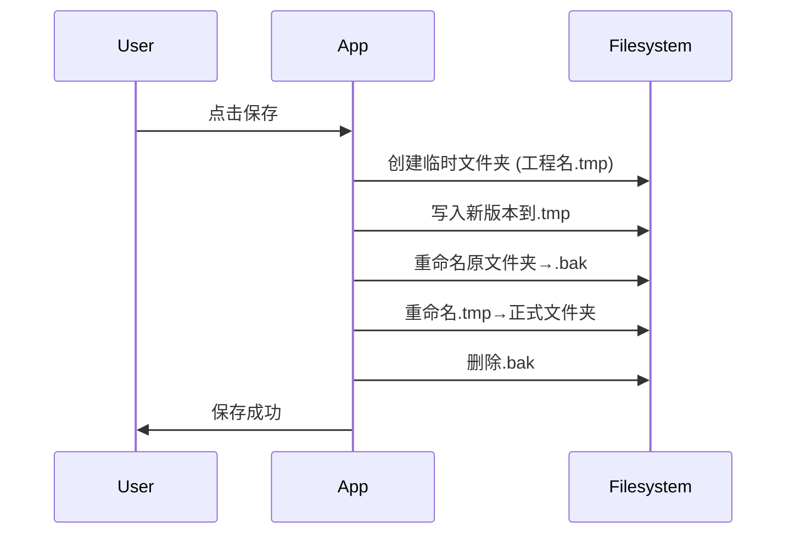

# **Qt**

## **1. Qt 中实现非阻塞延时方法**

在 Qt 中实现非阻塞延时（即在等待期间不冻结 UI 且能处理事件循环）主要有以下几种方法，每种方法适用于不同场景：

------

### **1. 1** `QTimer::singleShot` **+ 信号槽（推荐）**

**原理**：通过单次定时器触发信号槽，异步执行后续代码。**优点**：无阻塞、低CPU占用、代码清晰。**适用场景**：延迟执行某个函数或操作。

```C++
QTimer::singleShot(sleeptime, this, [=]() {    
    // 延时结束后执行的代码
});
// 此处代码会立即继续执行，不阻塞
```

------

### **1.2** `QEventLoop` **+** `QTimer`**（可控阻塞）**

**原理**：在局部事件循环中等待定时器退出，阻塞当前函数但不阻塞整个线程的事件处理。**优点**：可精确控制延时，保持UI响应。**适用场景**：需要同步等待的延迟（如等待异步操作完成）。

```C++
QEventLoop loop;
QTimer::singleShot(sleeptime, &loop, &QEventLoop::quit);
loop.exec();  // 阻塞当前函数，但事件循环仍运行
// 延时结束后继续执行
```

------

### **1.3** `QCoreApplication::processEvents()` **+ 时间循环（不推荐）**

**原理**：循环处理事件队列，直到时间耗尽。**缺点**：CPU占用高，延迟不精确。**适用场景**：旧代码兼容或极简场景。

```C++
QElapsedTimer timer;
timer.start();
while (timer.elapsed() < sleeptime) 
{    
    QCoreApplication::processEvents();  // 处理事件，避免UI卡死
}
```

------

### **1.4 异步延时（**`QFuture` **+** `QtConcurrent`**）**

**原理**：在子线程中休眠，通过信号槽或`QFutureWatcher`通知主线程。**优点**：完全不阻塞主线程。**适用场景**：后台任务需要延时后回调主线程。

```C++
QFuture<void> future = QtConcurrent::run([=]() {    
    QThread::msleep(sleeptime);  // 子线程休眠    
    QMetaObject::invokeMethod(this, [=]() {        
        // 延时结束后在主线程执行的代码    
    });
});
```

------

### **1.5 动画框架（**`QPropertyAnimation`**）**

**原理**：利用Qt动画机制实现时间控制。**优点**：与UI属性绑定，天然非阻塞。**适用场景**：需要与界面动画结合的延时。

```C++
QPropertyAnimation animation;
animation.setDuration(sleeptime);
connect(&animation, &QPropertyAnimation::finished, this, [=]() {    
    // 延时结束后执行的代码
});
animation.start();
```

------

### **1.6 方法对比总结**

| **方法**                     | **是否阻塞主线程** | **CPU占用** | **精度** | **适用场景**       |
| ---------------------------- | ------------------ | ----------- | -------- | ------------------ |
| `QTimer::singleShot`         | ❌ 非阻塞           | 低          | 高       | 通用延迟（推荐）   |
| `QEventLoop` **+** `QTimer`  | 函数内阻塞         | 低          | 高       | 需同步等待的场景   |
| `processEvents`**循环**      | ❌ 非阻塞           | 高          | 低       | 不推荐，兼容旧代码 |
| `QtConcurrent`**子线程延时** | ❌ 非阻塞           | 低          | 中       | 后台任务延时回调   |
| `QPropertyAnimation`         | ❌ 非阻塞           | 低          | 中       | UI动画相关的延时   |

------

### **1.7 如何选择？**

- **通用需求**：优先用 `QTimer::singleShot`。
- **需同步等待**：用 `QEventLoop` + `QTimer`。
- **后台任务延时**：用 `QtConcurrent` 子线程。
- **避免**直接使用 `processEvents` 循环（除非必要）。

## **2. Qt 窗口的显示方式**

------

### **2.1** `show()` **的非阻塞显示**

- **特点**：立即显示窗口，不阻塞代码执行。
- **控制模态性**：

```C++
dialog->setModal(true);       // 设置为模态（但需配合事件循环）
dialog->setWindowModality(Qt::ApplicationModal);  // 强模态
```

- **适用场景**：浮动工具窗口、实时通知等无需即时阻塞的场景。

------

### **2.2** `exec()` **的模态阻塞**

- **特点**：启动独立事件循环，阻塞直到窗口关闭。
- **返回值**：

```C++
if (dialog->exec() == QDialog::Accepted) {    
    // 用户点击"确定"
}
```

- **适用场景**：必须等待用户响应的对话框（如文件保存确认）。

------

### **2.3** `open()`**：非阻塞但有返回值的模态窗口**

- **特点**（Qt 5.10+引入）：
  - 非阻塞方式显示模态窗口，通过信号返回结果。
  - 避免 `exec()` 的事件循环嵌套问题。
- **用法**：

```C++
QDialog *dialog = new QDialog(this);
connect(dialog, &QDialog::finished, this, [](int result) {    
    qDebug() << "Dialog result:" << result;
});
dialog->open();  // 非阻塞，但窗口模态
```

- **适用场景**：需要模态交互但不想阻塞主线程的场景。

------

### **2.4** `setVisible(true)`**：底层显示控制**

- **特点**：
  - 是 `show()` 的底层实现，可精确控制显示状态。
  - 可覆盖 `show()` 的默认行为。
- **示例**：

```C++
dialog->setVisible(true);  // 等效于 show()
dialog->setVisible(false); // 等效于 hide()
```

- **适用场景**：需要自定义显示/隐藏逻辑时。

------

### **2.5** `showFullScreen()` **/** `showMaximized()` **/** `showMinimized()`

- **特点**：直接控制窗口状态：

```C++
window->showFullScreen();  // 全屏
window->showMaximized();   // 最大化
window->showMinimized();   // 最小化
```

- **适用场景**：需要特定窗口状态的场景（如播放器全屏）。

------

### **2.6** `QDialog::done(int)`**：强制关闭窗口**

- **特点**：
  - 手动关闭窗口并返回结果码。
  - 可替代 `accept()`/`reject()` 的通用方法。
- **示例**：

```C++
void MyDialog::onButtonClick() {    
    done(42);  // 关闭窗口并返回自定义结果
}
```

------

### **2.7** `QWidget::raise()` **和** `activateWindow()`

- **特点**：控制窗口层级和焦点：

```C++
window->raise();           // 置顶窗口
window->activateWindow();  // 激活焦点（可能受系统限制）
```

- **适用场景**：需要强制窗口获得焦点时。

------

### **2.8 透明窗口与特殊效果**

- **窗口透明度**：

```C++
setWindowOpacity(0.8);  // 设置透明度（0.0~1.0）
```

- **无边框窗口**：

```C++
setWindowFlags(Qt::FramelessWindowHint);
```

------

### **2.9 如何选择？**

| **需求**           | **推荐方式**                  |
| ------------------ | ----------------------------- |
| 必须等待用户响应   | `exec()` 或 `open()` + 信号槽 |
| 非阻塞显示         | `show()`                      |
| 需要返回值但非阻塞 | `open()` + `finished` 信号    |
| 全屏/最大化/最小化 | `showFullScreen()` 等         |
| 精细控制显示状态   | `setVisible()`                |
| 动态窗口效果       | 透明度 + 无边框               |

------

### **2.10 避免的常见错误**

1. **混用** `exec()` **和** `show()`：

```C++
dialog->show();
dialog->exec();  // ❌ 大概率导致事件循环混乱
```

1. **忽略模态设置**：

```C++
dialog->show();  // 非模态// 用户可能操作其他窗口，导致数据竞争
```

1. **未处理返回值**：

```C++
dialog->exec();  // ❌ 忽略返回值，无法知道用户选择
```

------

### **2.11 高级技巧**

#### **延迟显示（避免界面卡顿）**

```C++
QTimer::singleShot(0, this, []() {    
    dialog->show();  // 在当前事件循环结束后显示
});
```

#### ***\*动态创建并自动销毁**

```C++
QDialog *dialog = new QDialog;
dialog->setAttribute(Qt::WA_DeleteOnClose);  // 关闭时自动删除dialog->show();
```

------

### **2.12 总结**

Qt 提供了灵活的窗口显示方式，核心选择依据是：

1. **是否需要阻塞等待用户操作** → `exec()` 或 `open()`
2. **是否需要非阻塞交互** → `show()` + 信号槽
3. **是否需要特殊窗口状态** → 全屏/最大化等接口

根据具体场景选择合适的方法，可以避免事件循环问题并提升用户体验。

## **3. Qt 的 QVariant 特性详解**

`QVariant` 是 Qt 框架中一个非常强大的核心类，它提供了一种通用的方式来存储和操作多种数据类型。

#### **3.1 QVariant 的核心特性**

##### **3.1.1 类型擦除容器**

`QVariant` 是一个"万能容器"，可以存储：

- 所有 Qt 内置类型（`QString`、`QColor`、`QRect`等）
- 基本C++类型（`int`、`double`、`bool`等）
- 自定义类型（需注册）
- 甚至空值（`QVariant`()）

##### **3.1.2 类型安全机制**

虽然存储多种类型，但提供安全的类型转换方法：

```C++
QVariant v = 42;
if (v.canConvert<int>()) {
    int i = v.toInt(); // 安全转换
}
```

##### **3.1.3 元对象系统集成**

与 Qt 的元对象系统深度集成，支持：

- 信号槽传递
- 属性系统
- 动画框架
- 模型/视图架构

#### **3.2 QVariant 的基本使用**

##### **3.2.1 创建和赋值**

```C++
// 各种构造方式
QVariant intVar(42);           // 整数
QVariant strVar("Hello");      // 字符串
QVariant colorVar(Qt::red);    // QColor
QVariant emptyVar;             // 空值

// 赋值操作
intVar = 3.14;                // 现在变为double类型
```

##### **3.2.2 类型检查和转换**

```C++
QVariant var = "123";

// 检查类型
qDebug() << var.typeName();    // 输出"QString"

// 安全转换
bool ok;
int num = var.toInt(&ok);      // ok=true, num=123

// 强制转换
QString str = var.toString();  // 直接转换
```

##### **3.2.3 特殊值处理**

```C++
QVariant var;
if (var.isNull()) {    
    qDebug() << "变量为空";
}
var.clear();  // 显式清空
```

#### **3.3 QVariant 的高级用法**

##### **3.3.1 存储自定义类型**

**步骤1：定义可注册类型**

```C++
struct Person {
    QString name;
    int age;
    
    // 必须声明为元类型
    Q_GADGET
    Q_PROPERTY(QString name MEMBER name)
    Q_PROPERTY(int age MEMBER age)
};
```

**步骤2：注册类型**

```C++
// 在头文件或全局位置
Q_DECLARE_METATYPE(Person)

// 在main.cpp中
qRegisterMetaType<Person>("Person");
```

**步骤3：使用自定义类型**

```C++
Person p{"Alice", 25};
QVariant var = QVariant::fromValue(p);

// 取出数据
if (var.canConvert<Person>()) {
    Person p2 = var.value<Person>();
}
```

##### **3.3.2 与容器结合使用**

```C++
// QVariant列表
QVariantList list;
list << 42 << "Hello" << QColor(Qt::red);

// QVariantMap（字典）
QVariantMap map;
map["age"] = 25;
map["name"] = "Bob";
```

##### **3.3.3 在模型/视图中的应用**

```C++
// QStandardItemModel中使用
QStandardItemModel model;
QStandardItem* item = new QStandardItem;
item->setData(42, Qt::UserRole);  // 实际存储为QVariant

// 取出数据
int value = item->data(Qt::UserRole).toInt();
```

#### **3.4 QVariant 的底层原理**

##### **3.4.1 实现机制**

- 使用联合体(union)存储基本类型
- 对复杂类型使用指针存储
- 通过类型ID系统管理类型信息

##### **3.4.2 内存管理**

- 简单类型：直接存储在QVariant内部
- 复杂类型：堆上分配，引用计数管理
- 自定义类型：需要实现拷贝构造函数

##### **3.4.3 性能考虑**

- 访问比直接类型稍慢（需要类型检查）
- 对性能敏感场景慎用
- 适合数据传递、存储等非关键路径

#### **3.5 QVariant 的实用技巧**

##### **3.5.1 类型转换助手**

```C++
template<typename T>
T variantTo(const QVariant& var, const T& defaultValue = T()) {
    return var.canConvert<T>() ? var.value<T>() : defaultValue;
}

// 使用
double d = variantTo<double>(someVar, 0.0);
```

##### **3.5.2 JSON 互转**

```C++
// QVariantMap转JSON
QVariantMap map;
map["name"] = "Alice";
QByteArray json = QJsonDocument::fromVariant(map).toJson();

// JSON转QVariant
QVariant var = QJsonDocument::fromJson(json).toVariant();
```

##### **3.5.3 调试输出**

```C++
QVariant var = ...;
qDebug() << "Type:" << var.typeName() << "Value:" << var;
```

#### **3.6 QVariant 的常见问题**

##### **3.6.1 类型注册失败**

**症状**：`qDebug() << var` 报错**解决**：确保已正确使用 `Q_DECLARE_METATYPE` 和 `qRegisterMetaType`

##### **3.6.2 自定义类型转换问题**

**症状**：`value<T>()` 返回空值**解决**：

1. 检查是否缺少 `Q_GADGET` 宏
2. 确保所有成员都是可注册类型

##### **3.6.3 线程安全问题**

**注意**：在不同线程间传递自定义类型的QVariant需要：

```C++
qRegisterMetaType<MyType>("MyType");
```

### **3.7 QVariant 的最佳实践**

1. **合理使用场景**：
   - 适合：配置存储、动态数据、跨层传递
   - 避免：性能关键路径、高频调用的接口
2. **类型安全**：
   - 总是先检查 `canConvert()` 再转换
   - 为自定义类型实现完整的元类型支持
3. **资源管理**：
   - 大对象考虑使用智能指针包装

```C++
QVariant::fromValue(QSharedPointer<BigObject>(new BigObject));
```

1. **与现代C++结合**：

```C++
// C++17风格访问
std::visit([](auto&& arg) {
    using T = std::decay_t<decltype(arg)>;
    if constexpr (std::is_same_v<T, int>) {
        // 处理int
    } else if constexpr (std::is_same_v<T, QString>) {
        // 处理QString
    }
}, var.data());
```

QVariant 是 Qt 灵活性的重要体现，合理使用可以大大简化异构数据处理，但也要注意其性能成本和类型安全要求。

## 4. 工程文件夹的保存
针对 **工程文件夹** 的安全保存需求，我们需要改进方案以处理目录结构的完整性保护。以下是优化后的全流程解决方案：

---

### 4.1 解决方案：文件夹工程文件的安全保存协议

#### 1. 空间检查阶段（预检避坑）
```cpp
bool checkDiskSpace(const QString& folderPath, qint64 requiredSize) {
    QStorageInfo storage(folderPath);
    return (storage.bytesAvailable() > requiredSize * 1.5); // 预留50%安全空间
}

// 计算文件夹大小（改进版）
qint64 calculateFolderSize(const QString& path) {
    qint64 total = 0;
    QDirIterator it(path, QDir::Files | QDir::Hidden | QDir::NoSymLinks, QDirIterator::Subdirectories);
    while (it.hasNext()) {
        total += it.next().size();
    }
    return total;
}
```

#### 2. 原子化保存流程（事务性操作）


#### 3. 关键实现代码
```cpp
bool safeSaveFolder(const QString& projectDir, const QString& tempContentDir) {
    // 临时文件夹路径
    QString tmpDir = projectDir + ".tmp";
    QString bakDir = projectDir + ".bak";

    // 1. 清空临时目录（如果存在）
    QDir(tmpDir).removeRecursively();

    // 2. 复制新内容到临时目录
    if (!copyDirectory(tempContentDir, tmpDir)) {
        QDir(tmpDir).removeRecursively();
        return false;
    }

    // 3. 备份原目录
    if (QDir(projectDir).exists() && !QDir().rename(projectDir, bakDir)) {
        QDir(tmpDir).removeRecursively();
        return false;
    }

    // 4. 原子替换
    if (!QDir().rename(tmpDir, projectDir)) {
        // 失败时回滚
        if (QDir(bakDir).exists()) {
            QDir().rename(bakDir, projectDir);
        }
        return false;
    }

    // 5. 清理备份
    QDir(bakDir).removeRecursively();
    return true;
}

// 跨平台目录复制
bool copyDirectory(const QString& src, const QString& dst) {
    QDir(src).mkdir(dst);
    QFileInfoList entries = QDir(src).entryInfoList(QDir::NoDotAndDotDot | QDir::AllEntries);
    for (const QFileInfo& item : entries) {
        QString srcPath = item.filePath();
        QString dstPath = dst + "/" + item.fileName();
        if (item.isDir()) {
            if (!copyDirectory(srcPath, dstPath)) return false;
        } else {
            if (!QFile::copy(srcPath, dstPath)) return false;
        }
    }
    return true;
}
```

#### 4. 崩溃恢复机制
```cpp
void checkRecovery(const QString& projectDir) {
    QString bakDir = projectDir + ".bak";
    QString tmpDir = projectDir + ".tmp";

    // 情况1：存在.bak（主流程中断）
    if (QDir(bakDir).exists()) {
        if (QMessageBox::question(nullptr, "恢复", "检测到未完成的保存操作，是否恢复备份？") == QMessageBox::Yes) {
            QDir(projectDir).removeRecursively();
            QDir().rename(bakDir, projectDir);
        }
    }
    // 情况2：存在.tmp（预保存阶段中断）
    else if (QDir(tmpDir).exists()) {
        QDir(tmpDir).removeRecursively();
    }
}
```

#### 5. 用户空间不足时的处理
```cpp
void handleLowDiskSpace(const QString& path) {
    qint64 required = calculateFolderSize(app->tempProjectDir());
    qint64 available = QStorageInfo(path).bytesAvailable();

    QMessageBox msgBox;
    msgBox.setText("磁盘空间不足");
    msgBox.setInformativeText(
        QString("需要 %1 MB，但只有 %2 MB 可用\n选择操作：")
            .arg(required/1024/1024, 0, 'f', 1)
            .arg(available/1024/1024, 0, 'f', 1));
    
    QPushButton* cleanButton = msgBox.addButton("清理磁盘", QMessageBox::ActionRole);
    QPushButton* saveAsButton = msgBox.addButton("另存为...", QMessageBox::ActionRole);
    msgBox.addButton(QMessageBox::Cancel);

    msgBox.exec();

    if (msgBox.clickedButton() == cleanButton) {
        // 打开系统磁盘清理工具
        QDesktopServices::openUrl(QUrl::fromLocalFile(path));
    } else if (msgBox.clickedButton() == saveAsButton) {
        // 触发另存为逻辑
        QString newPath = QFileDialog::getExistingDirectory();
        if (!newPath.isEmpty()) saveToNewLocation(newPath);
    }
}
```

---

### 4.2 增强保护措施

1. **文件锁机制**：
   ```cpp
   // 保存期间锁定文件
   QLockFile lockFile(projectDir + ".lock");
   if (!lockFile.tryLock(1000)) {
       QMessageBox::warning(nullptr, "警告", "工程正在被其他进程修改");
       return;
   }
   ```

2. **校验和验证**：
   ```cpp
   bool verifyFolderIntegrity(const QString& path) {
       // 生成所有文件的MD5校验和
       QMap<QString, QByteArray> checksums;
       QDirIterator it(path, QDir::Files, QDirIterator::Subdirectories);
       while (it.hasNext()) {
           QFile f(it.next());
           if (!f.open(QIODevice::ReadOnly)) return false;
           checksums.insert(f.fileName(), QCryptographicHash::hash(f.readAll(), QCryptographicHash::Md5));
       }
       return !checksums.isEmpty();
   }
   ```

3. **版本快照**：
   ```cpp
   void createVersionSnapshot(const QString& projectDir) {
       QString versionDir = QString("%1/versions/v%2")
                           .arg(QDir(projectDir).absolutePath())
                           .arg(QDateTime::currentDateTime().toString("yyyyMMdd_hhmmss"));
       copyDirectory(projectDir, versionDir);
   }
   ```

---

### 4.3 最终保存流程图解
```plaintext
[开始保存]
  │
  ├─▶ [检查磁盘空间] → 不足 → 处理空间不足
  │
  ├─▶ [创建临时副本.tmp]
  │     │
  │     ├─▶ [写入所有新文件]
  │     │
  │     └─▶ [校验完整性] → 失败 → 删除.tmp并中止
  │
  ├─▶ [重命名原文件夹→.bak]
  │
  ├─▶ [重命名.tmp→正式文件夹]
  │
  └─▶ [删除.bak备份]
        │
        └─▶ [更新最近修改时间戳]
```

这种方案通过 **临时副本+原子替换+崩溃恢复** 三重保障，确保即使在高并发或意外断电情况下，工程文件夹要么完全保存成功，要么完整回退到之前的状态，从根本上避免了数据丢失风险。